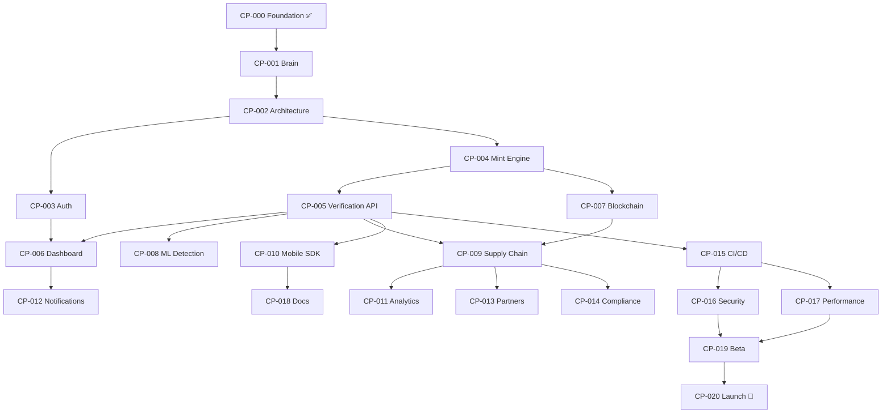

# CapMint — Milestones

> **Last Updated:** 2026-07-08  
> **Total Milestones:** 21 (CP-000 through CP-020)  
> **Completed:** 1 (CP-000)

---

## Milestone Dependency Chain

---

## Milestone Descriptions

### CP-000: Foundation Initialized ✅

**Status:** COMPLETE (2026-07-08)  
**Dependencies:** None  
**Deliverables:** Project governance, state tracking, AI rules, branching strategy,
ADRs, templates, and all foundational documentation.

---

### CP-001: Brain Complete ⏳

**Status:** PENDING  
**Dependencies:** CP-000  
**Deliverables:** All `BRAIN/` subdirectories fully populated — templates, checklists,
context docs, decisions framework, prompt library, runbooks, and metrics definitions.

---

### CP-002: Core Architecture

**Status:** NOT STARTED  
**Dependencies:** CP-001  
**Deliverables:** System architecture document, API contract definitions (OpenAPI),
data model schemas, infrastructure design, technology stack decisions, and security model.

---

### CP-003: Authentication Service

**Status:** NOT STARTED  
**Dependencies:** CP-002  
**Deliverables:** User authentication and authorization service — JWT/OAuth2 flows,
RBAC model, API key management, session handling, and audit logging.

---

### CP-004: Mint Engine

**Status:** NOT STARTED  
**Dependencies:** CP-002  
**Deliverables:** Core anti-counterfeiting minting service — unique identifier generation,
cryptographic signing, product registration, and certificate issuance.

---

### CP-005: Verification API

**Status:** NOT STARTED  
**Dependencies:** CP-004  
**Deliverables:** Public-facing verification endpoint — product authenticity checks,
certificate validation, scan-to-verify flow, and verification history logging.

---

### CP-006: Dashboard UI

**Status:** NOT STARTED  
**Dependencies:** CP-003, CP-005  
**Deliverables:** Admin and brand dashboard — product management, analytics views,
user management, verification reports, and real-time monitoring.

---

### CP-007: Blockchain Anchor

**Status:** NOT STARTED  
**Dependencies:** CP-004  
**Deliverables:** On-chain proof anchoring — hash anchoring to blockchain, proof
verification, chain selection strategy, and gas optimization.

---

### CP-008: ML Detection

**Status:** NOT STARTED  
**Dependencies:** CP-005  
**Deliverables:** Machine learning counterfeit detection — image analysis models,
anomaly detection, confidence scoring, and model training pipeline.

---

### CP-009: Supply Chain Tracker

**Status:** NOT STARTED  
**Dependencies:** CP-005, CP-007  
**Deliverables:** Product journey tracking — custody chain, geolocation tracking,
handoff events, tamper detection, and supply chain visualization.

---

### CP-010: Mobile SDK

**Status:** NOT STARTED  
**Dependencies:** CP-005  
**Deliverables:** Consumer-facing mobile SDK — scan-to-verify, NFC/QR reading,
offline verification cache, and push notification integration.

---

### CP-011: Analytics Pipeline

**Status:** NOT STARTED  
**Dependencies:** CP-009  
**Deliverables:** Data aggregation and insights — verification analytics, fraud
pattern detection, geographic hotspot analysis, and reporting dashboards.

---

### CP-012: Notification Service

**Status:** NOT STARTED  
**Dependencies:** CP-006  
**Deliverables:** Alert and escalation system — real-time fraud alerts, email/SMS/push
notifications, webhook integrations, and notification preferences.

---

### CP-013: Partner Integration

**Status:** NOT STARTED  
**Dependencies:** CP-009  
**Deliverables:** Third-party API connectors — ERP integrations, marketplace APIs,
logistics provider connectors, and partner onboarding flow.

---

### CP-014: Compliance Module

**Status:** NOT STARTED  
**Dependencies:** CP-009  
**Deliverables:** Regulatory compliance — GDPR/CCPA data handling, audit trails,
export controls, industry-specific regulations, and compliance reporting.

---

### CP-015: Infrastructure / CI/CD

**Status:** NOT STARTED  
**Dependencies:** CP-005  
**Deliverables:** Deployment pipelines — CI/CD setup, IaC (Terraform/Pulumi),
container orchestration, environment management, and monitoring stack.

---

### CP-016: Security Hardening

**Status:** NOT STARTED  
**Dependencies:** CP-015  
**Deliverables:** Security audit and hardening — penetration testing, vulnerability
scanning, dependency auditing, WAF configuration, and security documentation.

---

### CP-017: Performance Tuning

**Status:** NOT STARTED  
**Dependencies:** CP-015  
**Deliverables:** Load testing and optimization — benchmarking, caching strategy,
database optimization, CDN configuration, and performance budgets.

---

### CP-018: Documentation Site

**Status:** NOT STARTED  
**Dependencies:** CP-010  
**Deliverables:** Public documentation — API reference, integration guides, SDK docs,
tutorials, FAQ, and developer portal.

---

### CP-019: Beta Program

**Status:** NOT STARTED  
**Dependencies:** CP-016, CP-017  
**Deliverables:** Closed beta — partner onboarding, feedback collection, bug triage,
SLA validation, and beta metrics dashboard.

---

### CP-020: Production Launch 🚀

**Status:** NOT STARTED  
**Dependencies:** CP-019  
**Deliverables:** General availability release — production deployment, marketing
launch, support channels, SLA enforcement, and post-launch monitoring.

---

## Cross-References

| Document                                          | Purpose                       |
|---------------------------------------------------|-------------------------------|
| [MASTER_PLAN.md](../../governance/MASTER_PLAN.md) | Authoritative project roadmap |
| [ACTIVE_CHECKPOINT.md](ACTIVE_CHECKPOINT.md)      | Current checkpoint status     |
| [ROADMAP.md](ROADMAP.md)                          | Phased delivery plan          |
| [PROGRESS.md](PROGRESS.md)                        | Completion metrics            |
