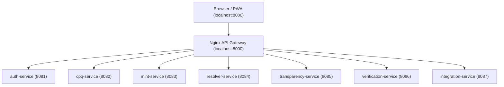

# CapMint — AI-First Anti-Counterfeiting Platform

**Authenticate Everything. Counterfeit Nothing.**

CapMint is an enterprise-grade agricultural supply-chain provenance platform designed to prevent food counterfeiting (e.g., duplicate organic honey) using capacity quota controls, cryptographic serialization, spatial clone detection, and an immutable auditable transaction ledger.

---

## 🏗️ Project Architecture Overview

CapMint runs 7 containerized TypeScript microservices orchestrated under a unified Nginx API Gateway with transactional PostgreSQL and Redis caches:



### Active Port Mappings

| Service / Container | Port | Endpoint URL / Path | Purpose |
| :--- | :---: | :--- | :--- |
| **`capmint-nginx`** (Gateway) | `8000` | `http://localhost:8000` | Unified reverse-proxy entrypoint |
| **`auth-service`** | `8081` | `http://localhost:8081/health` | User auth, Bcrypt hash, JWT issuance |
| **`cpq-service`** | `8082` | `http://localhost:8082/health` | Quota budget limits & PostgreSQL FOR UPDATE locks |
| **`mint-service`** | `8083` | `http://localhost:8083/health` | Barcode serialization & GTIN-14 check digit checks |
| **`resolver-service`** | `8084` | `http://localhost:8084/health` | GS1 Digital Link resolver redirects |
| **`transparency-service`** | `8085` | `http://localhost:8085/health` | SHA-256 linked transparency block ledger |
| **`verification-service`** | `8086` | `http://localhost:8086/health` | Haversine geovelocity clone detection |
| **`integration-service`** | `8087` | `http://localhost:8087/health` | External TraceNet & AgriStack registry proxy |
| **`capmint-postgres`** | `5432` | `localhost:5432` | Primary database |
| **`capmint-redis`** | `6379` | `localhost:6379` | Telemetry event caches |

---

## 🏁 Completed Checkpoints & Modules (GA Ready 🚀)

*   **CP-000 to CP-003 (Foundation)**: Relational database design, ERDs, schema migrations, and OpenAPI specs.
*   **CP-004 to CP-006 (Application & Infra)**: Implemented all core microservices, static responsive browser dashboard, external AgriStack/TraceNet proxies, AWS Terraform configuration, Dockerfiles, and Nginx Gateway.
*   **CP-007 (Quality Assurance)**: Configured automated E2E integration test suites validating transactional lifecycles project-wide.
*   **CP-008 (Production Readiness)**: Audited secrets, built multi-stage optimized Docker images, and signed off production release.

---

## 🚀 Local Development Quickstart

### Prerequisite
Ensure **Docker Desktop** is running on your system.

### 1. Start Database, Gateway, & Services
To build and spin up the complete container stack:
```bash
./scripts/dev.sh up
```

### 2. Verify Container Health
To check the running status and health checks of all containers:
```bash
./scripts/dev.sh status
```

### 3. Open UI Interfaces
*   **Interactive Web Portal (Dashboards / Scanner)**: Open **[http://localhost:8080](http://localhost:8080)**
*   **API Developer Playground (Swagger UI)**:
    1.  Start playground server:
        ```bash
        npx http-server . -p 8090
        ```
    2.  Open **[http://localhost:8090/playground/index.html](http://localhost:8090/playground/index.html)** to test live endpoints directly through the Nginx gateway!

---

## 🧪 Quality Assurance & Testing

Automated test suites are configured inside the Vitest workspace runtime. 

To run all package tests (including E2E integration tests) locally:
```bash
npm run test
```

---

## 📁 Repository Directory Structure

```text
CapMint/
├── api/                       # OpenAPI specs and contract schemas
├── database/                  # Schema definition and initialization scripts
├── frontend/                  # Dashboard and PWA client web pages
├── infrastructure/            # Docker, Nginx, and Terraform cloud blueprints
├── packages/                  # SDKs, config, and shared workspace libraries
├── playground/                # Developer API playground & Swagger UI console
├── scripts/                   # Orchestrator startup scripts
├── services/                  # The 7 TypeScript backend microservices & E2E tests
└── state/                     # Project milestone logs & sprint registers
```

---
*CapMint Platform — Production Ready GA Release*
