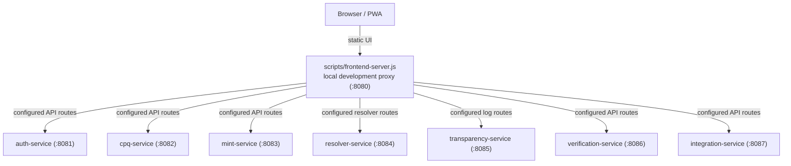

# CapMint — AI-First Anti-Counterfeiting Platform

**Authenticate Everything. Counterfeit Nothing.**

CapMint is an agricultural supply-chain provenance codebase designed to support
anti-counterfeiting workflows through capacity controls, cryptographic
serialization, spatial clone detection, and an auditable application ledger.

The repository is in an active **security-hardening and multi-tenancy
remediation** phase. DM-03's enforceable scope is complete, while DM-04
PostgreSQL Row-Level Security and other bounded security verification remain
open. Production readiness is not established; see
[Current State](state/CURRENT.md) and the authoritative
[Architecture Status](docs/architecture/ARCHITECTURE_STATUS.md).

---

## 🏗️ Project Architecture Overview

Seven backend directories contain implemented TypeScript service entrypoints.
For local development, the root
[`scripts/frontend-server.js`](scripts/frontend-server.js) process listens on
port 8080, serves the static frontend, and proxies configured request paths to
those services on ports 8081–8087. This root development proxy is not a backend
gateway service: `backend/gateway-service` is an unimplemented `.gitkeep`
placeholder.


```mermaid
graph TD
    Client["Browser / PWA"] -->|"static UI"| DevProxy["scripts/frontend-server.js<br/>local development proxy (:8080)"]
    DevProxy -->|"configured API routes"| Auth["auth-service (:8081)"]
    DevProxy -->|"configured API routes"| CPQ["cpq-service (:8082)"]
    DevProxy -->|"configured API routes"| Mint["mint-service (:8083)"]
    DevProxy -->|"configured resolver routes"| Resolver["resolver-service (:8084)"]
    DevProxy -->|"configured log routes"| Transparency["transparency-service (:8085)"]
    DevProxy -->|"configured API routes"| Verification["verification-service (:8086)"]
    DevProxy -->|"configured API routes"| Integration["integration-service (:8087)"]
```

### Active Port Mappings

| Service / Process | Port | Endpoint URL / Path | Purpose |
| :--- | :---: | :--- | :--- |
| **`scripts/frontend-server.js`** | `8080` | `http://localhost:8080` | Root local-development process serving the static SPA and proxying configured routes; not `backend/gateway-service` |
| **`auth-service`** | `8081` | `http://localhost:8081/health` | User auth, Bcrypt hashing, JWT issuance |
| **`cpq-service`** | `8082` | `http://localhost:8082/health` | Quota budget limits & PostgreSQL FOR UPDATE locks |
| **`mint-service`** | `8083` | `http://localhost:8083/health` | Barcode serialization & GTIN-14 validation |
| **`resolver-service`** | `8084` | `http://localhost:8084/health` | GS1 Digital Link resolver redirects |
| **`transparency-service`** | `8085` | `http://localhost:8085/health` | SHA-256 linked transparency block ledger |
| **`verification-service`** | `8086` | `http://localhost:8086/health` | Haversine geovelocity clone detection, Lot certifications |
| **`integration-service`** | `8087` | `http://localhost:8087/health` | External TraceNet & AgriStack registry proxy |
| **`capmint-postgres`** | `5432` | `localhost:5432` | Primary database |
| **`capmint-redis`** | `6379` | `localhost:6379` | Telemetry event caches & rate limiters |

---

## Implemented Capabilities Under Active Verification

*   **Identity & Onboarding Review**: JWT authentication, bcrypt password hashing, onboarding document uploads, and system admin review notes.
*   **AgriStack & CPQ Budgets**: Geo-boundary mapping, land registries, and certifier approval workflows (submit, review, request revisions, reject).
*   **Explicit Packaging Lots**: Separate lot creation drawdown step with downloadable PDF sheets and CSV exports.
*   **Lab Validation & PDF Integrity**: Registry checks on authorized laboratories, PDF magic bytes verification, and SHA-256 hash checks.
*   **Transparency Ledger & Audits**: Cryptographic SHA-256 block hash chaining and non-blocking verification scanning.
*   **Geovelocity & Caseworker Dashboard**: Chronological timeline, risk escalation, caseworker assignment, and revocation flow alerts.
*   **Security Hardening Controls**: Environment assertions at boot, explicit audited administrator bootstrap, no application startup fixtures, and CORS restrictions.
*   **Sliding-Window Rate Limiting**: Redis-backed atomic rate limiters on public login and scan lookup routes.
*   **State-Aware Migration Engine**: Forward migrations, an immutable empty-database baseline, checksums, explicit adoption records, and PostgreSQL advisory locking.
*   **Compliance Test Suite**: Disposable tenant-scoped harness with a current contract of 88 active assertions and no pending assertions.

---

## 🚀 Local Development Quickstart

### Setup & Test

The committed root `package-lock.json` locks the root package and every npm
workspace. From the repository root, install exactly that dependency graph:

```bash
npm ci
```

Run each workspace test suite explicitly:

```bash
npm test --workspace=backend/auth-service
npm test --workspace=backend/cpq-service
npm test --workspace=backend/e2e-tests
npm test --workspace=backend/integration-service
npm test --workspace=backend/mint-service
npm test --workspace=backend/resolver-service
npm test --workspace=backend/transparency-service
npm test --workspace=backend/verification-service
```

To run every workspace test script in one command:

```bash
npm test
```

### 1. Run Dev Servers
To spin up all local microservices:
```bash
npm run dev
```

### 2. Apply Database Migrations
To run the schema migrations runner script:
```bash
node playground/run_migrations.js --check
node playground/run_migrations.js --plan
node playground/run_migrations.js --apply
```

Use `--bootstrap` only for a genuinely empty database. Adoption of effects that
exist without migration history requires explicit filenames and an approved
state review. See [`database/README.md`](database/README.md).

### 3. Initialize an Empty Environment

Schema bootstrap creates no users or domain fixtures. Create the first system
administrator through the explicit operator command:

```bash
npm run bootstrap:admin
```

Development fixtures require explicit non-production environment variables and:

```bash
npm run seed:development
```

See [`database/README.md`](database/README.md) for required variables, safety
checks, and existing-database behavior.

### 4. Open UI Interfaces
*   **Interactive Web Portal (Dashboards / Scanner)**: Open **[http://localhost:8080](http://localhost:8080)**
*   **API Developer Playground (Swagger UI)**: Open **[http://localhost:8080/playground/index.html](http://localhost:8080/playground/index.html)** to test live endpoints through the root development proxy.

---

## 🧪 Quality Assurance & Compliance Testing

Run the tenant-scoped compliance harness only through its disposable database
test. The current contract is 88 active assertions and no pending assertions:
```bash
RUN_F1_COMPLIANCE=1 F1_SUITE_RUN_ID=local npm test --workspace=backend/e2e-tests -- compliance-suite.test.ts
```

---

## 📁 Repository Directory Structure

```text
CapMint/
├── .github/workflows/         # Native GitHub Actions CI/CD pipeline workflows
├── api/                       # OpenAPI specs and contract schemas
├── backend/                   # The 7 TypeScript backend microservices
├── database/                  # Baseline, snapshot, migrations (0001-0013), seeds, and triggers
├── deployment/                # Reserved deployment placeholder
├── docs/                      # Technical manuals (api, architecture, operations, user-guide)
├── frontend/                  # Dashboard and PWA client web pages
├── infrastructure/            # Terraform scaffolding; monitoring directories are placeholders
├── knowledge/                 # Domain specs (GS1 link standard, APEDA laws, AgriStack APIs)
├── packages/                  # SDKs, config, and shared workspace libraries
├── playground/                # Developer Swagger UI console, migrations, and test runners
├── releases/                  # Historical release artifacts; not current production-readiness evidence
└── scripts/                   # Development startup and preflight diagnostic scripts
```
