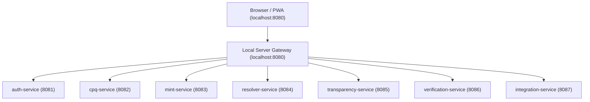

# CapMint — AI-First Anti-Counterfeiting Platform

**Authenticate Everything. Counterfeit Nothing.**

CapMint is an enterprise-grade agricultural supply-chain provenance platform designed to prevent food counterfeiting (e.g., duplicate organic honey) using capacity quota controls, cryptographic serialization, spatial clone detection, and an immutable auditable transaction ledger.

---

## 🏗️ Project Architecture Overview

CapMint runs 7 TypeScript microservices orchestrated under a reverse proxy API Gateway server with transactional PostgreSQL and Redis caches:


```mermaid
graph TD
    Client["Browser / PWA (localhost:8080)"] --> Gateway["Local Server Gateway (localhost:8080)"]
    Gateway --> Auth["auth-service (8081)"]
    Gateway --> CPQ["cpq-service (8082)"]
    Gateway --> Mint["mint-service (8083)"]
    Gateway --> Resolver["resolver-service (8084)"]
    Gateway --> Transparency["transparency-service (8085)"]
    Gateway --> Verification["verification-service (8086)"]
    Gateway --> Integration["integration-service (8087)"]
```

### Active Port Mappings

| Service / Process | Port | Endpoint URL / Path | Purpose |
| :--- | :---: | :--- | :--- |
| **`frontend-server`** (Gateway) | `8080` | `http://localhost:8080` | Local developer gateway serving static SPA + API routing |
| **`auth-service`** | `8081` | `http://localhost:8081/health` | User auth, Bcrypt hashing, JWT issuance |
| **`cpq-service`** | `8082` | `http://localhost:8082/health` | Quota budget limits & PostgreSQL FOR UPDATE locks |
| **`mint-service`** | `8083` | `http://localhost:8083/health` | Barcode serialization & GTIN-14 validation |
| **`resolver-service`** | `8084` | `http://localhost:8084/health` | GS1 Digital Link resolver redirects |
| **`transparency-service`** | `8085` | `http://localhost:8085/health` | SHA-256 linked transparency block ledger |
| **`verification-service`** | `8086` | `http://localhost:8086/health` | Haversine geovelocity clone detection, Lot certifications |
| **`integration-service`** | `8087` | `http://localhost:8087/health` | External TraceNet & AgriStack registry proxy |
| **`capmint-postgres`** | `5432` | `localhost:5432` | Primary database |
| **`capmint-redis`** | `6379` | `localhost:6379` | Telemetry event caches & rate limiters |

---

## 🏁 End-to-End Verified Capabilities (GA Ready 🚀)

*   **Identity & RBAC Authorization**: JWT authentication, bcrypt password hashing, and role checks across 3 organization classes.
*   **AgriStack & Quota Budgeting**: Geo-boundary mapping, land registries, and concurrent budget drawdown locks.
*   **Serialization & GS1 link**: Alphanumeric random code generator, GTIN check-digit, and resolver redirects.
*   **NABL Lab Reports & Lot Certification**: PDF validations, duplicate check hash controls, and certification validations.
*   **Transparency Ledger & Audits**: Cryptographic SHA-256 block hash chaining and non-blocking verification scanning.
*   **Geovelocity Clone Detection**: Spatial-temporal scan checking and automatic clone case investigations.
*   **Zero-Trust Hardening**: Strict environment assertions at boot, secured seed passwords, and CORS lockdown.
*   **Sliding-Window Rate Limiting**: Redis-backed atomic rate limiters on public login and scan lookup routes.
*   **Idempotent Migration Engine**: 7 database migrations (0001-0007) with database PL/pgSQL timestamp triggers.
*   **Compliance Test Suite**: 52 compliance test cases running with 100% success rate (`node playground/test_runner.js`).

---

## 🚀 Local Development Quickstart

### 1. Run Dev Servers
To spin up all local microservices:
```bash
npm run dev
```

### 2. Apply Database Migrations
To run the schema migrations runner script:
```bash
node playground/run_migrations.js
```

### 3. Open UI Interfaces
*   **Interactive Web Portal (Dashboards / Scanner)**: Open **[http://localhost:8080](http://localhost:8080)**
*   **API Developer Playground (Swagger UI)**: Open **[http://localhost:8080/playground/index.html](http://localhost:8080/playground/index.html)** to test live endpoints directly through the local server gateway.

---

## 🧪 Quality Assurance & Compliance Testing

To run the extended 52-case compliance test suite:
```bash
node playground/test_runner.js
```

---

## 📁 Repository Directory Structure

```text
CapMint/
├── .github/workflows/         # Native GitHub Actions CI/CD pipeline workflows
├── api/                       # OpenAPI specs and contract schemas
├── backend/                   # The 7 TypeScript backend microservices
├── database/                  # Schema, migrations (0001-0006), seed data, and PL/pgSQL triggers
├── deployment/                # Dockerfiles, Nginx configurations, and Kubernetes manifests
├── docs/                      # Technical manuals (api, architecture, operations, user-guide)
├── frontend/                  # Dashboard and PWA client web pages
├── infrastructure/            # Terraform cloud blueprints and Prometheus/Grafana monitoring
├── knowledge/                 # Domain specs (GS1 link standard, APEDA laws, AgriStack APIs)
├── packages/                  # SDKs, config, and shared workspace libraries
├── playground/                # Developer Swagger UI console, migrations, and test runners
├── releases/                  # Release versions (v1.0.0 manifest and notes)
└── scripts/                   # Development startup and preflight diagnostic scripts
```

---
*CapMint Platform — Production Ready GA Release*
