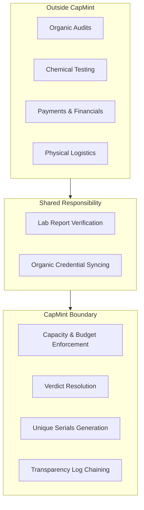
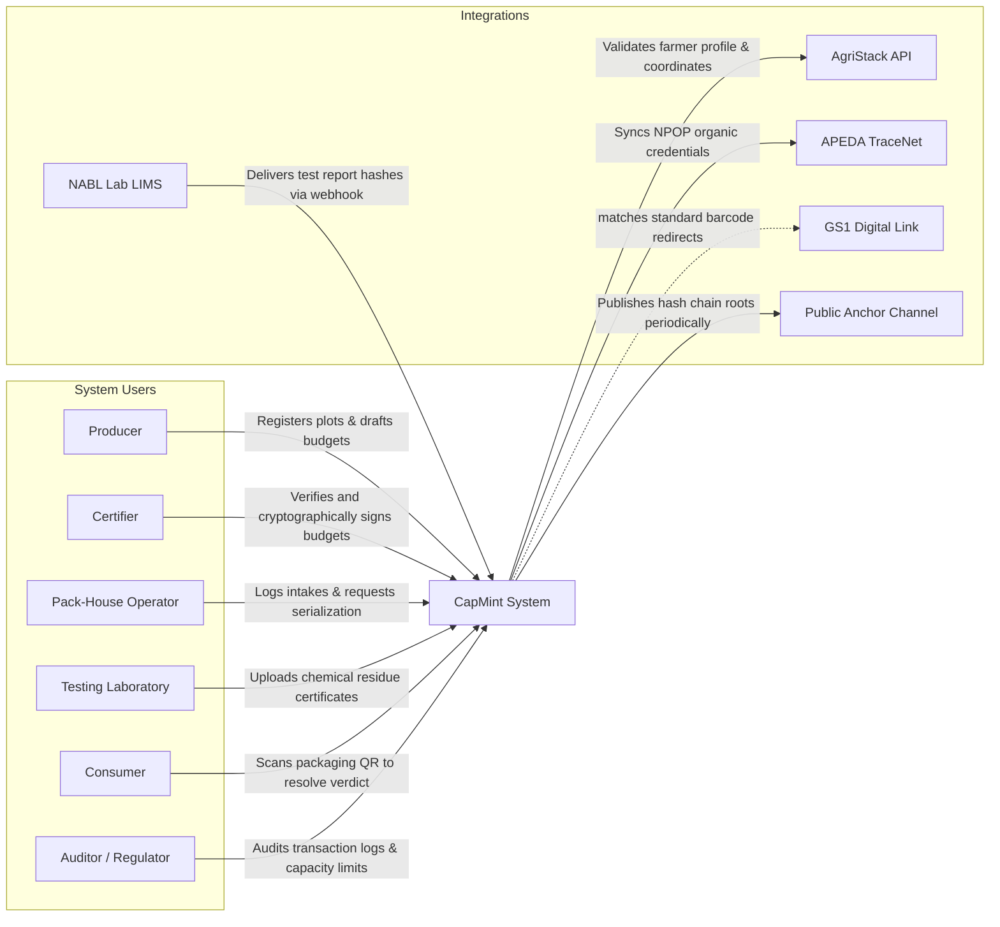

# L1 – System Context

## Scope

This document owns:
- The C4 Model Level 1 System Context diagram for the CapMint platform.
- Logical mappings of primary actors grouped by operational, authority, and supporting roles.
- Mappings of external system dependencies, including their communication direction, trust level, criticality, and integration types.
- Visual and conceptual definitions of CapMint's logical system boundary.
- Trust boundary zone classifications at the high-level system tier.

This document intentionally does NOT describe:
- C4 Level 2 (Container) or Level 3 (Component) diagrams (defined in [CONTAINER_ARCHITECTURE.md](./L2_CONTAINER.md)).
- Relational tables, index specs, or SQL-level database schemas.
- Network routing ports, application routes, or controller code.
- Specific library configurations or package directories.

---

## Purpose

This C4 Level 1 System Context document provides an executive, bird's-eye view of CapMint's place within the wider agricultural and certification ecosystem. It maps who interacts with CapMint and how information moves across the external boundaries, complementing the conceptual descriptions in **[SYSTEM_CONTEXT.md](../system/SYSTEM_CONTEXT.md)**.

---

## System Description

CapMint is a unit-level integrity and origin-claim registry for organic and premium food products. It acts as an issuance gatekeeper, enforcing a cryptographically signed capacity budget before allowing unit-level QR codes to be minted. By tying each physical package to a unique serialized identity backed by certifier authorization and lab evidence, it prevents over-issuance fraud in the agricultural supply chain.

---

## Primary Actors

CapMint's human and system actors are grouped by their operational and verification responsibilities:

### Primary Operational Actors
- **Producer**: Cultivates organic crops. Registers plots of land, manages crop profiles, and drafts production budgets based on historical yields.
- **Pack-House Operator**: Manages physical crop reception, sorting, packaging, and labeling. Records crop intake weights and requests code minting within approved capacity limits.
- **Consumer**: The final buyer of the retail package. Scans the printed QR code using standard mobile browsers to instantly verify product origin, certificates, and crop details.

### Authority Actors
- **Certifier**: Authorized external organic certification body. Reviews crop registrations, verifies agricultural context, and cryptographically signs budgets to authorize unit serialization. Can initiate lot-level revocations.
- **Auditor / Regulator**: Compliance official who reviews system allocations, cross-checks transparency logs, and validates supply chain provenance records.
- **Administrator**: High-privilege platform technician who registers actors, sets system parameters, and monitors security and high-risk anomalies.

### Supporting Actors
- **Testing Laboratory**: Accredited laboratory (NABL). Conducts chemical analysis on lots and posts certificates of analysis (test parameters and file hashes) to support lot provenance.

---

## External Systems

CapMint integrates with several external networks to validate claims and publish audit data:

| External System | Purpose | Direction of Comm. | Trust Level | Criticality | Integration Type |
|---|---|---|---|---|---|
| **AgriStack** | Source registry of farmer identity, crop history, and parcel boundaries. | Inbound Query (CapMint reads AgriStack) | High (Government Authority) | High (For registrations) / Low (For scans) | REST API |
| **TraceNet** | National database for NPOP organic certifications. | Sync (CapMint queries credentials) | High (Regulatory Authority) | Medium (Manual certifier upload fallback exists) | REST API |
| **NABL Laboratories** | Independent chemical residue testing networks. | Inbound Event (LIMS pushes report hashes) | High (Accredited Source) | Medium (Scan resolutions degrade gracefully) | Webhook |
| **GS1 Digital Link** | Barcode URI structure standards registry. | Public Redirect (Standard URI format resolution) | Public | High (QR codes must comply to remain scannable) | Public Standard |
| **Public Anchor Channel** | External public channel (e.g., repository or ledger). | Outbound (CapMint writes log roots) | Destination | Medium (Writes can be queued during WAN drops) | REST API / Git |

---

## System Boundary

---

## Trust Boundaries

CapMint's high-level system interactions traverse three primary trust zones:
- **Trusted Core**: The internal system boundary where transaction limits, cryptographic keys, and hash chains are processed.
- **Partner Systems**: Trusted external authority gateways (AgriStack, TraceNet) and laboratory networks.
- **Public Zone**: Untrusted public channels (e.g., standard consumer browsers, external redirect platforms).

For the physical container mappings and cryptographic key details of these boundaries, refer to **[SECURITY_ARCHITECTURE.md](../security/SECURITY_ARCHITECTURE.md#6-trust-boundaries)**.

---

## CapMint Guarantees & Constraints

### CapMint Guarantees
- **✓ Budget Enforcement**: No unit-level serial code can be issued once a budget's approved capacity reaches zero.
- **✓ Unique Serialization**: Every physical unit is assigned a cryptographically unique, non-sequential identifier.
- **✓ Verification**: Resolves scans to independent product validity status states (VERIFIED, REVOKED, EXPIRED, UNKNOWN).
- **✓ Risk Assessment**: Evaluates multiple behavioral signals to compute authenticity risk levels (LOW, MEDIUM, HIGH, CRITICAL) without performing automated deactivation.
- **✓ Immutable Audit**: Records all state-changing events in an append-only, tamper-evident log.

### CapMint Does NOT Guarantee
- **✗ Organic Certification**: CapMint does not make certification decisions; it registers and enforces decisions made by certifiers.
- **✗ Laboratory Accuracy**: CapMint does not verify the accuracy of chemical tests; it anchors testing files using their document hashes.
- **✗ Product Quality**: CapMint cannot confirm the physical state or purity of crop units.
- **✗ Logistics**: CapMint does not manage delivery scheduling, tracking, or warehouse operations.
- **✗ Financial Transactions**: CapMint does not process commercial invoices, quotes, or payments.

---

## Mermaid Diagram

---

## Interaction Summary

### Human Actors to CapMint
- **Producer $\rightarrow$ CapMint**: Submits crop acreage and yield context to request capacity.
- **Certifier $\rightarrow$ CapMint**: Validates crop bounds and signs budgets.
- **Pack-House Operator $\rightarrow$ CapMint**: Logs physical intakes and requests serial code generation.
- **Consumer $\rightarrow$ CapMint**: Sends scan queries via mobile web browsers.
- **Auditor $\rightarrow$ CapMint**: Queries logs and allocations for compliance checks.

### CapMint to External Systems
- **CapMint $\rightarrow$ AgriStack**: Matches land declarations to government records to calculate safe maximum yields.
- **CapMint $\rightarrow$ TraceNet**: Confirms organic certification status.
- **CapMint $\rightarrow$ NABL Laboratories**: Accepts webhooks carrying PDF certificates and hashes.
- **CapMint $\rightarrow$ GS1**: Standardizes generated URIs to conform to the Digital Link standard.
- **CapMint $\rightarrow$ Anchor**: Publishes periodic log block roots to external channels.

---

## Design Decisions

- **System Boundary Isolation**: CapMint is deliberately separated from complex external ERPs and blockchain gas overhead. Kept central to allow simple managed hosting for pilots while preserving decentralized cryptographic auditing. For details, reference **[SYSTEM_CONTEXT.md](../system/SYSTEM_CONTEXT.md)** and **[SERVICE_BOUNDARIES.md](../system/SERVICE_BOUNDARIES.md)**.
- **Standardized URIs**: Using the GS1 Digital Link standard allows the printed QR codes to remain compatible with standard retailer point-of-sale scanner hardware while acting as a consumer-facing web validation page. For details, see **[SYSTEM_OVERVIEW.md](../system/SYSTEM_OVERVIEW.md#20-architectural-decisions--alternatives-matrix)**.

---

## Architectural Assumptions

- **Government Registries**: We assume AgriStack and TraceNet APIs remain authoritative registries for land bounds and NPOP organic certifier lists.
- **GS1 Digital Link Standard**: We assume the GS1 Digital Link URI scheme remains stable and globally supported.
- **External Key Safety**: We assume certifiers manage their private signing keys securely out-of-band.
- **Partner System Availability**: We assume external API systems are accessible, falling back to manual upload procedures during WAN drops.

---

## Failure Philosophy

- **Fail Closed**: Security checks, cryptographic signature verifications, and budget capacity drawdowns must fail closed. If the KMS is offline, or database logs cannot commit, minting operations block instantly.
- **Fail Safe**: If external registries (AgriStack, TraceNet) fail, CapMint falls back to cached credentials or manual certifier overrides, allowing existing business runs to continue.
- **Graceful Degradation**: If the Redis cache fails, public scan requests read from database replicas with a minor latency increase rather than returning system errors.
- **Offline-First**: PWAs queue operational records locally in browser databases during WAN drops, synchronizing batches asynchronously when the connection is restored.

---

## References

- **[SYSTEM_CONTEXT.md](../system/SYSTEM_CONTEXT.md)**
- **[SYSTEM_OVERVIEW.md](../system/SYSTEM_OVERVIEW.md)**
- **[SERVICE_BOUNDARIES.md](../system/SERVICE_BOUNDARIES.md)**

---

## Architecture Compliance

- **✓ Consistent with SYSTEM_CONTEXT.md**
- **✓ Consistent with SYSTEM_OVERVIEW.md**
- **✓ Consistent with SERVICE_BOUNDARIES.md**
- **✓ Consistent with TECHNOLOGY_STACK.md**

| Attribute | Value |
|---|---|
| **Status** | Ready For Architecture Freeze |
| **Checkpoint** | CP-001 |
| **Version** | 1.0 |
