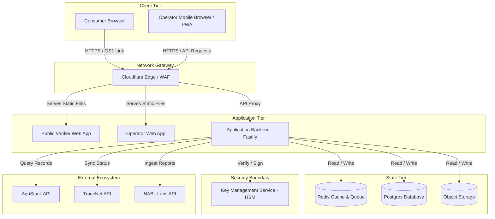
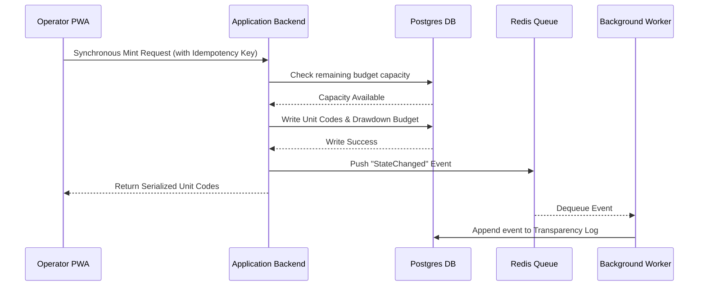
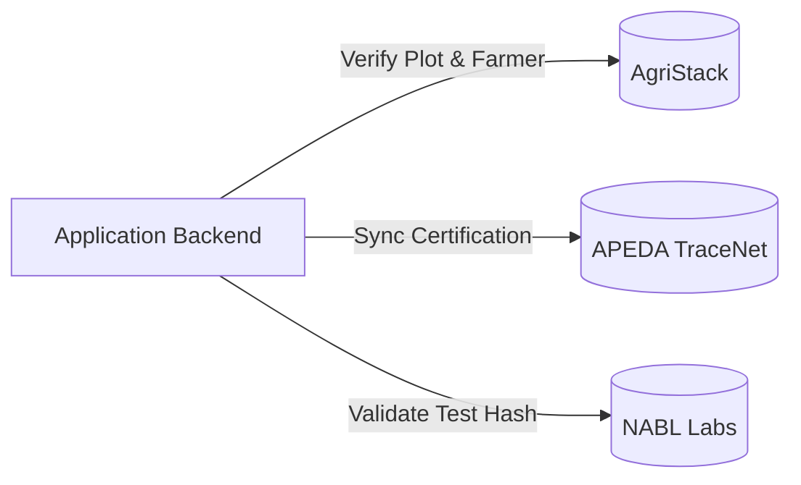

# CONTAINER_ARCHITECTURE

## Scope

This document owns:
- Runtime containers and execution processes (Fastify Application Backend, Redis, Postgres)
- Network topology (ingress routing, edge gateway layers)
- Managed storage structures (Object Storage, KMS integration models)
- Container-to-container network protocols and communication flows (TCP, HTTP)

This document intentionally does NOT define:
- Core business invariants, yield calculations, or budget rules (defined in [SYSTEM_CONTEXT.md](../system/SYSTEM_CONTEXT.md))
- Domain-driven bounded contexts and service responsibilities (defined in [SERVICE_BOUNDARIES.md](../system/SERVICE_BOUNDARIES.md))
- API endpoints, request/response data shapes, or state transitions (defined in [DATA_FLOW.md](../sequence/DATA_FLOW.md))
- Cryptographic keys, JWT sessions, RBAC rules, or encryption algorithms (defined in [SECURITY_ARCHITECTURE.md](../security/SECURITY_ARCHITECTURE.md))
- Host VM configurations, staging environment setups, or backup retention policies (defined in [DEPLOYMENT_ARCHITECTURE.md](../deployment/DEPLOYMENT_ARCHITECTURE.md))
- Specific library dependencies or software runtime configurations (defined in [TECHNOLOGY_STACK.md](../system/TECHNOLOGY_STACK.md))

## 1. Purpose

This document defines the container architecture for CapMint. It outlines how the system is decomposed into deployable logical services (containers), detailing their responsibilities, communication protocols, trust boundaries, data ownership, and failure isolation strategies.

### Relationship to SYSTEM_OVERVIEW.md
While [SYSTEM_OVERVIEW.md](../system/SYSTEM_OVERVIEW.md) maps the high-level business capabilities and domain models, this document provides the logical runtime structure of the platform. It maps those domain boundaries directly to deployable, isolated boundaries of execution.

### Architectural Definition of a "Container"
In this document, a **container** represents a standalone, independently deployable unit of software with its own process execution boundary, network interface, and resource allocation. This includes web applications, background processes, database instances, and key boundaries, regardless of whether they are hosted on virtual machines, serverless runtimes, or container orchestration platforms.

---

## 2. Architectural Philosophy

CapMint's container architecture is designed around several key design principles:

- **Strict Isolation of Privileged Operations**: Code execution boundaries must separate anonymous public verification queries from authenticated minting and administrative workflows.
- **Decoupled Read Path**: The public verification path is optimized for high availability and low latency ($<300\text{ms}$). It operates independently of the transactional write path.
- **Immutable Storage Boundaries**: Primary relational records are kept separate from the transparency log, even if sharing a physical database cluster, ensuring that log generation acts as an append-only boundary.
- **Stateless Application Servers**: Application servers remain stateless to enable rapid horizontal scaling, delegating state-synchronization to the database and caching layers.
- **Fail Closed Security**: System boundaries are designed to deny requests by default if any dependent security or cryptographic container becomes unavailable.

---

## 3. Container Landscape

The system is decomposed into the following logical containers:

| Container Name | Purpose | Primary Responsibility | Consumers | Dependencies |
|---|---|---|---|---|
| **Public Verifier Web App** | Browser-facing client interface. | Resolves GS1 Digital Link scans and displays verdict results. | Consumers, Public Users | Application Backend |
| **Operator Web App (PWA)** | Pack-house and field interface. | Captures offline field data, intake logs, and coordinates local mint requests. | Field & Pack-House Operators | Application Backend |
| **Application Backend** | Core business logic server. | Coordinates budgets, enforces limits, mints serials, and appends integrity events. | Public Verifier, Operator PWA | Cache & Queue, Primary Database, KMS, External APIs |
| **Cache & Ephemeral Store** | High-performance cache & rate-limiter. | Caches public verifications, manages rate limits, and buffers scan telemetry. | Application Backend | None |
| **Primary Database** | System of record. | Stores relational states for producers, lots, budgets, and logs. | Application Backend | None |
| **Object Storage** | Unstructured document store. | Persists lab test certificates and raw transparency anchors. | Application Backend | None |
| **Key Management Service (KMS)** | Cryptographic boundary. | Protects private signing keys and validates signatures. | Application Backend | None |

---

## 4. Container Diagram

---

## 5. Container Catalog

### 1. Public Verifier Web App (PWA)
- **Purpose**: Consumer-facing web application.
- **Responsibilities**: Serves the lightweight, mobile-responsive HTML/JS interface that parses GS1 Digital Link URIs, retrieves verdict payloads, and displays provenance.
- **Owned Business Capabilities**: Product verification, provenance visualization.
- **Inputs**: Scanned GS1 Digital Link serial parameters.
- **Outputs**: Read-only verification results.
- **Owned Data**: None (completely stateless).
- **Dependencies**: Application Backend.
- **Communication Style**: Synchronous HTTP/HTTPS.
- **Scaling Considerations**: Highly cacheable via Cloudflare CDN edge nodes.
- **Failure Impact**: Verification results are unavailable, directly impacting consumer trust.
- **Recovery Expectations**: Self-healing via edge network failover.

### 2. Operator Web App (PWA)
- **Purpose**: Operator portal for pack-house and field capture.
- **Responsibilities**: Provides secure access for registration, lot packaging, budget requests, and lab result uploads. Supports local database queuing for offline operations.
- **Owned Business Capabilities**: Field registration, lot tracking, pack-house intake, offline cache management.
- **Inputs**: User input, camera scans, NABL document uploads.
- **Outputs**: Signed operational requests, synchronization payloads.
- **Owned Data**: Local cache in browser IndexedDB (ephemeral until sync).
- **Dependencies**: Application Backend.
- **Communication Style**: Synchronous HTTPS APIs; asynchronous background queue syncing.
- **Scaling Considerations**: Minimal CPU footprint; assets served via CDN.
- **Failure Impact**: Operators cannot record yields or request minting.
- **Recovery Expectations**: Operators continue collecting data offline until backend connection recovers.

### 3. Application Backend (Fastify API)
- **Purpose**: Core application logic and execution engine.
- **Responsibilities**: Validates user requests, calculates budgets, manages code serialization, processes lifecycle transitions, evaluates authenticity risk patterns, and writes log chains.
- **Owned Business Capabilities**: Budget enforcement, identity serialization, state engine, audit log serialization.
- **Inputs**: Structured JSON payloads from client applications and external APIs.
- **Outputs**: Cryptographically signed serial outputs, verdict payloads, transaction logs.
- **Owned Data**: None directly (stateless service layers).
- **Dependencies**: Cache & Ephemeral Store, Primary Database, Object Storage, KMS, External APIs.
- **Communication Style**: HTTPS REST endpoints, internal TCP database connections.
- **Scaling Considerations**: Scale horizontally behind a load balancer based on CPU and request volume.
- **Failure Impact**: Complete platform shutdown. Minting and state transitions are disabled.
- **Recovery Expectations**: Fastify app nodes recover instantly upon restart.

### 4. Cache & Ephemeral Store (Redis)
- **Purpose**: ephemerality layer and performance buffer.
- **Responsibilities**: Manages verification result caches, handles distributed rate-limiting, buffers raw scan telemetry, and queues sync messages.
- **Owned Business Capabilities**: Rate-limiting, high-speed read optimization, scan queue management.
- **Inputs**: Ephemeral key-value writes from the Application Backend.
- **Outputs**: Cached data retrieval, queue status.
- **Owned Data**: Ephemeral verification states, lock primitives, rate limit counters.
- **Dependencies**: None.
- **Communication Style**: TCP Redis Protocol.
- **Scaling Considerations**: Clustered Redis replication for high read availability.
- **Failure Impact**: Verification latency spikes; rate-limiting is bypassed; authenticity risk calculation is delayed.
- **Recovery Expectations**: Automatically reloads from Postgres persistent state on restart.

### 5. Primary Database (Postgres)
- **Purpose**: System of record.
- **Responsibilities**: Stores relational entity data, enforces transaction boundaries, and records the append-only logs.
- **Owned Business Capabilities**: Persistent state safety, relational consistency, append-only log storage.
- **Inputs**: Relational queries and transactional commits.
- **Outputs**: Datasets, transaction statuses.
- **Owned Data**: Producer, certifier, budget, lot, unit code, lab result, scan history, and transparency log tables.
- **Dependencies**: None.
- **Communication Style**: Postgres wire protocol over TCP.
- **Scaling Considerations**: Vertical scaling (CPU/IOPS) for writes; read-replicas for scale.
- **Failure Impact**: Complete system freeze.
- **Recovery Expectations**: Transactional recovery via Write-Ahead Logs (WAL) and point-in-time recovery (PITR) backups.

### 6. Object Storage
- **Purpose**: File store.
- **Responsibilities**: Stores raw NABL PDF certificates and periodic transparency log export files.
- **Owned Business Capabilities**: Blob storage.
- **Inputs**: File uploads.
- **Outputs**: Signed file URLs.
- **Owned Data**: PDF lab files, log snapshots.
- **Dependencies**: None.
- **Communication Style**: HTTPS Object Store API.
- **Scaling Considerations**: Managed cloud service scaling.
- **Failure Impact**: Cannot view original lab test PDF files; verification verdicts remain functional but detailed provenance links fail.
- **Recovery Expectations**: High durability guarantees.

### 7. Key Management Service (KMS)
- **Purpose**: Cryptographic validation and signing boundary.
- **Responsibilities**: Secures the system private keys used to generate identity signatures and log hashes.
- **Owned Business Capabilities**: Cryptographic signature generation.
- **Inputs**: Sign requests.
- **Outputs**: Cryptographic signatures.
- **Dependencies**: None.
- **Communication Style**: Secure HTTPS API / IAM controls.
- **Scaling Considerations**: Governed by provider limits.
- **Failure Impact**: No unit codes can be minted; log hashes cannot be signed.
- **Recovery Expectations**: Fails closed immediately.

---

## 6. Communication Architecture

### Synchronous Communication Pattern
All user-facing read/write requests operate synchronously:
- **Consumer Scans**: Resolved over HTTPS via the Edge router directly to the Application Backend.
- **Minting Requests**: Operators request serialization synchronously; the backend writes to Postgres, commits, and returns unit codes before completing the request.

### Asynchronous Communication Pattern
- **Offline Sync Queue**: Operator PWAs capture registration and batch data locally, queueing them in browser IndexedDB. These are pushed asynchronously to the Application Backend when connection allows.
- **Risk Assessment**: Verification requests trigger an asynchronous fire-and-forget scan log write to Redis. A background queue worker processes these logs to evaluate multi-signal anomalies (travel speed, device fingerprints, frequency) and compute authenticity risk levels without automatic deactivation.
- **External Anchoring**: Log root publication is executed via an out-of-band asynchronous worker.

---

## 7. Data Ownership

To maintain strict domain boundaries, each container strictly owns its storage surface:

- **Primary Database (Postgres)** owns the canonical, relational data. The Application Backend is the only service permitted to read/write to the database. External systems have no database access.
- **Cache (Redis)** owns the ephemeral validation states and queue buffers. 
- **Object Storage** owns the physical binary files (such as lab reports). Database records only hold references (URI and SHA-256 hashes) to these files.
- **KMS** owns the private key material. The Application Backend never sees or exports private keys; it only submits payloads for signing.

---

## 8. External Systems

- **AgriStack**:
  - *Purpose*: Resolves producer names, identities, and plot sizes.
  - *Authority*: Source of truth for land boundaries.
  - *Interaction*: HTTPS JSON API.
  - *Failure Impact*: Blocked registration of new plots.
  - *Recovery*: Operator app allows registration cached locally as "Pending Verification."
- **APEDA TraceNet**:
  - *Purpose*: Validates organic credentials.
  - *Authority*: Source of truth for organic certification context.
  - *Interaction*: HTTPS JSON API.
  - *Failure Impact*: Cannot verify certifier credentials in real-time.
  - *Recovery*: Fall back to manual file validation signed by the certifier.
- **NABL Laboratories**:
  - *Purpose*: Ingests certified chemical residues.
  - *Authority*: Lab evidence generation.
  - *Interaction*: HTTPS webhook ingestion.
  - *Failure Impact*: Delayed evidence attachment on lots.
  - *Recovery*: Re-process webhook queues upon restoration.

---

## 9. Trust Boundaries & Security Controls

Cryptographic keys, token sessions, and edge network restrictions protect individual container nodes from unauthorized operations. For detailed zone boundaries and the authorization matrix, refer to [SECURITY_ARCHITECTURE.md](../security/SECURITY_ARCHITECTURE.md#6-trust-boundaries).

---

## 10. Container Deployment Model

Containers require secure hosting zones, CDN caches, and replica subnets to ensure high availability. For physical subnet configurations and environment setups, see [DEPLOYMENT_ARCHITECTURE.md](../deployment/DEPLOYMENT_ARCHITECTURE.md#3-deployment-model).

---

## 14. Cross-Cutting Concerns

- **Logging**: All container logs are output as structured JSON stdout (Pino/Fastify standards) for ingestion by log collectors.
- **Monitoring**: Health check endpoints (`/health`) are exposed on the Application Backend to monitor DB, Redis, and KMS connectivity.
- **Secrets Management**: Database passwords and API keys are injected via environment variables; they are never stored inside container images.
- **Localization**: Operator interfaces support localized language selection. Verification verdicts are translated based on browser user-agent.

---

## 15. Architectural Constraints

- **Append-Only History**: Log entries must be hash-chained transactionally within the database.
- **Fixed Verdict Limit**: The verifier API is prohibited from returning arbitrary strings; verdicts must match the five-word vocabulary.
- **Budget Enforcement**: Remaining capacity must be checked within a database transaction block containing a row-level lock on the budget record.

---

## 16. Assumptions

- **Cloud Platform Capabilities**: We assume the hosting infrastructure supports standard IAM role mapping and managed KMS integration.
- **Network Bandwidth**: We assume that operators have network availability at least once every 24 hours to synchronize local queues.
- **PWA Capabilities**: We assume target mobile browsers support IndexedDB storage limits up to 50MB for offline queuing.

---

## 17. Future Evolution

- **Decoupled Verification Container**: Splitting the verification API into a separate, lightweight microservice running on edge workers.
- **Distributed HSM Key Ceremony**: Migrating certifier keys from software vaults to physical hardware tokens for high-security environments.
- **Asynchronous Telemetry Pipeline**: Migrating raw scan logging from Redis queues to a dedicated event broker (e.g., Kafka or similar stream processor) as database volume grows.

---

## 18. Glossary

- **Container**: A deployable, isolated boundary of execution.
- **Fastify**: The backend web API framework.
- **KMS**: Key Management Service used for HSM-backed operations.
- **PWA**: Progressive Web Application (the Operator client).
- **Relational Store**: Persistent SQL database (Postgres).
- **Row Lock**: Database locks used to prevent race conditions on capacity calculations.
- **Verdict Payload**: The structured JSON response mapping a code query to verification state.

---

## 19. Architecture Freeze

> [!IMPORTANT]
> This section formally freezes the CapMint Container Architecture Version 1.0. Any downstream changes to containers, communication channels, or databases must follow the formal RFC process.

| Attribute | Value |
|---|---|
| **Version** | 1.0 |
| **Checkpoint** | CP-001 |
| **Status** | Approved |
| **Next Checkpoint** | CP-002 Database Design |
