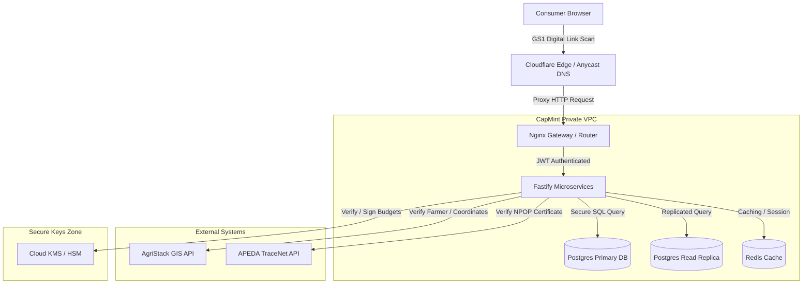

# CapMint — Architecture Index

Welcome to the central system architecture documentation index for the CapMint platform. This index maps all core architectural specifications and blueprints located in this folder.

---

## 🗺️ Architectural Blueprints Directory

| Document | Description | Focus Area |
| :--- | :--- | :--- |
| 📘 **[SYSTEM_OVERVIEW.md](file:///Users/nandyyy/project/CapMint/architecture/SYSTEM_OVERVIEW.md)** | High-level system overview. | Platform values, target users, and business mission. |
| 📕 **[SYSTEM_CONTEXT.md](file:///Users/nandyyy/project/CapMint/architecture/SYSTEM_CONTEXT.md)** | Non-negotiable rules and external boundaries. | AgriStack/TraceNet interactions and system invariants. |
| 🛡️ **[SECURITY_ARCHITECTURE.md](file:///Users/nandyyy/project/CapMint/architecture/SECURITY_ARCHITECTURE.md)** | Zero Trust zones, threat models, and RBAC rules. | KMS keys, Ed25519 signatures, STRIDE risk, and RBAC. |
| 🔗 **[DATA_FLOW.md](file:///Users/nandyyy/project/CapMint/architecture/DATA_FLOW.md)** | Event life cycles and transactional data sequences. | Minting sequences, clone detection, and verification path. |
| ⚙️ **[SERVICE_BOUNDARIES.md](file:///Users/nandyyy/project/CapMint/architecture/SERVICE_BOUNDARIES.md)** | Logical microservice scopes. | Domain owners, database writers, and modular interfaces. |
| 📦 **[MODULE_DEPENDENCIES.md](file:///Users/nandyyy/project/CapMint/architecture/MODULE_DEPENDENCIES.md)** | Import guidelines and strict packaging dependencies. | Layer constraints and dependency cycles prevention. |
| 🚢 **[DEPLOYMENT_ARCHITECTURE.md](file:///Users/nandyyy/project/CapMint/architecture/DEPLOYMENT_ARCHITECTURE.md)** | Environments, edge caching, and failover topologies. | Scaling metrics, NFR targets, CDN TTLs, and replica sets. |
| 🛠️ **[TECHNOLOGY_STACK.md](file:///Users/nandyyy/project/CapMint/architecture/TECHNOLOGY_STACK.md)** | List of core technologies and runtimes. | Fastify, Postgres, Redis, libsodium, TypeScript, and Vitest. |
| 📂 **[DIRECTORY_OWNERSHIP.md](file:///Users/nandyyy/project/CapMint/architecture/DIRECTORY_OWNERSHIP.md)** | Folder layout map and monorepo configurations. | Packages mappings, services, and tooling targets. |
| 🎨 **[L1_SYSTEM_CONTEXT.md](file:///Users/nandyyy/project/CapMint/architecture/L1_SYSTEM_CONTEXT.md)** | C4 Model Level 1 Context diagram. | External actor boundaries and system connections. |
| 🧱 **[L2_CONTAINER.md](file:///Users/nandyyy/project/CapMint/architecture/L2_CONTAINER.md)** | C4 Model Level 2 Container diagram. | Physical runtimes, database instances, and network borders. |

---

## 📐 C4 Architecture Diagrams

