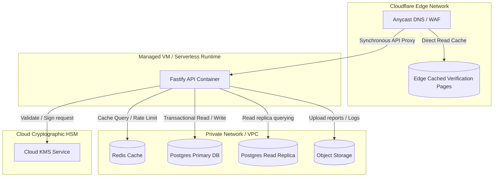

# DEPLOYMENT_ARCHITECTURE

## Scope

This document owns:
- Runtime environment divisions (Development, Staging, Pilot/Production)
- Deployment units (Static web bundles, backend containers, managed database replication)
- Networking topology (VPC subnets, DNS configurations, Cloudflare edge routing)
- Availability and disaster recovery policies (standby instances, Postgres WAL logs, backups)
- Scaling models (stateless horizontal container scaling, Redis read replica pools)
- Performance Non-Functional Requirements (NFR targets)

This document intentionally does NOT define:
- Logical container boundaries, processes, or internal APIs (defined in [CONTAINER_ARCHITECTURE.md](../C4/L2_CONTAINER.md))
- Core business invariants or land registration limits (defined in [SYSTEM_CONTEXT.md](../system/SYSTEM_CONTEXT.md))
- Domain-driven service boundaries or single-writer database tables (defined in [SERVICE_BOUNDARIES.md](../system/SERVICE_BOUNDARIES.md))
- State transitions, entity state machines, or transactional API sequences (defined in [DATA_FLOW.md](../sequence/DATA_FLOW.md))
- JWT authentication specs, RBAC validation parameters, or KMS key rotation rules (defined in [SECURITY_ARCHITECTURE.md](../security/SECURITY_ARCHITECTURE.md))
- Code repository directory layouts or workspace configurations (defined in [DIRECTORY_OWNERSHIP.md](../system/DIRECTORY_OWNERSHIP.md))

## 1. Purpose

This document defines the deployment architecture and runtime topology for the CapMint platform. It outlines how the system's software components are packaged into deployable units, where they execute, how runtime isolation is maintained, and how the platform scales and tolerates infrastructure failures.

### Structural Relationships
- **[SYSTEM_CONTEXT.md](../system/SYSTEM_CONTEXT.md)**: Defines the system mission and core invariants.
- **[CONTAINER_ARCHITECTURE.md](../C4/L2_CONTAINER.md)**: Maps the process boundaries and resource isolation.
- **[SERVICE_BOUNDARIES.md](../system/SERVICE_BOUNDARIES.md)**: Establishes logical service boundaries and component ownership.
- **[SECURITY_ARCHITECTURE.md](../security/SECURITY_ARCHITECTURE.md)**: Maps the key vaults and threat mitigations.
- **DEPLOYMENT_ARCHITECTURE.md** (This Document): Focuses specifically on the physical execution layout, environment isolation, hosting footprints, and runtime failover rules.

---

## 2. Deployment Philosophy

CapMint's deployment model is designed around three core guidelines:

- **Low-Cost Pilot Footprint**: The initial pilot (Season 0) utilizes managed databases and serverless/small virtual machine (VM) runtimes to minimize operational complexity and infrastructure overhead.
- **Decoupled Verification Edge**: The public verifier path is hosted at the CDN edge (Cloudflare) to ensure global availability and extremely low-latency reads, decoupled from the active transactional backend.
- **Fail Closed Cryptographic Boundary**: Signing keys (KMS) are isolated at the deployment level. If the secure deployment zone is breached or isolated, all minting and capacity modification capabilities immediately fail closed.

---

## 3. Deployment Model



---

## 4. Runtime Environments

### 1. Development Environment
- **Purpose**: Local integration and code testing.
- **Expected Users**: Engineers, AI Coding Agents.
- **Deployment Characteristics**: Runs locally or in sandbox setups; utilizes local mock databases and software-based signing.
- **Isolation**: Entirely local, isolated from staging and production.

### 2. Pilot / Production Environment (Season 0)
- **Purpose**: The active pilot deployment for farmers, certifiers, pack-houses, and consumers.
- **Expected Users**: Consumers, Pack-house Operators, Certifiers, Labs.
- **Deployment Characteristics**: Managed Postgres (highly available), Redis caching, Fastify hosted on small serverless/VM instances, Cloudflare edge, Cloud KMS keys.
- **Isolation**: Strictly isolated; resides within a locked private network VPC.

### 3. Staging / Testing Environment
- **Purpose**: Pre-release verification.
- **Expected Users**: QA, Product Managers.
- **Deployment Characteristics**: Configured to match the production topology, utilizing separate test databases and staging KMS keys.
- **Isolation**: Network-isolated from production; no production data is accessible.

---

## 5. Deployment Units

### 1. Static Web Client
- **Purpose**: Serves the Public Verifier and Operator PWA code.
- **Responsibilities**: Renders client browser layouts and processes client-side IndexedDB queues.
- **Dependencies**: None.
- **Runtime Assumptions**: Runs in the client browser. Served via Edge CDN.
- **Failure Impact**: Verification pages and operator portals fail to load.
- **Recovery Expectations**: Edge CDN failover to secondary static assets.

### 2. Application Backend (Fastify API Container)
- **Purpose**: Core application logic execution.
- **Responsibilities**: Enforces capacity, validates signatures, generates serial values, and processes lifecycle changes.
- **Dependencies**: Redis Cache, Primary Database, KMS, Object Storage.
- **Runtime Assumptions**: Deployed on managed VM or serverless runtimes.
- **Failure Impact**: Packaging lines halt; administrative tools become unusable.
- **Recovery Expectations**: Automatically spawns new backend instances when health checks fail.

### 3. Relational Storage Instance (Postgres)
- **Purpose**: Persistence layer.
- **Responsibilities**: Maintains relational tables and stores the append-only logs.
- **Dependencies**: None.
- **Runtime Assumptions**: Deployed on a managed relational database service.
- **Failure Impact**: Complete system shutdown.
- **Recovery Expectations**: Fails over to Standby DB replica; backups restored using WAL logs.

---

## 6. Environment Isolation

CapMint enforces environment separation:
- **No Shared Keys**: The production KMS key ring is completely distinct from staging and development key rings.
- **VPC Boundaries**: Production databases and Redis caches are deployed inside a dedicated Virtual Private Cloud (VPC), with access restricted to Fastify backend IP pools.
- **Environment Configuration**: Secrets and database credentials are injected at runtime via environment variables; hardcoded credentials in deployment scripts are prohibited.

---

## 7. Runtime Communication

- **External Client to Edge**: HTTPS (TLS 1.3).
- **Edge to Application API**: HTTPS (TLS 1.3) through a secure Cloudflare origin tunnel.
- **Application Backend to Storage**: TCP connections (TLS 1.2 encrypted).
- **Application Backend to KMS**: Secure HTTPS API requests with IAM credential checks.

---

## 8. External Dependencies

- **AgriStack API**: Integrated via secure HTTP requests. Failure blocks new plot onboarding; the local PWA caches registrations as "Pending" until restored.
- **APEDA TraceNet API**: Integrated via secure HTTP requests. Failure blocks online certifier validations; operators fall back to manual certificate uploads.
- **NABL Accredited Labs API**: Receives incoming webhook events. Failure queues reports until connection is recovered.

---

## 9. Availability Model

### Graceful Degradation
- **Cache (Redis) Offline**: The Application Backend falls back to direct database queries. Scan rate-limiting is degraded, but verification remains functional.
- **DB Write Failure**: Writes (minting, status changes) are disabled. The public verifier continues serving queries by falling back to cached results at the edge or read-replicas.
- **KMS Offline**: Minting is blocked. Verifications remain active.

---

## 10. Scalability Model

### Scale-out Targets
- **Public Verification**: Scaled horizontally by caching validation verdicts at the CDN edge. Database replica queries support cache misses.
- **Minting Services**: Fastify instances scale out based on CPU load. Database performance is maintained by using row-level locks on the `budgets` table instead of locking the entire database during capacity drawdown.

---

## 11. Security Considerations

VPC subnets, API gateway filters, and secure Cloud KMS access are managed at the infrastructure layer. For detailed cryptographic zone setups and user role permissions, see [SECURITY_ARCHITECTURE.md](../security/SECURITY_ARCHITECTURE.md).

---

## 12. Operational Considerations

- **Health Checks**: Fastify exposes `/health` to verify database, Redis, and KMS connection states.
- **Monitoring**: Integration with prometheus metrics (verification latency, minting failure rates, budget violations).
- **Logging**: JSON logging stdout is ingested by centralized logging services.

---

## 13. Failure Domains

```
[ Edge Router / CDN ]        --> Global consumer scan resolution point (Failover: Edge CDN redundant zones)
[ Fastify Application VM ]   --> API route processing (Failover: Horizontal scaling group auto-respawn)
[ Postgres DB Primary ]      --> System of record (Failover: Hot-standby DB instance)
```

---

## 13.1 Non-Functional Performance Targets

To fulfill the core invariants and ensure consumer trust, the system commits to the following performance bounds:

| Requirement / Metric | Target Threshold | Scope / Context |
|---|---|---|
| **Public Verification Latency** | `< 300ms` (p95) | Under peak loads; from edge request to verifier response page. |
| **Minting Latency** | `< 2.0 seconds` (p95) | Authenticated request to signature validation, DB commit, and serial return. |
| **System Uptime / Availability** | `99.9%` | Measured monthly; critical path is the public verifier. |
| **Offline Sync Time** | `< 30 seconds` | Time to process, sequence, and commit a backlog of 100 queued items. |

---

## 14. Deployment Constraints

- **Low Infrastructure Budget**: Season 0 pilot is restricted to low-cost managed setups (single VM + managed database).
- **Offline Operator PWA**: Operator portals must run as installable PWAs, eliminating native app store deployment dependencies.
- **Append-only Preservation**: Log structures must be write-only; postgres user permissions must deny `DELETE` and `UPDATE` on the `log_entries` table.

---

## 15. Evolution Strategy

### Stage 1 (Pilot Online Path)
- **Deployment**: Deployment of edge verifier, single Fastify VM, and Postgres database. Keys managed in Cloud KMS.

### Stage 2 (Offline-First Deployment)
- **Deployment**: Installation of Operator PWAs with IndexedDB local queues. Introduction of Redis sync queues to handle asynchronous batch submissions from the field.

---

## 16. Assumptions

- **PWA Storage Limits**: We assume mobile devices permit up to 50MB of local IndexedDB storage for offline operator queues.
- **Edge Cache Coherency**: We assume a 60-second edge TTL for public verifier results is acceptable, allowing lot revocations to propagate to consumers within one minute.

---

## 17. Glossary

- **Availability Zone**: Physically isolated data center locations.
- **Edge Network**: CDN nodes distributed globally to serve content close to users.
- **VPC**: Virtual Private Cloud (network isolation).
- **WAL**: Write-Ahead Logging for Postgres recovery.

---

## 18. Architecture Freeze

> [!IMPORTANT]
> This section formally freezes the CapMint Deployment Architecture Version 1.0. Any downstream changes to hosting models, VPC boundaries, or environment isolation rules must follow the formal RFC process.

| Attribute | Value |
|---|---|
| **Version** | 1.0 |
| **Checkpoint** | CP-001 |
| **Status** | Approved |
| **Next Checkpoint** | CP-002 Database Design |
