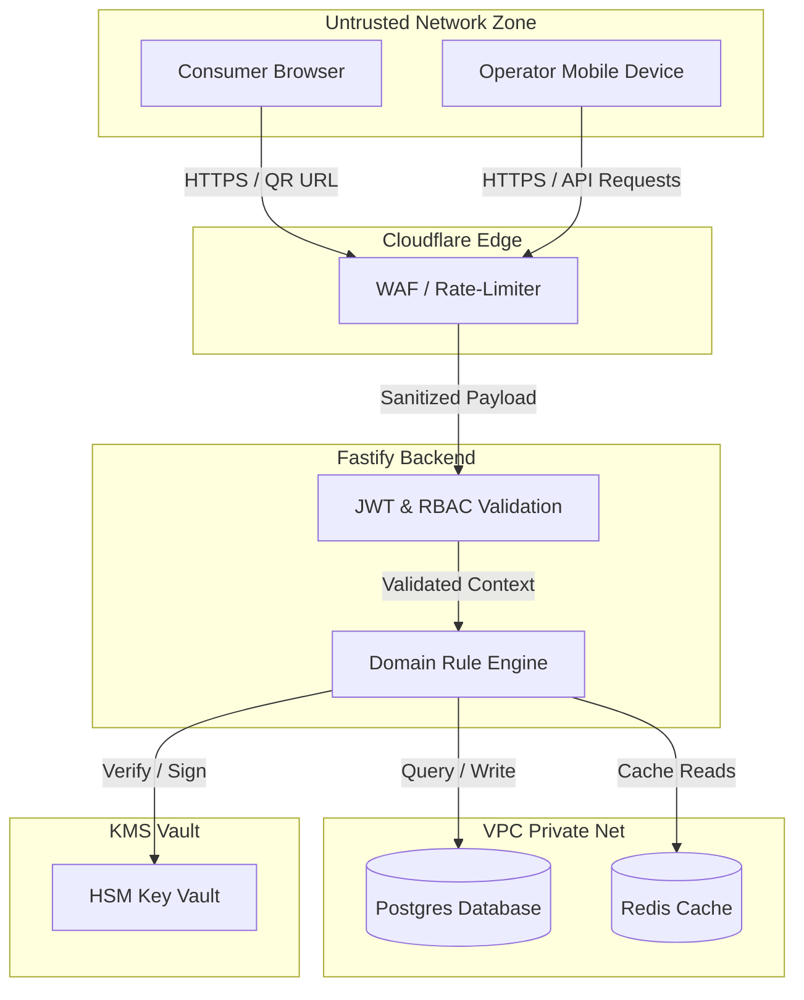
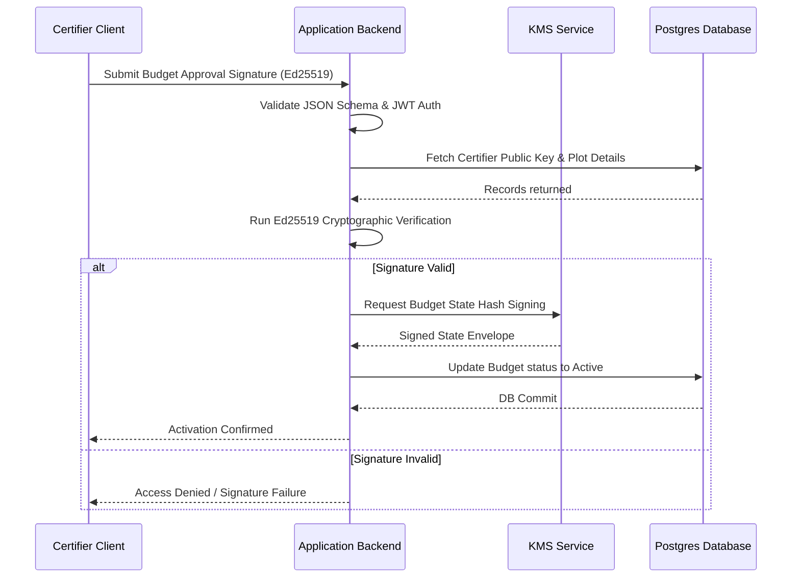

# SECURITY_ARCHITECTURE

## Scope

This document owns:
- System threat modeling (STRIDE assessment, threat scenarios)
- Zero Trust network zone maps and trust boundaries
- User Authentication (Fastify sessions, JWT authorization details)
- Role-Based Access Control (RBAC) permission matrices
- Cryptographic library choices (Ed25519, SHA-256)
- Cloud KMS key rotation boundaries and hardware specs (HSM)
- Telemetry, logging, and security monitoring alerts (Observability Suite)

This document intentionally does NOT define:
- Detailed physical container deployment setups or network VPC routing (defined in [CONTAINER_ARCHITECTURE.md](../C4/L2_CONTAINER.md) and [DEPLOYMENT_ARCHITECTURE.md](../deployment/DEPLOYMENT_ARCHITECTURE.md))
- Core business logic crop yield calculations or budget creation details (defined in [SYSTEM_CONTEXT.md](../system/SYSTEM_CONTEXT.md))
- Domain-driven service writers or logical boundaries (defined in [SERVICE_BOUNDARIES.md](../system/SERVICE_BOUNDARIES.md))
- State transitions, entity state machines, or transactional API sequences (defined in [DATA_FLOW.md](../sequence/DATA_FLOW.md))
- Source code directories or repository monorepo layouts (defined in [DIRECTORY_OWNERSHIP.md](../system/DIRECTORY_OWNERSHIP.md))

## 1. Purpose

This document defines the security architecture and threat modeling framework for CapMint. It outlines how the system maintains issuance integrity, implements zero-trust principles, secures cryptographic signatures, and protects data privacy across all operational and verification workflows.

### Structural Relationships
- **[SYSTEM_CONTEXT.md](../system/SYSTEM_CONTEXT.md)**: Establishes the foundational business mission and constraints.
- **[CONTAINER_ARCHITECTURE.md](../C4/L2_CONTAINER.md)**: Defines the process boundaries and resource isolation layers.
- **[SERVICE_BOUNDARIES.md](../system/SERVICE_BOUNDARIES.md)**: Assigns domain responsibility and authorization checks.
- **[DATA_FLOW.md](../sequence/DATA_FLOW.md)**: Maps payload movement and state validation paths.
- **SECURITY_ARCHITECTURE.md** (This Document): Focuses specifically on the system's defenses, key authority boundaries, threat mitigations, and validation requirements.

---

## 2. Security Philosophy

CapMint's security design is guided by three core philosophies:

- **Issuance Integrity Above All**: The primary function of security is to prevent the unauthorized creation of identity. Any failure in authentication, key validation, or budget enforcement must lock the system against minting.
- **Explicit Cryptographic Authority**: The registry must not be capable of creating supply independently. Every active budget requires verification of an external certifier's cryptographic signature.
- **Tamper Evidence Over Prevention**: If a compromised internal server alters historical database records, the modification must be mathematically detectable via a public hash chain anchored to independent external channels.

---

## 3. Security Objectives

- **Integrity**: Prevent unauthorized modifications to budgets, unit code states, or historical log blocks.
- **Authenticity**: Confirm that all capacity limits are approved by registered certifiers and lab evidence originates from accredited laboratories.
- **Auditability**: Maintain an append-only, tamper-evident record of all material state changes.
- **Privacy**: Expose verification provenance to consumers without leaking personally identifiable information (PII) of individual farmers.
- **Non-Repudiation**: Ensure that certifier budget approvals and lot revocations are backed by cryptographic signatures that cannot be denied.

---

## 4. Trust Model

CapMint classifies entities into distinct trust boundaries:

```
[ Untrusted Client Zone ]       --> Validate schemas, sanitize payload properties
           |
           v (TLS / WAF Boundary)
[ Semi-Trusted Operator Zone ]  --> Restrict access via JWT, enforce budget limits
           |
           v (IAM / KMS Vault Boundary)
[ Trusted Cryptographic Zone ]  --> FIPS 140-2 Level 3 HSM, immutable log chaining
```

### Trusted Actors & Systems
- **KMS / HSM**: Trusted to securely store platform keys and generate signatures.
- **Certifier Key Pairs**: The private keys owned by certifiers are trusted to represent certified organic approval.

### Semi-Trusted Actors & Systems
- **Pack-House Operators**: Authorized to transition code states and log inputs, but constrained by capacity limits.
- **Accredited Laboratory APIs**: Authorized to post test results, but bound by document hashes.

### Untrusted Actors & Systems
- **Consumer Web Browsers**: Telemetry payload properties (IP, location) are treated as untrusted.
- **Public API Traffic**: Subject to strict rate limits and input sanitization.

---

## 5. Threat Model

### 1. Unauthorized Minting (Over-Issuance)
- *Threat*: A compromised operator account attempts to generate serial codes exceeding the approved budget.
- *Mitigation*: The Budget Service transactionally locks the budget row and verifies that remaining capacity is $\ge$ requested count before authorizing serialization.

### 2. Administrative Forgery
- *Threat*: A database administrator attempts to increase a producer's budget capacity directly in the Postgres table.
- *Mitigation*: The public verifier page resolves logs from the hash chain. Any mismatch between current state and the signed log root is resolved as a `MISMATCH` verdict.

### 3. QR Code Cloning (Double Scanning)
- *Threat*: A producer prints the same QR code across thousands of conventional packages.
- *Mitigation*: The Verification Service processes scan events and delegates behavioral patterns to an independent Risk Engine. If cumulative risk anomalies (e.g., impossible travel, multiple fingerprints, scan frequency anomalies) exceed safety thresholds, the QR's authenticity risk is flagged as HIGH or CRITICAL. This alerts administrative systems for human review and explicit certifier revocation, avoiding automatic deactivation.

### 4. Certifier Signature Forgery
- *Threat*: An attacker drafts a budget and attempts to activate it by submitting a fake signature.
- *Mitigation*: The Budget Service performs Ed25519 signature validation against the certifier's public key registered in the database.

---

## 6. Trust Boundaries



---

## 7. Identity Architecture

- **Public Users (Consumers)**: Anonymous, unauthenticated clients querying the verification path.
- **Operators (Pack-house / Field)**: Authenticated using JWTs containing unique User IDs and role assignments.
- **Certifiers**: Authenticated for administrative functions via JWTs, and cryptographically verified on-chain via their Ed25519 key pairs.
- **Laboratories**: Authenticated via machine-to-machine API tokens.

---

## 8. Authentication

- **Administrative Interfaces**: Secured by Fastify sessions and JSON Web Token (JWT) verification.
- **Public Verification**: No authentication required.
- **Machine Identities (External APIs)**: Authenticated using HTTPS Client Certificates or signed API Tokens.

---

## 9. Authorization

CapMint applies a strict Role-Based Access Control (RBAC) policy:

| Role | Target Endpoint Access | Execution Boundary Constraints |
|---|---|---|
| **Consumer** | Verification query | Can verify products only. Restricted to read-only status and risk metadata. |
| **Retailer** | Verification query | Can verify products only. Accesses standard consumer-facing authenticity results. |
| **Manufacturer** | Operator portal / Minting | Can mint codes within signed capacity limits and request investigations or revocations. |
| **Certifier** | Budget signing / Revocation | Authorized to sign budgets and approve or reject revocation requests. |
| **System Administrator** | System override | Global read access; authorized for emergency administrative overrides only. Cannot bypass log chaining. |
| **Transparency Ledger** | Domain events logging | Permanent, non-destructive ledger recording every lifecycle state change, scan, investigation, and revocation approval. |

---

## 10. Cryptographic Architecture

CapMint relies on the following cryptographic algorithms:

- **Signature Algorithm**: Ed25519 (libsodium or `@noble/ed25519` standards). Used for certifier budget approvals, lot revocations, and system integrity logs.
- **Hashing Algorithm**: SHA-256. Used for computing log block hashes, verifying lab PDF file integrity, and creating database transaction records.

---

## 11. Key Management

### Key Ownership
- **Certifier Keys**: Certifiers generate and own their private keys. The public key is stored in the CapMint database.
- **System Integrity Keys**: Managed in cloud KMS (FIPS 140-2 Level 3 HSM).

### Key Rotation
- **Certifier Keys**: Rotated out-of-band following verification of certifier authority credentials.
- **KMS Keys**: Automatically rotated annually by the KMS provider.

---

## 12. Data Protection

### Encryption in Transit
- All connections across public networks are encrypted using TLS 1.3. Internal service communication uses TLS 1.2 within a private VPC.

### Encryption at Rest
- Primary databases and cache storage containers utilize AES-256 encryption-at-rest.

---

## 13. Integrity Model

To detect tampering, the Transparency Service links events in a hash-chained structure:

$$\text{BlockHash}_{n} = \text{SHA-256}(\text{BlockHash}_{n-1} \parallel \text{EventPayload}_n)$$

The resulting chain head is periodically published to external anchors. If a malicious database script alters a row in Postgres, the signature chain breaks, and future validation calls will flag a `MISMATCH` verdict.

---

## 14. Audit Architecture

CapMint records the following security-relevant events:
1. **Budget Status Transitions**: Records who drafted, approved, and activated the budget.
2. **KMS Signature Generations**: Logs all KMS requests.
3. **Lot Revocations**: Records the signature of the certifier invalidating the lot.
4. **Validation Failures**: Logs signature checks and capacity overdraw attempts.

---

## 15. Privacy Architecture

### Public Data
- Exposes product name, origin location, certified cooperative name, lab parameter pass/fail results, and verification chain validation status.

### Private Data
- Individual farmer names, exact GPS plot coordinates, cooperative financial transactions, and client IP addresses are masked.

---

## 16. Secure Data Flow

The diagram below shows the validation stages required before a budget transitions to the `Active` state.



---

## 17. Failure Philosophy

### Fail-Closed Design
- **Signature Failures**: If KMS or certifier signature verification fails, the transaction is rejected immediately.
- **Database Logs Blocked**: If the transparency log table fails to write, all related business operations fail closed.
- **Verification Cache Misses**: If Redis is offline, the verifier queries Postgres database read replicas.

---

## 18. Cross-Cutting Security Concerns

- **Secrets Management**: System credentials and database connections are injected at runtime using environment variables.
- **Input Validation**: Fastify router checks all incoming payloads against JSON schema validations.
- **Rate-Limiting**: Enforced via Cloudflare and Redis to prevent Denial of Service (DoS) attacks on verification paths.

## 18.1 Observability & Telemetry Suite

CapMint implements a comprehensive observability framework structured across four core pillars: Metrics, Logs, Traces, and Alerts.

### Metrics
We gather quantitative runtime indicators to assess performance and resource behavior:
- **Verification Latency**: Tracks duration of public scan resolution (target: p95 < 300ms).
- **Mint Latency**: Measures the time required to sign and issue serials (target: p95 < 2s).
- **Budget Violations / Blocked Requests**: Counts frequency of attempted over-budget mints.
- **Queue Size**: Tracks backup depth of offline-sync message queues (target: sync execution < 30s).
- **Failed Signatures**: Tracks verification failures for certifier signatures.
- **Active Connections & Throughput**: Tracks rate-limiting hits and edge traffic.

### Logs
Structured, machine-readable JSON logs are generated across all components:
- **Audit Logs**: Record actor, timestamp, IP, and details of administrative events.
- **Integrity Logs**: Append-only transaction records including cryptographic hashes.
- **Operational Logs**: Standard logging levels (Debug, Info, Warn, Error) for application lifecycle events.

### Traces
Distributed request tracing maps transactions across system boundaries:
- Correlation IDs are injected at Edge and passed through Fastify down to Postgres query spans.
- Track async offline synchronization operations from initial PWA queue to backend database commit.
- Profile time spent in key operations (e.g., KMS budget signing vs DB read).

### Alerts
Automatic notification rules are triggered by operational anomalies:
- **Severity 1 (Critical)**: Successive signature failures, KMS connection loss, or detection of database tamper events.
- **Severity 2 (High)**: Spikes in HIGH or CRITICAL risk evaluation events, verification latency exceeding 500ms, or Redis memory exhaustion.
- **Severity 3 (Warning)**: Queue depth exceeding threshold, budget approaching 90% depletion.

---

## 19. Security Constraints

- **No Unsigned Budgets**: Budgets cannot activate and authorize minting without verification of the certifier's cryptographic signature.
- **Unchangeable Logs**: Log entries in Postgres must remain write-only; deletion commands must be blocked at the database role level.
- **Strict Public Verdicts**: Public verifications must only return defined validity states (VERIFIED, REVOKED, EXPIRED, UNKNOWN) and independent risk scores (LOW, MEDIUM, HIGH, CRITICAL). No automated code deactivation may occur.

---

## 20. Assumptions

- **Certifier Key Security**: We assume certifiers secure their private keys. If a key is compromised, the certifier must notify the admin out-of-band to revoke their public key.
- **HSM Provider Isolation**: We assume the KMS provider prevents unauthorized access to Platform keys.

---

## 21. Future Evolution

- **Decentralized Auditing Interfaces**: Providing a public web tool that downloads the transparency log chain and validates the hashes locally.
- **Hardware Token Auth**: Migrating certifier approvals to secure hardware tokens to protect keys against phishing.

---

## 22. Glossary

- **Authentication**: Verifying the identity of a client.
- **Authorization**: Verifying the permissions of an authenticated user.
- **Ed25519**: A public-key signature system.
- **HSM**: Hardware Security Module used to protect private keys.
- **Integrity Log**: A hash-chained event record.
- **Verdict Vocabulary**: The five allowed verification results.

---

## 23. Architecture Freeze

> [!IMPORTANT]
> This section formally freezes the CapMint Security Architecture Version 1.0. Any downstream changes to cryptographic algorithms, key storage containers, or role matrices must follow the formal RFC process.

| Attribute | Value |
|---|---|
| **Version** | 1.0 |
| **Checkpoint** | CP-001 |
| **Status** | Approved |
| **Next Checkpoint** | CP-002 Database Design |
