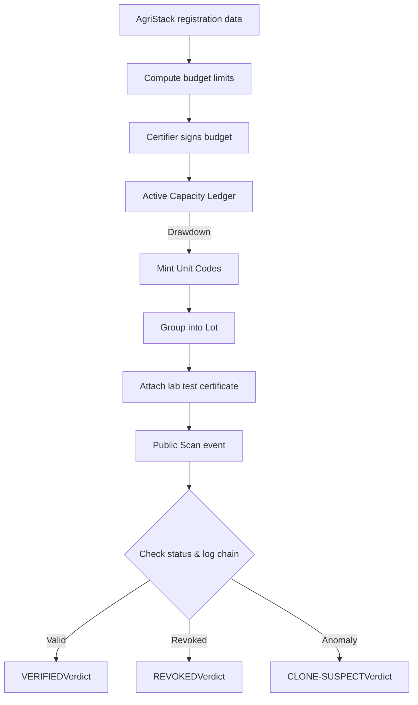
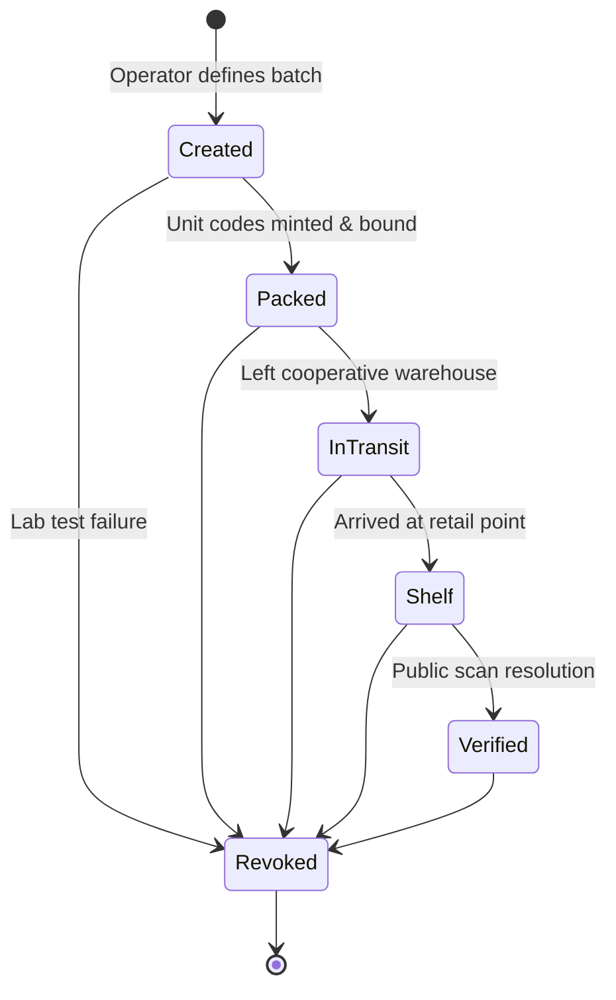
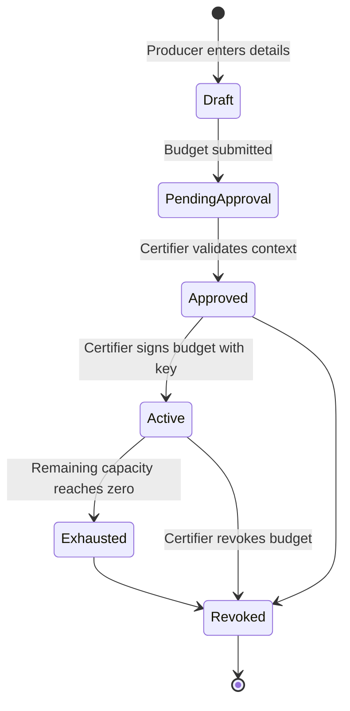
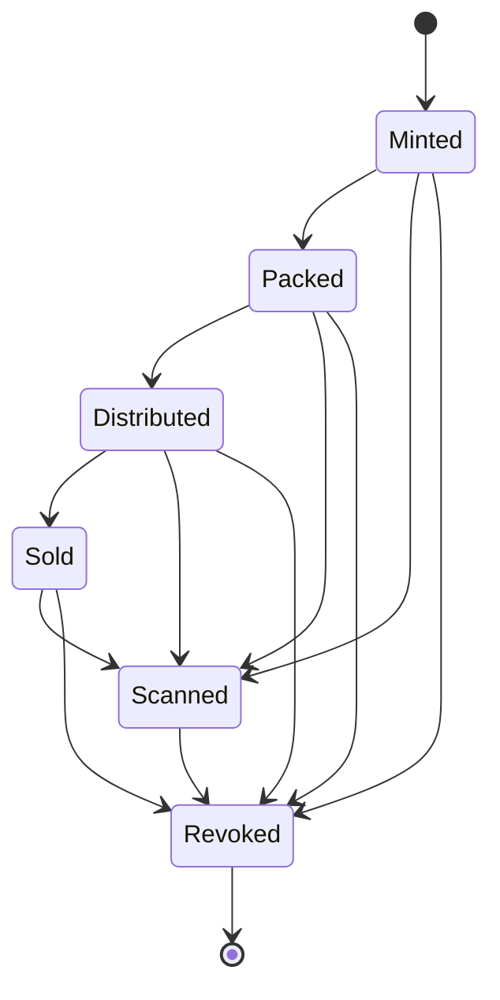
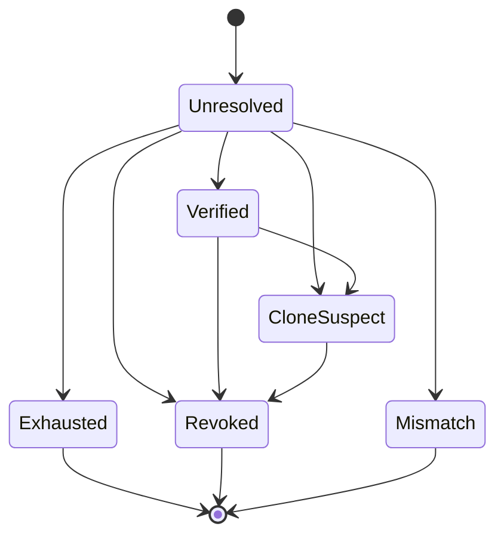
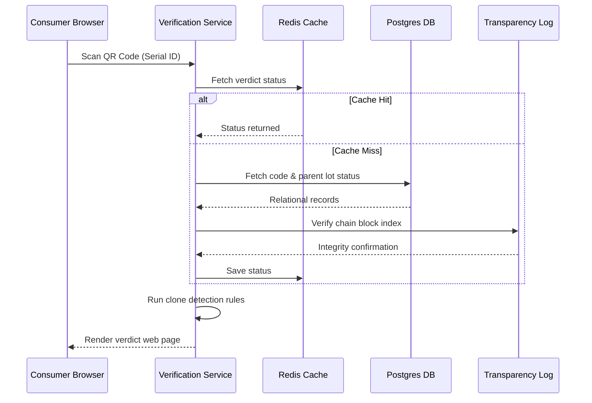

# DATA_FLOW

## Scope [DF-001]

This document owns:
- Primary business flow sequences (onboarding, creation, minting, revocation)
- Synchronous API request-response patterns (minting, verification paths)
- Asynchronous data queues and offline synchronization logic
- Data transformation pipelines and validation pipelines
- Entity state transitions (lifecycle state machines)

This document intentionally does NOT define:
- Detailed relational database schemas, check constraints, or column types (defined in [schema/schema.sql](../../database/schema/schema.sql))
- Core business invariants or conceptual trust requirements (defined in [SYSTEM_CONTEXT.md](../system/SYSTEM_CONTEXT.md#9-system-invariants-sc-010) [SC-010])
- User authentication, JWT issuance, or cryptographic curves (defined in [SECURITY_ARCHITECTURE.md](../security/SECURITY_ARCHITECTURE.md#scope-sec-001) [SEC-001])
- Deployment scaling tiers, failover topologies, or infrastructure backups (defined in [DEPLOYMENT_ARCHITECTURE.md](../deployment/DEPLOYMENT_ARCHITECTURE.md))
- Build configurations, package directories, or monorepo tools (defined in [DIRECTORY_OWNERSHIP.md](../system/DIRECTORY_OWNERSHIP.md#scope-do-001) [DO-001])

## 1. Purpose [DF-002]

This document defines the data flow and information lifecycle for CapMint. It traces how data is created, validated, signed, mutated, and resolved across the platform.

### Structural Relationships
- **[SYSTEM_CONTEXT.md](../system/SYSTEM_CONTEXT.md)**: Establishes the non-negotiable business rules and invariants.
- **[CONTAINER_ARCHITECTURE.md](../C4/L2_CONTAINER.md)**: Maps the execution containers (Fastify, Postgres, Redis, KMS).
- **[SERVICE_BOUNDARIES.md](../system/SERVICE_BOUNDARIES.md)**: Defines logical service boundaries and component ownership.
- **DATA_FLOW.md** (This Document): Connects these layers by tracing the step-by-step movement of data payloads through their lifecycles.

---

## 2. Data Flow Philosophy [DF-003]

CapMint's data handling is based on three core guidelines:

- **Verification Requires Independent Provenance**: A public verification verdict cannot rely on mutable state tables. It must be computed from a sequence of immutable events anchored to external authorities (certifiers, labs).
- **Enforced Capacity Checkpoints**: Capacity must be checked and drawn down within transactional boundaries. No speculative or unchecked code generation is permitted.
- **Immediate Cryptographic Binding**: Once generated, a unit code serial is immediately bound to its producer, lot, and budget context. This link is permanent and cannot be modified.

---

## 3. High-Level Information Lifecycle [DF-004]

The diagram below traces information from its origin in AgriStack registration, through budget approvals, minting, packaging, and public scans, to its final verification outcome.



---

## 4. Primary Business Flows [DF-005]

### 1. Producer & Plot Onboarding
- **Actors**: Producer, Identity Service, AgriStack API.
- **Inputs**: Producer ID, land parcel identifiers.
- **Validation**: Query AgriStack to verify farmer identity and plot size; ensure plot does not contain overlapping coordinates.
- **Transformations**: Resolves raw land records into a registered **Plot** and **Producer Profile** within the CapMint Registry.
- **Outputs**: Confirmed registry entries.
- **State Changes**: Producer state set to `Active`; Plot status set to `Verified`.
- **Failure Conditions**: AgriStack API timeout or mismatched farmer ID.
- **Recovery Expectations**: Flag record as `Pending Validation` for manual admin review.

### 2. Budget Creation & Approval
- **Actors**: Certifier, Budget Service.
- **Inputs**: Registered plot limits, yield formulas, requested unit capacity.
- **Validation**: Ensure requested capacity is within computed yield bounds for the plot's crop type.
- **Transformations**: Generates a **Draft Budget** and locks the parameters for certifier signature.
- **Outputs**: Unsigned budget envelope.
- **State Changes**: Budget: `Draft` $\rightarrow$ `PendingApproval`.
- **Failure Conditions**: Capacity request exceeds maximum theoretical crop yield.
- **Recovery Expectations**: Reject submission with explicit boundary validation message.

### 3. Budget Activation (Signing)
- **Actors**: Certifier, KMS/Signing Service.
- **Inputs**: Budget ID, Certifier Ed25519 cryptographic signature.
- **Validation**: Verify signature matches the certifier's public key registered in Identity.
- **Transformations**: Cryptographically binds the signature and certifier key details to the active budget.
- **Outputs**: **Active Budget** status confirmation.
- **State Changes**: Budget: `PendingApproval` $\rightarrow$ `Active`.
- **Failure Conditions**: Invalid signature, key mismatch, or expired certifier credentials.
- **Recovery Expectations**: Lock budget status; block all related minting requests.

### 4. Code Minting & Drawdown
- **Actors**: Pack-House Operator, Minting Service, Budget Service.
- **Inputs**: Active Budget ID, Lot ID, requested count of unit codes.
- **Validation**: Check that requested count $\le$ remaining budget capacity.
- **Transformations**: 
  1. Transactional drawdown: Subtract requested count from remaining capacity.
  2. Code Generation: Request unique serial signatures from KMS.
  3. Format GS1 Digital Link URIs.
- **Outputs**: Serialized unit codes.
- **State Changes**: Budget remaining capacity reduced; Unit Codes state set to `Minted`.
- **Failure Conditions**: Insufficient remaining capacity; database row lock timeout.
- **Recovery Expectations**: Transaction rollback; reject request with `Exhausted` error.

### 5. Lab Evidence Association
- **Actors**: Lab API, Evidence Service, Minting Service.
- **Inputs**: Test certificate JSON metadata, PDF file stream, Lot ID.
- **Validation**: Calculate PDF file SHA-256 hash; verify lab credentials.
- **Transformations**: Binds the lab test metadata and document hash to the target **Lot**.
- **Outputs**: Lot provenance metadata updates.
- **State Changes**: Lot state moves to `Verified` (if passing parameters) or triggers revocation sequence (if failing parameters).
- **Failure Conditions**: PDF file hash mismatch; target Lot ID does not exist.
- **Recovery Expectations**: Reject file upload; log security alert.

### 6. Public Verification
- **Actors**: Consumer Browser, Verification Service, Clone Detection.
- **Inputs**: Serial identifier, GTIN, scan metadata (IP, user-agent, geohash).
- **Validation**: Verify serial format, check registration status in database.
- **Transformations**: Computes verdict based on unit state, log chain status, and scan history.
- **Outputs**: Verdict payload.
- **State Changes**: Scan logged in telemetry cache.
- **Failure Conditions**: Invalid format or missing serial records.
- **Recovery Expectations**: Return `MISMATCH` verdict.

### 7. Lot Revocation
- **Actors**: Certifier, Minting Service, Verification Service.
- **Inputs**: Lot ID, Revocation signature.
- **Validation**: Confirm certifier signature and lot relationship.
- **Transformations**: Cascades revocation state across all child units.
- **Outputs**: Log entry indicating lot status modification.
- **State Changes**: Lot state set to `Revoked`; all child unit codes immediately resolve to `REVOKED`.
- **Failure Conditions**: Missing signature; lot already revoked.
- **Recovery Expectations**: Fail closed.

### 8. Clone Detection
- **Actors**: Verification Service, Cache/Redis, Analytics Worker.
- **Inputs**: Current scan event parameters, historical scan event logs for the serial.
- **Outputs**: Anomaly detection alerts.
- **State Changes**: Target unit code flagged as `CLONE-SUSPECT` if spatial/temporal checks are breached.
- **Failure Conditions**: Redis telemetry cache loss.
- **Recovery Expectations**: Query scan database replica.

### 9. Offline Synchronization
- **Actors**: Operator PWA, Sync queue, Application Backend.
- **Inputs**: Local database event batch payload.
- **Validation**: Verify batch size limits, token signatures, and idempotency keys.
- **Transformations**: Processes queued actions in sequential transactional blocks.
- **Outputs**: Batch commit results.
- **State Changes**: Local events committed to database; remaining budget drawn down.
- **Failure Conditions**: Duplicate transaction attempt; conflicts with updated budget limits.
- **Recovery Expectations**: Safe skip of already-committed events via idempotency keys; reject conflicting transactions and flag to operator.

---

## 5. Information Producers [DF-006]

| Producer | Data Created | Authority | Validation Method |
|---|---|---|---|
| **AgriStack** | Farmer records, plots, crops. | High | Inherent coordinate checks. |
| **Certifier** | Signed budgets, revocation requests. | High | Cryptographic signature validation. |
| **NABL Lab** | Chemical analysis, report file hashes. | High | PDF SHA-256 hash checks. |
| **Operator** | Intakes, lot definitions, sync batches. | Medium | User authentication, schema checks. |
| **Consumer Browser** | Scan telemetry (IP, timestamps). | Low | Rate limits, format checks. |

---

## 6. Information Consumers [DF-007]

- **Consumer Browser**: Reads verdict and provenance metadata to display authenticity confirmation.
- **Auditors / Regulators**: Read transparency logs, budget allocations, and lab records for compliance reviews.
- **Pack-House Operators**: Read remaining budget limits to plan packaging runs.
- **Public Anchor Channel**: Reads log roots to lock block chain history.

---

## 7. Data Transformation [DF-008]

Data progresses through validation levels:

```
[ Raw Operator Input ] 
       | (Schema & Authentication Checks)
       v
[ Validated Record ] 
       | (Certifier Cryptographic Signature Validation)
       v
[ Trusted Capacity / State ] 
       | (Hash Chain Event Appended)
       v
[ Immutable Log Block ] 
       | (PII Masking & Verifier Resolution)
       v
[ Public Verdict Page ]
```

---

## 8. Trust Transitions & Privacy Boundaries [DF-009]

Data transitions across security boundaries undergo cryptographic validation, validation filters, and privacy masking. For detailed security policies, RBAC validation rules, and PII masking, see [SECURITY_ARCHITECTURE.md](../security/SECURITY_ARCHITECTURE.md#scope-sec-001) [SEC-001].

---

## 9. State Transition Flow [DF-010]

### Lot Lifecycle State Machine


### Budget Lifecycle State Machine


### Unit Lifecycle State Machine


### Verification Result Lifecycle


---

## 10. Data Ownership Flow [DF-011]

Write and update privileges are locked to exactly one service owner per database table. For service mappings and logical boundaries, see [SERVICE_BOUNDARIES.md](../system/SERVICE_BOUNDARIES.md#6-data-ownership).

---

## 11. Validation Pipeline [DF-012]

```
[ Client Ingress ] ---> Validate schema rules (Fastify router JSON schema)
                         |
                         v
[ Domain Engine ]   ---> Validate business invariants (Budget capacity check)
                         |
                         v
[ Security Layer ]  ---> Validate signatures (Ed25519 key validation)
                         |
                         v
[ DB Transaction ]  ---> Validate unique constraints (Row locks, serial checks)
                         |
                         v
[ Logging Worker ]  ---> Validate chain continuity (Compute next SHA-256 block hash)
```

---

## 12. Audit Flow [DF-013]

CapMint requires that all events are auditable:
1. **Event Trigger**: A state change occurs (e.g., `BudgetActivated`).
2. **Payload Hash**: The system hashes the event payload with the timestamp and author metadata.
3. **Chain Binding**: The payload hash is combined with the hash of the preceding log block.
4. **Anchor Write**: The new block is written to the append-only `log_entries` table. Deletion is blocked at the Postgres role level.

---

## 13. Public Verification Flow [DF-014]



---

## 14. Failure & Performance Scenarios [DF-015]

Data flows must degrade gracefully or fail closed when runtime execution limits or capacity constraints are breached. For performance Non-Functional Requirements (NFRs) and disaster recovery, see [DEPLOYMENT_ARCHITECTURE.md](../deployment/DEPLOYMENT_ARCHITECTURE.md#10-scalability-model).

---

## 15. Operational Constraints [DF-016]

Logical components are constrained by transaction rules and security policies. For system-wide architectural constraints, refer to [SYSTEM_CONTEXT.md](../system/SYSTEM_CONTEXT.md#9-system-invariants-sc-010) [SC-010].

---

## 16. Cross-Cutting Concerns [DF-017]

- **Consistent Reads**: Verification results utilize read-through caching in Redis to prevent database latency spikes.
- **Retention Rules**: Raw scan telemetry is pruned from the Redis queue after clone evaluation. Summarized metrics are retained long-term in Postgres for auditing.
- **Observability**: Metric emission hooks publish telemetry to Prometheus/CloudWatch. Security violation events generate high-severity alerts. For logging and security telemetry details, refer to [SECURITY_ARCHITECTURE.md](../security/SECURITY_ARCHITECTURE.md#18-cross-cutting-security-concerns-sec-019) [SEC-019]. For runtime and configuration variables, refer to [TECHNOLOGY_STACK.md](../system/TECHNOLOGY_STACK.md#scope-ts-001) [TS-001]. **Scan telemetry** logging runs asynchronously, decoupling verification execution from telemetry writes.

---

## 17. Scalability Considerations [DF-018]

As scale increases, data pipelines decouple using event streams:
1. **Verification reads** are offloaded to edge CDN nodes, preventing database load.
2. **Scan telemetry** logging runs asynchronously, decoupling verification execution from telemetry writes.

---

## 18. Architectural Constraints [DF-019]

- **Single Writer Constraint**: Direct database updates are restricted to the domain owner service.
- **Tamper Evidence**: Deletion commands on log tables trigger immediate system alerts and fail-closed state locks.

---

## 19. Assumptions [DF-020]

- **AgriStack Payload Formats**: We assume AgriStack returns standard JSON structures.
- **Operator Synchronization Frequency**: We assume operators initiate synchronization runs daily.

---

## 20. Future Evolution [DF-021]

- **Webhook-Driven Evidentiary Pipes**: Shifting from operator-driven manual uploads of lab certificates to direct, automated API hooks from NABL labs.
- **Decoupled Verification Pipelines**: Running verifications directly on CDN edge workers using distributed key-value data stores.

---

## 21. Glossary [DF-022]

- **Data Ownership**: Rules defining which service writes to an entity.
- **Draft Budget**: An unapproved, unsigned budget.
- **Idempotency Key**: Unique client token used to prevent duplicate request processing.
- **Information Lifecycle**: The sequence of stages data passes through within the system.
- **Verification Verdict**: The calculated status returned for a public QR scan.

---

## 22. Architecture Freeze [DF-023]

> [!IMPORTANT]
> This section formally freezes the CapMint Data Flow Version 1.0. Any downstream changes to data lifecycles, business flows, validation pipelines, or privacy boundaries must follow the formal RFC process.

| Attribute | Value |
|---|---|
| **Version** | 1.0 |
| **Checkpoint** | CP-001 |
| **Status** | Approved |
| **Next Checkpoint** | CP-002 Database Design |
