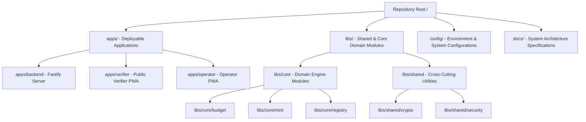

# DIRECTORY_OWNERSHIP

## Scope [DO-001]

This document owns:
- Physical directory structure layout (`apps/`, `libs/`, `config/`, `docs/`)
- Directory catalog and specific folder responsibilities
- Team ownership boundaries over folder groups
- Code organization guidelines (allowed vs. forbidden content per folder)
- Monorepo package packaging guidelines and directory layout evolution

This document intentionally does NOT define:
- Logical import rules and compile-time code dependencies (defined in [MODULE_DEPENDENCIES.md](./MODULE_DEPENDENCIES.md))
- Container runtime models, network VPC subnets, or database servers (defined in [CONTAINER_ARCHITECTURE.md](../C4/L2_CONTAINER.md) and [DEPLOYMENT_ARCHITECTURE.md](../deployment/DEPLOYMENT_ARCHITECTURE.md))
- Core business invariants or crop yield rules (defined in [SYSTEM_CONTEXT.md](./SYSTEM_CONTEXT.md))
- API endpoint specifications or database schema structures (defined in [DATA_FLOW.md](../sequence/DATA_FLOW.md))
- Cryptographic signature execution, RBAC authorization, or secrets management (defined in [SECURITY_ARCHITECTURE.md](../security/SECURITY_ARCHITECTURE.md))
- Programming languages or technical framework choices (defined in [TECHNOLOGY_STACK.md](./TECHNOLOGY_STACK.md))

## 1. Purpose [DO-002]

This document defines the physical repository layout and folder ownership rules for the CapMint codebase. It specifies the architectural purpose of each directory, maps logical domains to physical paths, and enforces import boundaries to maintain clean layering and modularity as the codebase grows.

### Structural Relationships
- **[SYSTEM_CONTEXT.md](./SYSTEM_CONTEXT.md)**: Establishes core system requirements and rules.
- **[SERVICE_BOUNDARIES.md](./SERVICE_BOUNDARIES.md)**: Defines logical services.
- **[MODULE_DEPENDENCIES.md](./MODULE_DEPENDENCIES.md)**: Defines dependency rules.
- **DIRECTORY_OWNERSHIP.md** (This Document): Maps these logical service boundaries and dependency rules directly to physical folders and import paths in the repository.

---

## 2. Repository Philosophy [DO-003]

CapMint's codebase structure is organized around the following rules:

- **Domain-first Layout**: Directories correspond to logical business domains (Identity, Budget, Minting) rather than framework layers (controllers, models, services), keeping related logic together.
- **Clear Layer Separation**: A strict boundary separates deployable entry points (applications), core business logic (domain modules), and cross-cutting infrastructure libraries.
- **Explicit Domain Ownership**: Every directory has a single logical owner and clear boundaries defining what files are allowed inside it.

---

## 3. Repository Organization [DO-004]

---

## 4. Directory Catalog [DO-005]

The table below catalogs CapMint's directory organization:

| Directory | Purpose | Owns | Does NOT Own | Dependencies |
|---|---|---|---|---|
| `apps/` | Deployable runtime boundaries. | Router setups, controllers, PWA entry points, static client pages. | Core business rules, database query logic. | `libs/`, `config/` |
| `libs/core/` | Core business domain logic. | Relational domain logic, capacity calculators, log event generation. | HTTP router bindings, database connection configurations. | `libs/shared/` |
| `libs/shared/` | Cross-cutting shared modules. | Cryptographic signature libraries, security validation primitives. | Business domain rules, application routers. | None |
| `config/` | Environment & infrastructure configurations. | Schema declarations, environment variables, database configuration files. | Application logic. | None |
| `docs/` | System architecture documentation. | SYSTEM_CONTEXT, Service Boundaries, API specifications, ADR records. | Application code. | None |

---

## 5. Directory Responsibilities [DO-006]

### 1. `apps/` (Application Entry Points)
- **Mission**: Serves as the execution boundary for deployable units.
- **Responsibilities**: Sets up HTTP routing, initializes database connections, registers middleware, and serves static files for PWAs.
- **Allowed Files**: Fastify controller routes, static HTML/CSS client assets, PWA service workers.
- **Forbidden Files**: Capacity drawdown math, Ed25519 signature verification code.
- **Consumers**: Infrastructure execution environments.
- **Dependencies**: `libs/core/`, `libs/shared/`, `config/`.
- **Architectural Role**: Integrates independent domain modules into a runnable container.

### 2. `libs/core/` (Domain Engine Modules)
- **Mission**: Encapsulates core business domains.
- **Responsibilities**: Enforces budget limits, generates unique serials, updates lot states, and formats log payloads.
- **Allowed Files**: Domain services, capacity calculators, event generators.
- **Forbidden Files**: HTTP handler functions, database connection setups, third-party API configurations.
- **Consumers**: `apps/`.
- **Dependencies**: `libs/shared/`.
- **Architectural Role**: Enforces the platform's core invariants.

### 3. `libs/shared/` (Cross-Cutting Shared Modules)
- **Mission**: Provides core utilities across all applications and libraries.
- **Responsibilities**: Executes signature validation (Ed25519) and calculates SHA-256 hashes.
- **Allowed Files**: Helper utilities, cryptographic wrappers.
- **Forbidden Files**: Business logic, database queries.
- **Consumers**: `libs/core/`, `apps/`.
- **Dependencies**: None.
- **Architectural Role**: Reusable cross-cutting utility layer.

---

## 6. Ownership Rules [DO-007]

### Core Domain Logic
- Core business rules (e.g., drawdown calculations) reside strictly in `libs/core/budget/`. Only the Budget Team owns changes to this directory.

### Infrastructure & Routers
- Fastify routing and HTTP responses reside in `apps/backend/`. Only the Platform Team owns modifications to this folder.

### Documentation & Specifications
- All architectural specs and system diagrams are stored in `docs/`. Any documentation updates require formal review from the Architecture Team.

---

## 7. Dependency Rules [DO-008]

1. **Unidirectional Import Flow**: Code inside `libs/core/` can import utilities from `libs/shared/`, but `libs/shared/` is prohibited from importing anything from `libs/core/` or `apps/`.
2. **Abstract Interface Boundaries**: Applications in `apps/` must call domain modules using exported public interfaces. Directly importing private helper files from `libs/core/` subfolders is forbidden.
3. **Circular Import Ban**: Cyclic imports between sibling packages in `libs/core/` (e.g., budget importing mint, and mint importing budget) are strictly prohibited.

---

## 8. Cross-Cutting Directories [DO-009]

- `libs/shared/crypto/`: Provides the Ed25519 cryptography wrappers used by Budget and Minting.
- `libs/shared/security/`: Implements JWT parsing and role verification helpers.
- `config/`: Contains runtime configuration schema files.

---

## 9. Documentation Ownership [DO-010]

Technical documentation is structured in `docs/` as follows:
- **Architecture Specifications**: High-level design files (SYSTEM_CONTEXT, SERVICE_BOUNDARIES) are stored at the root of `docs/`.
- **Architectural Decision Records (ADRs)**: Stored in `docs/adr/`.
- **API Contracts**: REST API schemas and webhook contract payloads are stored in `docs/api/`.

---

## 10. Configuration Ownership [DO-011]

- **VPC & Database Credentials**: Referenced in `config/` via schema definition files (e.g., `config/env.schema.ts`).
- **Build Configurations**: Build tool files are isolated in application root directories (e.g., `apps/backend/tsconfig.json`).

---

## 11. Shared Code Rules [DO-012]

- Code is eligible to migrate to `libs/shared/` only when it is entirely generic (e.g., cryptographic helper libraries, date parsers).
- Business validations (such as verifying a plot coordinate matches AgriStack) must not reside in shared libraries; they belong in their respective domain modules inside `libs/core/`.

---

## 12. Architectural Constraints [DO-013]

- **Single Folder Ownership**: Code related to a single business capability must be contained within its designated domain directory.
- **Immutable Documentation**: Changes to documentation inside `docs/` must follow the formal RFC review process.

---

## 13. Repository Evolution [DO-014]

As the codebase expands:
1. Sibling folders in `libs/core/` can transition to independent npm workspaces.
2. Applications in `apps/` can migrate to separate git repositories without requiring modifications to the core business logic in `libs/core/`.

---

## 14. Anti-Patterns [DO-015]

Contributors must actively avoid the following folder organization mistakes:

- **The "Dumping Ground"**: Creating folders like `libs/shared/utils/` to store miscellaneous business logic helpers.
- **Cross-Layer Leakage**: Storing raw HTTP error messages or Fastify reply primitives inside `libs/core/`.
- **Infrastructure Code in Domain Folders**: Placing raw Postgres connection pools or Redis connection instances inside `libs/core/budget/`.

---

## 15. Assumptions [DO-016]

- **Single Code Repository**: We assume a monorepo setup utilizing a single workspace configuration for Season 0.

---

## 16. Glossary [DO-017]

- **Apps**: Executable application entry points.
- **Domain Directory**: A module directory enclosing logic for a single Bounded Context.
- **Libs**: Shared package libraries.
- **Monorepo**: A single git repository containing multiple applications and libraries.
- **Shared Code**: Generic code shared across multiple modules.

---

## 17. Architecture Freeze [DO-018]

> [!IMPORTANT]
> This section formally freezes the CapMint Directory Ownership Version 1.0. Any downstream changes to folder structures, allowed import maps, or packaging layouts must follow the formal RFC process.

| Attribute | Value |
|---|---|
| **Version** | 1.0 |
| **Checkpoint** | CP-001 |
| **Status** | Approved |
| **Next Checkpoint** | CP-002 Database Design |
