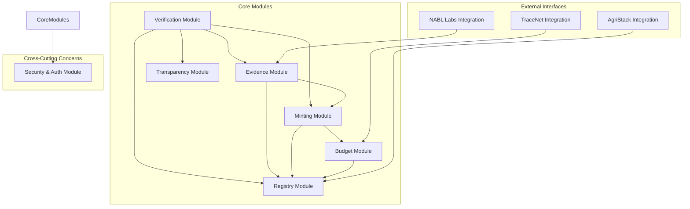
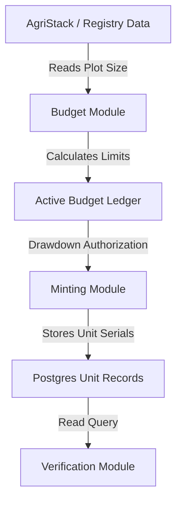

# MODULE_DEPENDENCIES

## Scope [MD-001]

This document owns:
- Logical modules definition and responsibilities (Registry, Budget, Minting, etc.)
- Allowed and forbidden library dependency constraints
- Directed Acyclic Graph (DAG) logic validation rules
- Cross-module request delegation and data flows
- Module decoupling strategy (ports and adapters, event routing)

This document intentionally does NOT define:
- Concrete service execution ports, system variables, or framework packages (defined in [TECHNOLOGY_STACK.md](./TECHNOLOGY_STACK.md#scope-ts-001) [TS-001])
- Physical folder directories, monorepo packages, or file path permissions (defined in [DIRECTORY_OWNERSHIP.md](./DIRECTORY_OWNERSHIP.md#scope-do-001) [DO-001])
- Cryptographic signature execution, RBAC authorization, or secrets management (defined in [SECURITY_ARCHITECTURE.md](../security/SECURITY_ARCHITECTURE.md#scope-sec-001) [SEC-001])
- Core business invariants or crop yield rules (defined in [SYSTEM_CONTEXT.md](./SYSTEM_CONTEXT.md))
- API router endpoint specifications or database schema structures (defined in [DATA_FLOW.md](../sequence/DATA_FLOW.md))

## 1. Purpose [MD-002]

This document defines the module dependency architecture and layering constraints for the CapMint platform. It maps the structural relationships between logical modules, outlines allowed communication paths, and establishes compile-time and runtime dependency constraints.

### Structural Relationships
- **[SYSTEM_CONTEXT.md](./SYSTEM_CONTEXT.md)**: Establishes the system's business mission and invariants.
- **[CONTAINER_ARCHITECTURE.md](../C4/L2_CONTAINER.md)**: Defines deployable runtime boundaries (processes, databases).
- **[SERVICE_BOUNDARIES.md](./SERVICE_BOUNDARIES.md)**: Maps logical domains and single writer responsibilities.
- **MODULE_DEPENDENCIES.md** (This Document): Focuses specifically on code-level relationships, establishing dependency rules to prevent circular references and maintain modular architecture as the codebase scales.

---

## 2. Dependency Philosophy [MD-003]

CapMint's module organization is guided by the following principles:

- **Strict Directed Acyclic Graph (DAG)**: The module dependency structure must represent a directed acyclic graph. Circular dependencies between modules are strictly prohibited.
- **Dependency Inversion on External Systems**: Core business logic modules must never import external API client structures directly. Instead, they interact via abstract ports, isolating core code from changes in external APIs (AgriStack, TraceNet).
- **Unidirectional Layering Flow**: Downstream consumer-facing modules (Verification) depend on upstream transaction systems (Minting, Registry). Upstream components are entirely unaware of downstream verifiers.

---

## 3. Module Overview [MD-004]

CapMint is composed of the following logical modules:

| Module Name | Responsibility | Owns (Entities) | Consumers (Imported By) |
|---|---|---|---|
| **Registry** | Maintains core records for actors and locations. | Producers, Plots, Certifier records. | Budget, Minting, Verification, Evidence |
| **Budget** | Calculates yield capacity and enforces limits. | Budgets, Drawdowns. | Minting |
| **Minting** | Generates unique serials and packs lots. | Unit Codes, Lots. | Verification, Evidence |
| **Evidence** | Manages testing records and report hashes. | Lab Results. | Verification |
| **Verification** | Resolves public scan queries. | Scan Events. | Client UI |
| **Transparency** | Builds hash chains and publishes roots. | Log Entries. | Budget, Minting, Evidence, Verification |

---

## 4. Dependency Graph [MD-005]

---

## 5. Module Responsibilities [MD-006]

### 1. Registry Module
- **Purpose**: Canonical registry of actors and land contexts.
- **Responsibilities**: Validates producer profiles, plot sizes, and certifier credentials against source datasets.
- **Owned Business Rules**: A producer cannot own overlapping plots.
- **Owned State**: Actor registration details.
- **Owned Concepts**: Producer, Plot, Certifier, Cooperative.
- **Consumers**: Budget, Minting, Evidence, Verification.
- **Dependencies**: Security Module (cross-cutting).
- **Failure Impact**: No new plots can be onboarded; verifications can continue using cached records.
- **Recovery Expectations**: Local cache queries.

### 2. Budget Module
- **Purpose**: Governs capacity allocations.
- **Responsibilities**: Computes max theoretical yield limits, validates certifier budget signatures, and tracks drawdown status.
- **Owned Business Rules**: Budget approval requires a validated Ed25519 signature.
- **Owned State**: Approved Capacity, Drawdown counters.
- **Owned Concepts**: Capacity Budget, Yield Limits.
- **Consumers**: Minting.
- **Dependencies**: Registry, Security.
- **Failure Impact**: Fails closed. Minting is blocked.
- **Recovery Expectations**: Re-sync allocation states from Postgres logs.

### 3. Minting Module
- **Purpose**: Packaging and serialization execution.
- **Responsibilities**: Generates unique, non-sequential serials and packs lots.
- **Owned Business Rules**: Minting must occur within an active budget's remaining capacity limits.
- **Owned State**: Unit status (Minted, Packed, Distributed, Sold, Revoked).
- **Owned Concepts**: Unit Code, Lot.
- **Consumers**: Verification, Evidence.
- **Dependencies**: Budget, Registry, Security, Transparency.
- **Failure Impact**: Packaging lines halt.
- **Recovery Expectations**: Resubmit requests using client-side idempotency keys.

### 4. Verification Module
- **Purpose**: Resolves public verification queries.
- **Responsibilities**: Evaluates serial validity, checks lot and lab results, and computes verdicts.
- **Owned Business Rules**: Public verifications return exactly one of the five fixed verdicts.
- **Owned State**: Scan telemetry.
- **Owned Concepts**: Scan Event, Verdict.
- **Consumers**: Public Web Interface.
- **Dependencies**: Registry, Minting, Evidence, Transparency, Security.
- **Failure Impact**: Public verification returns errors.
- **Recovery Expectations**: Edge CDN failover to cached read replicas.

---

## 6. Dependency Matrix [MD-007]

| Module | Imports / Depends On | Why | Direction | Allowed? |
|---|---|---|---|---|
| **Registry** | None | Core root entity module. | N/A | Yes |
| **Budget** | Registry | Requires plot sizes and certifier credentials to compute capacity. | Upstream $\rightarrow$ Downstream | Yes |
| **Minting** | Budget, Registry | Requires active capacity limits and producer profiles to mint serials. | Upstream $\rightarrow$ Downstream | Yes |
| **Evidence** | Minting, Registry | Binds lab reports to specific lots and producer context. | Upstream $\rightarrow$ Downstream | Yes |
| **Verification** | Minting, Evidence, Registry, Transparency | Resolves and validates code status, lab results, and log chain roots. | Upstream $\rightarrow$ Downstream | Yes |
| **Transparency** | None | Ingests events asynchronously; no core imports. | Downstream Observer | Yes |

---

## 7. Allowed Dependencies [MD-008]

- **Budget $\rightarrow$ Registry**: Allowed because budget limits require plot bounds defined in the Registry.
- **Minting $\rightarrow$ Budget**: Allowed because the Minting module must transactionally request capacity drawdown from the Budget module before issuing serials.
- **Verification $\rightarrow$ Minting / Evidence / Registry**: Allowed because resolving a public verdict requires loading code state, lab reports, and cooperative data.

---

## 8. Forbidden Dependencies [MD-009]

- **Verification $\rightarrow$ *Any Write Operation***: The Verification module is strictly read-only for core business logic; it is prohibited from mutating budget capacities, lot structures, or actor records.
- **Registry $\rightarrow$ Minting**: The Registry is a core leaf node; it must never import or depend on unit serialization logic.
- **Clone Detection $\rightarrow$ Registry**: Clone Detection must operate solely on scan events and cache states; it is prohibited from modifying core registries.

---

## 9. Dependency Ownership [MD-010]

In cross-module calls:
- **Drawdown Requests**: The **Minting Module** initiates the call, but the **Budget Module** owns the validation rules and enforces capacity constraints.
- **Revocation Propagation**: The **Evidence Module** triggers revocation upon receiving failing lab reports, but the **Minting Module** executes the cascade to child unit codes.

---

## 10. Data Dependency Flow [MD-011]

1. **Origin**: Plot coordinates are written to the Registry.
2. **Capacity Allocation**: The Budget Module reads plot bounds to set capacity constraints.
3. **Serialization**: The Minting Module references budget limits to authorize code serialization.
4. **Resolution**: The Verification Module queries unit records to resolve consumer requests.

---

## 11. Cross-Cutting Modules [MD-012]

- **Security & Authorization Module**: Provides token parsing and role checking. Every application module depends on this service to authenticate operator requests.
- **Audit & Logging Module**: Buffers events for the Transparency log. All mutating operations depend on this module to ensure log records are written.

---

## 12. External Dependencies [MD-013]

- **AgriStack**:
  - *Purpose*: Returns plot details.
  - *Failure Impact*: Blocked registrations; existing budgets are unaffected.
- **APEDA TraceNet**:
  - *Purpose*: Confirms organic credentials.
  - *Failure Impact*: Delayed budget approvals.
- **NABL Laboratories**:
  - *Purpose*: Feeds lab reports to Evidence.
  - *Failure Impact*: Lots remain unverified; public page flags pending results.

---

## 13. Dependency Constraints [MD-014]

- **DAG Enforced**: Compile-time check tools block circular imports.
- **Single Source of Truth**: The Postgres database is the canonical source of truth; modules must not maintain duplicate relational records in cache.

---

## 14. Failure Propagation [MD-015]

- If the **Budget Module** fails, the **Minting Module** is blocked, but the **Verification Module** remains operational.
- If the **Verification Module** fails, public consumer resolution is disrupted, but pack-houses can continue packaging and shipping lots.

---

## 15. Evolution Strategy [MD-016]

To ensure clean decomposition as the codebase grows:
- **Abstract Interfaces**: Module-to-module communication must use abstract interfaces rather than concrete class imports.
- **Shared Event Bus**: Cross-module dependencies can be replaced with asynchronous events (e.g., `BudgetExhausted` notifications) to decouple services.

---

## 16. Assumptions [MD-017]

- **TypeScript Version Compatibility**: We assume all modules compile under a unified TypeScript compiler configuration.

---

## 17. Glossary [MD-018]

- **Directed Acyclic Graph (DAG)**: A directed graph with no cycles.
- **Loose Coupling**: Minimizing dependencies between modules.
- **Modular Monolith**: An architectural style where code is organized in cohesive, independent modules within a single codebase.
- **Single Source of Truth**: A database design where each piece of data is stored in exactly one canonical location.

---

## 18. Architecture Freeze [MD-019]

> [!IMPORTANT]
> This section formally freezes the CapMint Module Dependencies Version 1.0. Any downstream changes to module definitions, allowed/forbidden dependency maps, or layering rules must follow the formal RFC process.

| Attribute | Value |
|---|---|
| **Version** | 1.0 |
| **Checkpoint** | CP-001 |
| **Status** | Approved |
| **Next Checkpoint** | CP-002 Database Design |
