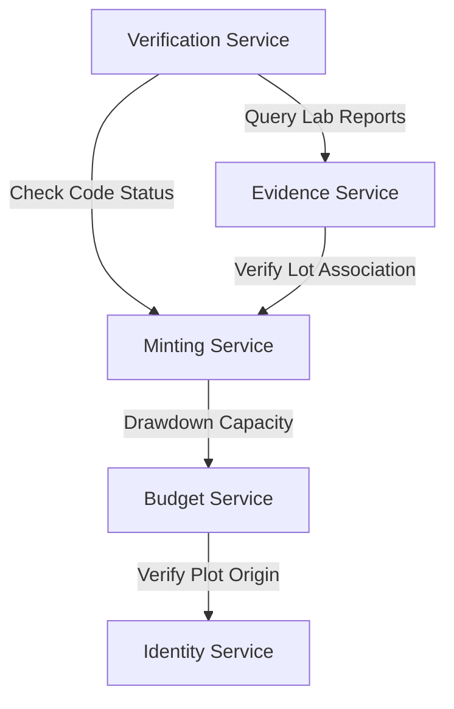

# SERVICE_BOUNDARIES

## Scope

This document owns:
- Service boundaries and Bounded Context divisions (Identity, Budget, Minting, etc.)
- Service catalog and logical responsibilities
- Single-Writer database rules for system entities
- Allowed and forbidden cross-service logic dependency boundaries
- Service interactions and lifecycle ownership matrix

This document intentionally does NOT define:
- Physical runtime containers, host subnets, or database servers (defined in [CONTAINER_ARCHITECTURE.md](../C4/L2_CONTAINER.md))
- Core business invariants or real-world crop yield rules (defined in [SYSTEM_CONTEXT.md](./SYSTEM_CONTEXT.md))
- API endpoint parameters, state machine transitions, or database schemas (defined in [DATA_FLOW.md](../sequence/DATA_FLOW.md))
- Key management, user sessions, RBAC rules, or encryption algorithms (defined in [SECURITY_ARCHITECTURE.md](../security/SECURITY_ARCHITECTURE.md))
- Deployment scaling models, backup strategies, or environment VM sizes (defined in [DEPLOYMENT_ARCHITECTURE.md](../deployment/DEPLOYMENT_ARCHITECTURE.md))
- Repository folders or code import pathways (defined in [DIRECTORY_OWNERSHIP.md](./DIRECTORY_OWNERSHIP.md) and [MODULE_DEPENDENCIES.md](./MODULE_DEPENDENCIES.md))

## 1. Purpose

This document defines the service boundaries and domain division for the CapMint platform. It outlines the responsibilities of each logical service, maps business capabilities to exact boundaries of ownership, and defines dependency rules to prevent architectural erosion.

### Structural Relationships
- **[SYSTEM_CONTEXT.md](./SYSTEM_CONTEXT.md)**: Outlines the high-level business model, mission, and invariants of the CapMint system.
- **[CONTAINER_ARCHITECTURE.md](../C4/L2_CONTAINER.md)**: Details the runtime deployment layers (Fastify, Redis, Postgres, KMS).
- **SERVICE_BOUNDARIES.md** (This Document): Defines how CapMint's logic is split into cohesive domains to enforce single ownership, clean boundaries, and loose coupling, preventing the creation of a "God Service."

---

## 2. Architectural Philosophy

CapMint enforces a decoupled, domain-driven structure guided by the following principles:

- **Strict Single Writer Principle**: Exactly one service acts as the writer and validator for any given entity. Other services must query this service for validation or updates.
- **Unidirectional Dependency Flow**: Core domains (Identity, Budget) must never depend on downstream orchestration services (Verification, Telemetry).
- **Command-Query Separation**: Systems that mutate state (Budget drawdown, Lot Revocation) are logically separated from high-throughput verification queries.
- **Boundary Invariance**: No business rule validation can span across multiple service boundaries without explicit service-to-service contracts. Shared mutable database state is prohibited.

---

## 3. Bounded Contexts

CapMint is composed of the following Bounded Contexts (domains):

```
            [ Identity Context ] (Producers, Plots, Certifiers)
                     |
                     v
             [ Budget Context ] (Capacities, Drawdowns)
                     |
                     v
              [ Mint Context ] (Serials, GS1 Digital Link)
                     |
                     v
          [ Verification Context ] (Public Scan Resolutions)
```

### 1. Identity Context
- **Purpose**: Establishes the real-world actors, plots of land, and certifier credentials.
- **Business Responsibility**: Mapping producer profiles to AgriStack records and registering authorized certifier keys.
- **Owned Concepts**: Producer, Certifier, Plot, Hive Cluster.
- **Dependencies**: None.

### 2. Budget Context
- **Purpose**: Manages the capacity ceiling for claim-bearing identities.
- **Business Responsibility**: Calculating safe yield bounds, validating certifier signatures on budget drafts, and tracking capacity drawdown.
- **Owned Concepts**: Budget, Yield Assumption, Allocation Capacity.
- **Dependencies**: Identity Context.

### 3. Mint Context
- **Purpose**: Materializes physical identity.
- **Business Responsibility**: Generating unique serial numbers, assembling GS1 Digital Link URIs, and ensuring no codes are issued without remaining budget capacity.
- **Owned Concepts**: Unit Code, Lot, GS1 digital format.
- **Dependencies**: Budget Context, Identity Context.

### 4. Verification Context
- **Purpose**: Evaluates public legitimacy queries.
- **Business Responsibility**: Ingesting scan attempts, running clone detection checks, and returning verdicts.
- **Owned Concepts**: Scan Event, Verification Verdict, Telemetry Profile.
- **Dependencies**: Mint Context, Evidence Context.

### 5. Evidence Context
- **Purpose**: Attaches verification proof to lots.
- **Business Responsibility**: Ingesting lab results and document hashes from NABL labs.
- **Owned Concepts**: Lab Result, PDF Document Hash, Parameter Limit.
- **Dependencies**: Mint Context (to bind results to Lots).

### 6. Transparency Context
- **Purpose**: Guarantees system auditability.
- **Business Responsibility**: Recording state changes in a hash-chained sequence and publishing roots to external anchor channels.
- **Owned Concepts**: Log Entry, Genesis Block, Block Root, External Anchor.
- **Dependencies**: None (acts as a downstream observer of all events).

---

## 4. Service Catalog

| Service Name | Primary Responsibility | Owns (Writes) | Does NOT Own | Dependencies |
|---|---|---|---|---|
| **Identity Service** | Manages profiles and agricultural origins. | Producers, Plots, Certifier profiles. | Budgets, Lot assignments. | AgriStack API |
| **Budget Service** | Computes and restricts capacity limits. | Budgets, capacity ledgers, drawdown records. | Serial numbers, unit codes. | Identity Service |
| **Minting Service** | Issues unit-level identity codes. | Lots, unit codes, GS1 Digital Link generation. | Budget approvals, lab reports. | Budget Service, Identity Service |
| **Evidence Service** | Manages lab test certificates. | Lab result records, PDF file references. | Lot lifecycles, unit codes. | Minting Service, NABL Labs API |
| **Verification Service** | Resolves public scan queries. | Scan events, verdict outputs. | Original budget ledgers. | Minting Service, Evidence Service |
| **Transparency Service** | Builds append-only ledger history. | Log entries, hash chain blocks. | Active business logic. | None (events ingested) |

---

## 5. Service Responsibilities

### 1. Budget Service
- **Mission**: Ensure CapMint never over-issues capacity.
- **Business Capabilities**: Capacity enforcement, certifier signature verification, drawdown ledger management.
- **Inputs**: AgriStack plot context, certifier signatures, drawdown request values.
- **Outputs**: Signed budget activation state, allocation success/failure tokens.
- **Owned Business Rules**: Approved capacity limits; no active minting without valid certifier key signature.
- **Owned Lifecycle**: Draft $\rightarrow$ Pending $\rightarrow$ Active $\rightarrow$ Exhausted / Revoked.
- **Owned Invariants**: $\sum \text{Minted} \le \text{Approved Capacity}$.
- **Failure Impact**: Fails closed. Minting is blocked.
- **Recovery Expectations**: Re-sync drawdown ledgers from Postgres transactions.

### 2. Minting Service
- **Mission**: Bind unique physical packages to standard-compliant serial identifiers.
- **Business Capabilities**: Serials generation, GS1 Digital Link formatting, lot creation.
- **Inputs**: Lot request, GTIN, Product ID.
- **Outputs**: Unique serial numbers, GS1 DL URIs.
- **Owned Business Rules**: One serial per physical package; unique non-sequential key generation.
- **Owned Lifecycle**: Created $\rightarrow$ Packed $\rightarrow$ Distributed $\rightarrow$ Sold / Revoked.
- **Owned Invariants**: Serial identifiers must be globally unique.
- **Failure Impact**: Pack-houses cannot package or ship units.
- **Recovery Expectations**: Clients retry using idempotency keys.

### 3. Verification Service
- **Mission**: Resolve public scans instantly and reliably.
- **Business Capabilities**: Public scan resolution, verdict computation, clone suspect analytics.
- **Inputs**: Serial code, scan telemetry (timestamp, geohash, client metadata).
- **Outputs**: Verdict response (`VERIFIED`, `REVOKED`, `EXHAUSTED`, `CLONE-SUSPECT`, `MISMATCH`).
- **Owned Business Rules**: Verdict calculation based on code status, scan counts, and spatial-temporal clone analysis.
- **Owned Lifecycle**: Scan recording, verdict generation.
- **Owned Invariants**: Verdict output is constrained to the five-word vocabulary.
- **Failure Impact**: Public trust experiences degradation.
- **Recovery Expectations**: Automatic fallback to edge read-replicas.

---

## 6. Data Ownership

To prevent data corruption and preserve service boundaries, data ownership is restricted as follows:

```
[ Identity Service ]   === writes ===>  [ Producer & Plot Tables ]
[ Budget Service ]     === writes ===>  [ Budget Capacity Ledgers ]
[ Minting Service ]    === writes ===>  [ Lot & Unit Code Tables ]
[ Verification Service] === writes ===>  [ Scan Event Tables ]
```

- **Identity Service** exclusively writes to **Producer** and **Plot** records. All other services read these tables via read-only queries.
- **Budget Service** exclusively updates the **Budget** capacity counters and drawdown ledger records.
- **Minting Service** exclusively writes to the **Lot** and **Unit Code** tables.
- **Evidence Service** exclusively owns **Lab Result** records.
- **Verification Service** exclusively writes to **Scan Event** logs.
- **Transparency Service** exclusively writes to the **Log Entry** tables.

---

## 7. Business Rule Ownership

| Business Rule | Owning Service | Invariant Enforced |
|---|---|---|
| **Budget Ceiling** | Budget Service | Drawdown requests cannot exceed remaining budget capacity. |
| **Budget Activation** | Budget Service | A budget cannot be active without a valid certifier signature. |
| **Serial Generation** | Minting Service | Serial codes must be non-sequential and unique. |
| **Lot Revocation Cascade** | Minting Service | Revoking a lot cascades the status to all child units. |
| **Verdict Calculation** | Verification Service | Public scans resolve to exactly one of the five fixed verdicts. |
| **Log Chain Hashing** | Transparency Service | Every event must chain to the SHA-256 hash of the previous log block. |

---

## 8. Communication Boundaries



### Allowed Dependencies
- **Minting Service** $\rightarrow$ **Budget Service** (to check and draw down capacity).
- **Verification Service** $\rightarrow$ **Minting Service** (to check code validity and status).
- **Verification Service** $\rightarrow$ **Evidence Service** (to fetch lab evidence for provenance displays).

### Forbidden Dependencies
- **Identity Service** $\rightarrow$ **Budget Service** (Identity must remain completely independent of capacity allocation).
- **Budget Service** $\rightarrow$ **Minting Service** (Budget has no knowledge of how codes are generated or structured).
- **Transparency Service** $\rightarrow$ *Any other service* (Transparency is write-only and must never block operational domains).

---

## 9. Trust Boundaries & Security Controls

Cryptographic keys, token sessions, and edge network restrictions protect individual service nodes from unauthorized operations. For detailed zone boundaries and the authorization matrix, refer to [SECURITY_ARCHITECTURE.md](../security/SECURITY_ARCHITECTURE.md#6-trust-boundaries).

---

## 10. Operational Failure & Scalability Models

Services require high-availability scaling and error-handling capabilities to degrade gracefully under system failures. For details on deployment availability, stateless VM scaling, and backup setups, see [DEPLOYMENT_ARCHITECTURE.md](../deployment/DEPLOYMENT_ARCHITECTURE.md#10-scalability-model).

---

## 11. Lifecycle & Entity Ownership

Entity states and transitions are managed systematically across system components. The canonical list of business invariants is owned by [SYSTEM_CONTEXT.md](./SYSTEM_CONTEXT.md#9-system-invariants).

---

## 12. Logical Dependency Rules

1. **Circular Dependency Ban**: Under no circumstances may two services depend on each other. If Service A queries Service B, Service B must never call Service A. (For repository import validation rules, see [MODULE_DEPENDENCIES.md](./MODULE_DEPENDENCIES.md#13-dependency-constraints)).
2. **Single Writer Principle**: Only the designated owner of an entity is permitted to execute `INSERT`, `UPDATE`, or `DELETE` operations on that entity.
3. **No Direct cross-DB Access**: Services must communicate using API endpoints or event interfaces; direct querying of other services' databases is strictly forbidden.

---

## 17. Evolution Strategy

If the codebase expands to the point where team division is necessary, the domains can split into independent microservices:
1. **Verification** can migrate to CDN edge workers (e.g., Cloudflare Workers).
2. **Minting** can be deployed directly within pack-house local networks to improve performance during WAN drops.
3. **Identity** can be refactored into a read-only local replica synced with AgriStack.

---

## 18. Anti-Patterns

Contributors must actively avoid the following implementation mistakes:

- **The "God" Registry Service**: Adding budget logic or serial generation rules into the database identity schema.
- **Shared Database Transactions**: Executing a transaction that updates both a budget counter and a producer profile simultaneously.
- **Direct Cross-Service database Joins**: Writing database queries that perform a `JOIN` between the `budgets` table and the `unit_codes` table. Services must resolve relationships via APIs.
- **Bypassing the KMS**: Generating serial signatures inside the Fastify process memory rather than calling the KMS container.

---

## 19. Glossary

- **Bounded Context**: A logical boundary within which a specific domain model applies.
- **Circular Dependency**: A structural flaw where two or more services depend on each other.
- **God Service**: A service that accumulates excessive responsibilities, violating separation of concerns.
- **Single Writer**: The design rule restricting write access to exactly one owner service.
- **Verdict Output**: The constrained five-word response returned by the verification path.

---

## 20. Architecture Freeze

> [!IMPORTANT]
> This section formally freezes the CapMint Service Boundaries Version 1.0. Any downstream changes to service boundaries, data ownership tables, or dependency rules must follow the formal RFC process.

| Attribute | Value |
|---|---|
| **Version** | 1.0 |
| **Checkpoint** | CP-001 |
| **Status** | Approved |
| **Next Checkpoint** | CP-002 Database Design |
