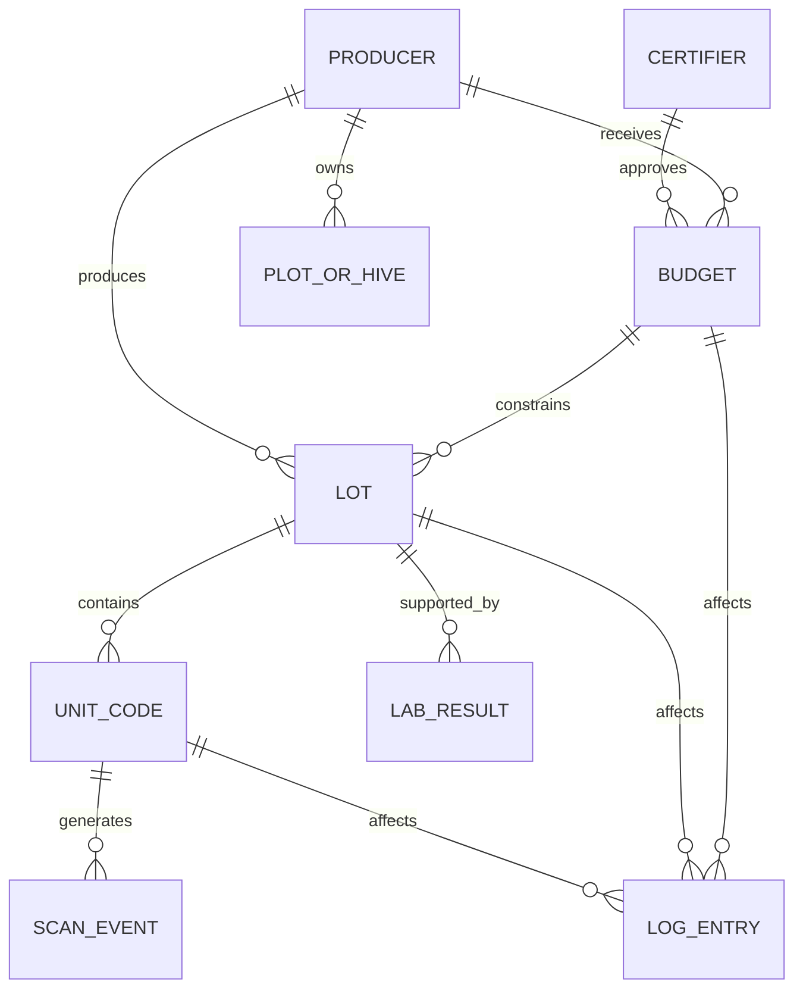

# SYSTEM_CONTEXT

## Scope

This document owns:
- System Mission and Vision (Why CapMint exists and success criteria)
- Real-world Business and Operational Problems (Trust Gap, Over-issuance, and Connectivity)
- Product and Trust Philosophies (Core beliefs, design, engineering, and operational values)
- Core Business Concepts (Certifier, Producer, Plot, Budget, Lot, Unit Code, Lab Result, Scan, Log Entry)
- Business Invariants (No over-issuance, signed budgets, unique identity, cascades, fixed verdict vocabulary, append-only logs)
- External Ecosystem and System Boundaries (AgriStack, TraceNet, NABL Labs, GS1 Digital Link, Out-of-Scope limits)

This document intentionally does NOT define:
- Deployment topology, hosting platforms, backup plans, or physical network routing (defined in [DEPLOYMENT_ARCHITECTURE.md](../deployment/DEPLOYMENT_ARCHITECTURE.md))
- Container runtime components such as Fastify parameters, Redis configurations, or Postgres indexing (defined in [CONTAINER_ARCHITECTURE.md](../C4/L2_CONTAINER.md))
- Detailed service-level boundaries, domain ownership contexts, or single-writer logic (defined in [SERVICE_BOUNDARIES.md](./SERVICE_BOUNDARIES.md))
- Code-level directory layout or monorepo import structures (defined in [DIRECTORY_OWNERSHIP.md](./DIRECTORY_OWNERSHIP.md) and [MODULE_DEPENDENCIES.md](./MODULE_DEPENDENCIES.md))
- User authentication mechanisms, JWT tokens, RBAC permissions, or KMS hardware specs (defined in [SECURITY_ARCHITECTURE.md](../security/SECURITY_ARCHITECTURE.md))

## 1. System Mission

CapMint exists to establish a secure, unit-level origin-claim registry for premium and organic agricultural products. Its primary purpose is to prevent the over-issuance of claim-bearing product identities by enforcing cryptographically signed production budgets before physical identities can be minted.

### The Problem
In the premium food supply chain, organic, fair-trade, and geographic claims command significant market premiums. However, these claims are trivial to print, easy to copy, and highly difficult for buyers and consumers to verify at the point of sale. Existing certification systems (such as physical NPOP/TraceNet papers) operate at the farm or cooperative level, creating a structural visibility gap between cooperative certification and the individual retail packages sold to consumers. This gap allows bad actors to purchase a small, certified organic crop and mix it with cheaper, conventional crops while using the same organic credentials to label conventional units—a practice known as over-issuance.

### Existing System Limitations
- **AgriStack & Government Registries**: Maintain land parcels and farmer identities but do not track package-level logistics or commercial packaging.
- **TraceNet & Certification Workflows**: Record organic certifications but lack the resolution to associate a certificate with a specific, unit-level barcode.
- **Traditional ERP & Traceability Logs**: Operated as closed, mutable databases. Administrators or warehouse managers can alter records retroactively to cover inventory discrepancies, eliminating public auditability.
- **Public Blockchains**: Introduce high transaction costs (gas fees), slow latency, key-management complexity for non-technical field operators, and privacy leaks of sensitive farm ownership data.

### Success Criteria
A successful deployment of CapMint enforces a strict capacity ceiling on issued identity codes. Success looks like:
1. Every physical retail package carries a unique, non-reproducible GS1 Digital Link QR code.
2. The total number of minted unit codes matches the certifier-approved agricultural budget.
3. Consumers, auditors, and regulators can resolve any QR scan to a narrow, high-confidence verdict in under 300 milliseconds.
4. Any historical mutation of states is publicly discoverable via an append-only, hash-chained transparency log.

---

## 2. Product Philosophy

### Core Beliefs
- **Calculated Integrity**: Integrity cannot be self-declared. It must be computed from source constraints, verified by external authority, and enforced at the boundary of issuance.
- **Durable Transparency**: Public trust is earned through verifiable, append-only records. History must be immutable to internal administrators and external actors alike.

### Design Philosophy
- **Frictionless Verification**: Consumers should not be forced to install a native application to verify a product. A standard smartphone camera scanning a QR code must resolve verification immediately in a web browser.
- **Operational Reality**: Field and pack-house environments have highly variable connectivity, dusty or wet conditions, and non-technical staff. Interfaces must support offline-first local queueing with deferred synchronization.

### Engineering Philosophy
- **Boring Technology**: The core system prioritizes high-confidence, readable, and simple architectures (TypeScript, Fastify, Postgres, Redis) over complex or experimental frameworks. Correctness is prioritized over coding speed.
- **Modular Boundaries**: Domain contexts (Identity, Budget, Minting, Verification, Evidence, Transparency) are kept strictly separate to permit clean horizontal scaling and future subsystem decomposition.

### Trust Philosophy
- **Co-Signed Authority**: CapMint does not trust its own registry to create product supply unilaterally. A budget must be explicitly co-signed by an authorized certifier before identity codes are generated.
- **Verify, Then Restrict**: All inputs from clients, devices, and manual entries are untrusted. However, the verifier must gracefully degrade during service failures rather than showing false alarms.

### Operational Philosophy
- **Coexistence**: CapMint is a thin verification layer. It does not replace national certifiers, testing laboratories, or ERP workflows; it aggregates their outputs and translates them into an un-cloneable public claim.

---

## 3. System Identity

### What the System Is
CapMint is an append-only integrity registry, capacity enforcer, and public verifier. It acts as a gatekeeper that ensures the physical volume of organic-labeled units entering the market does not exceed the certified capacity of the source farms. It is a security boundary that binds agricultural evidence, laboratory outcomes, and certifier authorizations to unique, serialized GS1 Digital Link identifiers.

### What the System Is Not
- **Not a Farm Management ERP**: It does not track labor, payroll, daily crop progress, or logistics details.
- **Not a Certification Body**: It does not make organic certification decisions; it registers and enforces decisions made by certifiers.
- **Not a Payment Platform**: It does not process payments, commercial quotes, or marketplace transactions.
- **Not a Blockchain**: It is a centralized database coupled with a public, hash-chained transparency log and periodic external anchoring.
- **Not a Replacement for TraceNet**: It relies on TraceNet and AgriStack data as external sources of authority.

---

## 4. Core Problem

```
[ Farm Production Yield ]  ---> Bounded by AgriStack land data & Certifier limits
           |
           v
[ Co-Signed Budget Capacity ] ---> Enforced by CapMint (Supply Ceiling)
           |
           v
[ Serialization & Minting ] ---> 1 Serial = 1 Physical Unit (GS1 Digital Link)
           |
           v
[ Public Consumer Scan ]   ---> Verified verdict mapped to NABL Lab evidence
```

The core challenge is the **Trust Gap** at the consumer level. The system must address four distinct problems:

### 1. The Business Problem (Over-Issuance Fraud)
Organic food products command a premium of 30% to over 100% compared to conventional crops. Because organic and conventional grains, honey, or produce look identical, producers can easily sell conventional crops under organic packaging. By copying a valid organic certificate across multiple batches, the total supply of organic units in the market can vastly exceed the actual organic farm yield.

### 2. The Operational Problem (Intermittent Connectivity)
Harvest and packing operations occur in remote rural regions, agricultural cooperative warehouses, or pack-houses. Internet connectivity in these locations is frequently unstable. If the minting and budget enforcement mechanism requires a real-time, synchronous connection for every single item packed, the system will block operations, causing adoption failure.

### 3. The Trust Problem (Fragmented Evidence)
Lab analysis certificates (NABL reports) and organic certificates are stored in disconnected silos. Consumers cannot verify if a specific package in their hands actually correlates to a passing pesticide test or a valid farm certification.

### 4. The Integrity Problem (Administrative Compromise)
If the system database is standard and mutable, a rogue administrator or compromised server credential could alter past issuance limits or delete logs to mask budget breaches. The system must prove its own history is untampered.

---

## 5. System Boundaries

### Internal Responsibilities
CapMint maintains strict ownership over the following capabilities:
- **Registry Records**: Managing the canonical state of producers, certifiers, plots, budgets, lots, unit codes, lab results, and scans.
- **Budget Enforcement**: Tracking approved, reserved, packed, and remaining capacity, and blocking code issuance when the remaining budget is zero.
- **Signature Verification**: Validating the cryptographic signatures of certifiers before activating budgets.
- **Unit Code Serialization**: Generating unique, non-sequential serialized identifiers in the GS1 Digital Link URI format.
- **Lifecycle Management**: Enforcing legal state transitions for lots and unit codes.
- **Risk Assessment**: Evaluating telemetry patterns across multiple signals to calculate product authenticity risk levels.
- **Transparency Logging**: Recording every material event in a hash-chained, append-only log.

### External Systems
CapMint depends on, but does not own:
- **AgriStack**: The national agricultural registry which serves as the source of truth for farmer identities, land parcel boundaries, and crop records.
- **APEDA TraceNet / NPOP**: The certification workflows and regulatory frameworks that define certifier credentials and process validity.
- **NABL Laboratories**: Accredited testing labs that generate chemical residue and organic testing reports.
- **GS1 Digital Link Standard**: The URI syntax specification used to construct QR code web links.
- **Public Anchor Channel**: External public infrastructure (e.g., GitHub, public repository, or chain head log) where log roots are published periodically to prevent historical rewriting.

### Things Intentionally Excluded
- **Payment Processing**: No pricing, billing, or transaction logic exists within CapMint.
- **Physical Camera Feed Analysis**: Crop verification using satellite imagery, drone telemetry, or field cameras is out of scope for Season 0.
- **Certifier Registration Authorities**: CapMint does not issue organic certificates; it consumes existing certificates.
- **ERP and POS Software**: Warehouse management and supermarket point-of-sale systems are entirely external.

---

## 6. Core Concepts

### Certifier
An external authority registered with a regulatory framework (such as NPOP/APEDA). Certifiers own the cryptographic key pairs used to approve production budgets and revoke lots when discrepancies arise.

### Producer
The commercial operating entity (e.g., farmer, Farmer Producer Organization (FPO), brand, or exporter) responsible for growing or sourcing the organic food product.

### Plot / Hive Cluster
The physical production site. The land area and crop type registered in AgriStack establish the maximum theoretical production capacity.

### Budget
The approved capacity allocation (measured in weight, volume, or unit count) representing the maximum allowed supply of claim-bearing product. A budget is created in a draft state and requires a certifier's cryptographic signature to transition to an active state.

### Lot
A logical batch of goods processed, sorted, or packed during a specific production run. A lot groups thousands of individual unit codes and binds them to shared lab results and certification metadata.

### Unit Code
A unique, serialized identifier assigned to a single physical retail unit. Exposed to consumers via a GS1 Digital Link QR code (e.g., `https://verify.capmint.org/01/GTIN/21/SERIAL`).

### Lab Result
An analytical test report issued by an NABL-accredited laboratory. It contains parameter levels (e.g., pesticide residues) and is stored in CapMint as metadata alongside a cryptographic hash of the original PDF document.

### Scan Event
A telemetry record created whenever a unit code is scanned. It captures the timestamp, geohash (where permitted), client user-agent, and IP hash for clone detection analysis.

### Log Entry
The building block of the transparency log. It represents a cryptographically hash-chained, immutable record of a material state change or administrative action.

---

## 7. Domain Model



### Domain Boundary Interactions
CapMint is split into eight distinct conceptual domains:
1. **Identity**: Manages relationships between Producers, Certifiers, and Plots.
2. **Budget**: Calculates yield constraints and coordinates budget state transitions.
3. **Minting**: Processes serialization and tracks remaining capacity drawdown.
4. **Verification**: Handles anonymous scan resolutions and returns verdict payloads.
5. **Evidence**: Manages lab results and binds verification provenance.
6. **Transparency**: Constructs the append-only log chain and publishes external anchors.
7. **Administration**: Processes authenticated administrative actions.
8. **Authorization**: Evaluates role-based access rules (RBAC) at service boundaries.

---

## 8. Core Business Rules

### 1. Issuance Constraint Rule
The total count of unit codes minted for a budget cannot exceed the approved unit capacity of that budget. 

$$\sum \text{Minted Units} \le \text{Approved Budget Capacity}$$

Once the remaining capacity reaches zero, the budget transitions to `Exhausted`, and the minting service must immediately refuse further serialization requests.

### 2. Certifier Approval Rule
A budget cannot authorize the minting of unit codes while it is in a `Draft` or `Pending` state. Activation requires a valid Ed25519 cryptographic signature generated by the registered certifier's private key. The registry cannot activate a budget unilaterally.

### 3. Lot Revocation Cascade Rule
When a certifier or administrator revokes a lot (due to lab failure or operational error), the revocation status must instantly cascade to all unit codes grouped under that lot. Future scan resolutions for those units must immediately return the public status of `REVOKED`.

### 4. Verification and Risk Assessment Separation Rules

#### 4.1 Verification Status
Verification determines only product validity and does NOT represent fraud confidence. The system supports the following verification states:
- `VERIFIED`: The unit code exists, is correctly minted, active, and belongs to a valid product.
- `REVOKED`: The lot or associated unit code has been explicitly invalidated by a certifier authority decision.
- `EXPIRED`: The product associated with the unit code has exceeded its designated shelf-life.
- `UNKNOWN`: The scanned serial is malformed, does not exist in the registry, or fails cryptographic integrity checks.

#### 4.2 Risk Levels
An independent Risk Assessment model determines whether the behavior of a QR indicates possible fraud. Supported levels:
- `LOW`: Standard scan behavior with no anomalous indicators.
- `MEDIUM`: Minor anomalies detected (e.g., unusual device signatures, slight timeline mismatch).
- `HIGH`: Significant anomalous behavior detected, triggering immediate human investigation.
- `CRITICAL`: High-confidence fraud indicators detected (e.g., duplicate simultaneous scans, impossible travel).

The Risk Engine calculates risk level using multiple signals:
- Impossible travel (velocity threshold anomalies)
- Multiple device fingerprints scanning the same QR
- Scan frequency anomalies (e.g., rapid successive queries)
- Geographic inconsistencies (scans from unexpected coordinates)
- Unexpected destination market deviation
- Duplicate simultaneous scans
- Historical scan behavior profiles
- Shipment route inconsistencies

The Risk Engine describes this assessment conceptually and does not enforce a rigid single-rule check.

#### 4.3 Revocation Workflow
The Risk Engine SHALL NEVER automatically revoke a QR code. Revocation requires an explicit business decision.
The workflow is:
1. **Consumer Scan**: Telemetry sent to gateway.
2. **Verification Engine**: Confirms product validity status (`VERIFIED`, `EXPIRED`, `UNKNOWN`).
3. **Risk Assessment**: Computes behavioral risk level (`LOW`, `MEDIUM`, `HIGH`, `CRITICAL`).
4. **Human Investigation**: Initiated automatically for `HIGH` or `CRITICAL` risk events.
5. **Business Decision**: Manufacturer or certifier reviews the audit trail.
6. **Revocation (if approved)**: Certifier validates and signs the revocation.
7. **Transparency Ledger Update**: The revocation event is logged permanently.

---

## 9. System Invariants

System invariants are architectural truths that must never be broken by any code change, configuration, database update, or deployment script.

| Invariant | Reason | Business Importance | Failure Consequence |
|---|---|---|---|
| **Capacity Cap** | Over-issuance is the core vulnerability. Minted count must never exceed the budget. | Prevents dilution of the premium brand value. | Market oversaturation, loss of organic certification validity. |
| **No Unsigned Budgets** | Registry operators must be prevented from creating phantom capacity. | Ensures external certifiers maintain ultimate authority. | Regulatory non-compliance, system-wide trust collapse. |
| **Identity Uniqueness** | One serialized unit code matches exactly one physical retail unit. | Prevents copy-pasting of QR labels across multiple packages. | Unchecked cloning, breakdown of trace metrics. |
| **Cascade Revocation** | Invalidation of a lot must bubble down to all associated unit codes. | Prevents compromised batches from being sold. | Consumer exposure to pesticide/chemical contamination. |
| **Append-Only History** | Historical logs cannot be modified, deleted, or re-ordered. | Guarantees non-repudiation and external auditability. | Silent coverage of administrative abuse or server compromise. |
| **Separated Status & Risk** | Public verification response must report validity status and authenticity risk independently. | Prevents incorrect automatic deactivations and false-positive clone claims. | False positives blocking legitimate product access. |

---

## 10. Trust Model

CapMint establishes clear trust zones to isolate untrusted user inputs from verified cryptographic controls. For the complete cryptographic trust analysis, refer to [SECURITY_ARCHITECTURE.md](../security/SECURITY_ARCHITECTURE.md#4-trust-model).

### Trusted Zone
- **Certifier Signature Authority**: Represents the certified organic approval of capacity.
- **Key Vault**: Cryptographic hardware boundary protecting serialization and anchoring keys.
- **System of Record**: The canonical persistent database validated by append-only event chains.

### Semi-Trusted Zone
- **Pack-House Operators**: Permitted to request minting and transition states, constrained by capacity limits.
- **Testing Laboratories**: Provide chemical and biological analysis bound by secure document hashes.

### Untrusted Zone
- **Consumer Browsers & Telemetry**: Public verification queries and browser metadata (location, IP, user-agent).
- **Presented Identifiers**: QR codes and printed packaging labels in the retail marketplace.

---

## 11. Authority Model

Authority in CapMint is decentralized and cryptographic:

- **Certifier Authority**: The certifier is the source of truth for the *validity of the organic claim*. Their authority is proven via digital signatures on budgets and revocations.
- **Laboratory Authority**: NABL-accredited labs are the source of truth for *chemical and biological evidence*. This is captured by binding a SHA-256 hash of the lab report to the lot.
- **Registry Authority**: CapMint is the source of truth for *issuance volume and state execution*. It ensures that no two packages share the same serial and that no budget is overdrawn.
- **AgriStack Authority**: AgriStack is the source of truth for *farmer identity and land ownership*.

---

## 12. State Model

CapMint tracks entity states through deterministic lifecycle state machines. For details on state models and state machines (Budget, Unit, Lot, and Verdict lifecycles), refer to [DATA_FLOW.md](../sequence/DATA_FLOW.md#9-state-transition-flow).

## 13. Information Flow

Information transitions from unvalidated operator inputs through cryptographic verification, capacity drawdown, and public resolution. The detailed transaction logic, API sequences, and data flows are documented in [DATA_FLOW.md](../sequence/DATA_FLOW.md#3-high-level-information-lifecycle).

---

## 14. Major Subsystems

CapMint's capabilities are divided into modular service responsibilities. For details on subsystem boundaries, owner roles, and consumer interactions, refer to [SERVICE_BOUNDARIES.md](./SERVICE_BOUNDARIES.md#5-service-responsibilities).

---

## 15. External Ecosystem

- **AgriStack**:
  - *Purpose*: Provides farmer profile, plot location, and crop history.
  - *Expectations*: Returns valid JSON records.
  - *Fallback if Unavailable*: Fall back to local, certifier-signed cached records; block new producer registrations but allow minting.
- **APEDA TraceNet**:
  - *Purpose*: Provides organic certification authority and certificate verification.
  - *Expectations*: Returns organic status updates.
  - *Fallback if Unavailable*: Fall back to manual certifier uploads backed by certifier signatures.
- **NABL Laboratories**:
  - *Purpose*: Delivers lab testing results.
  - *Expectations*: Generates testing metadata and original PDF files.
  - *Fallback if Unavailable*: Require manual certificate entry and audit flag on the lot.
- **Public Anchor Channel**:
  - *Purpose*: Publishes periodic chain heads to prevent history rewrite.
  - *Expectations*: Accepts string hashes.
  - *Fallback if Unavailable*: Queue anchoring requests locally; retry until publication is confirmed.

## 16. Security Context

Security and cryptographic controls protect the platform's key validation, user permissions, and log integrity. For details on the security architecture, reference [SECURITY_ARCHITECTURE.md](../security/SECURITY_ARCHITECTURE.md).

---

## 17. Failure Philosophy

CapMint's components are designed to fail closed. In the event of validation key drops, network separation, or database locking failures, operational minting is immediately blocked. Anonymous public verifications gracefully degrade to edge read-replicas.

---

## 18. Scalability Philosophy

The platform scales reads at the edge CDN and caches, while scaling writes using row-level locking patterns. For the physical scaling rules, refer to [DEPLOYMENT_ARCHITECTURE.md](../deployment/DEPLOYMENT_ARCHITECTURE.md#10-scalability-model).

---

## 19. Architectural Principles

CapMint enforces architectural discipline across all modules. For a comprehensive mapping of these principles, refer to [SYSTEM_OVERVIEW.md](./SYSTEM_OVERVIEW.md#21-architecture--design-principles).

---

## 20. Cross-Cutting Concerns

Cross-cutting concerns such as input validation, configuration variables, and monitoring rules are managed systematically. For logging and security telemetry details, refer to [SECURITY_ARCHITECTURE.md](../security/SECURITY_ARCHITECTURE.md#18-cross-cutting-security-concerns). For runtime and configuration variables, refer to [TECHNOLOGY_STACK.md](./TECHNOLOGY_STACK.md).

---

## 21. Assumptions

- **Certifier Key Security**: We assume certifiers secure their private keys. If a certifier's private key is compromised, they can approve fraudulent budgets until the key is revoked.
- **GS1 Digital Link Adoption**: We assume brand packaging layouts can accommodate the size requirements of the GS1 QR code format.
- **External API Availability**: We assume AgriStack and TraceNet APIs will provide stable endpoints during production pilots (TBD).

---

## 22. Out of Scope

- **Satellites and IoT**: Real-time farm sensor logging or satellite crop verification.
- **Marketplace Engine**: Purchasing, bidding, or invoice creation.
- **Identity Issuance**: CapMint does not issue identity documents to farmers; it maps existing AgriStack and cooperative IDs.
- **Native Mobile Apps**: Developing or maintaining Apple App Store or Google Play Store native applications.

---

## 23. Future Evolution

- **TraceNet Automated Integration**: Transitioning from manual certificate upload to webhook-based trace updates.
- **Multi-Certifier Budgets**: Support for products requiring multiple independent organic and fair-trade certificates on a single packaging budget.
- **Advanced Clone Analytics**: Integrating machine-learning models to analyze global scan patterns and detect QR duplication networks.

---

## 24. Glossary

- **AgriStack**: Source government identity and parcel registry.
- **Anchor**: The external cryptographic publication of the current transparency log root.
- **Append-Only History**: Log structure where updates are only recorded as new events.
- **Budget**: Cryptographically signed production capacity.
- **Certifier**: External organic certification authority.
- **Clone-Suspect**: Public verdict indicating suspicious repeated scans.
- **Digital Link**: GS1-compliant QR code URI format.
- **Exhausted**: State indicating a budget's capacity has been fully minted.
- **Lab Evidence**: Certificate data and document hash from an NABL lab.
- **Lot**: Logical batch of packaged units.
- **Mismatch**: Verdict returned for invalid or malformed serials.
- **Producer**: Entity growing or packing organic goods.
- **Revoked**: Verdict returned for invalid batches.
- **Scan Event**: Telemetry record of a QR resolution request.
- **Transparency Log**: Hash-chained event log of material system events.
- **Unit Code**: Unique serial number representing one physical item.
- **Verified**: Verdict indicating a valid, un-revoked, budget-compliant unit code.

---

## 25. Architecture Freeze

> [!IMPORTANT]
> This section formally freezes the CapMint System Architecture Version 1.0. Any downstream changes to modules, invariants, data flows, or deployment models must follow the formal RFC process.

| Attribute | Value |
|---|---|
| **Version** | 1.0 |
| **Checkpoint** | CP-001 |
| **Status** | Approved |
| **Next Checkpoint** | CP-002 Database Design |
