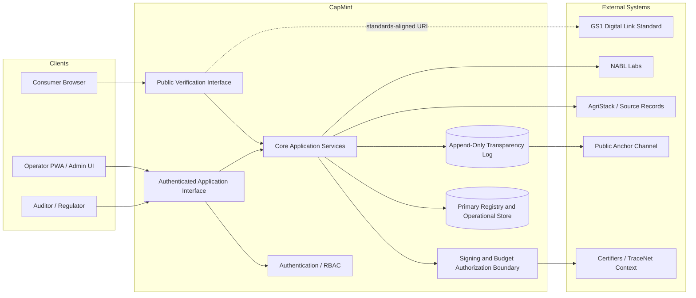
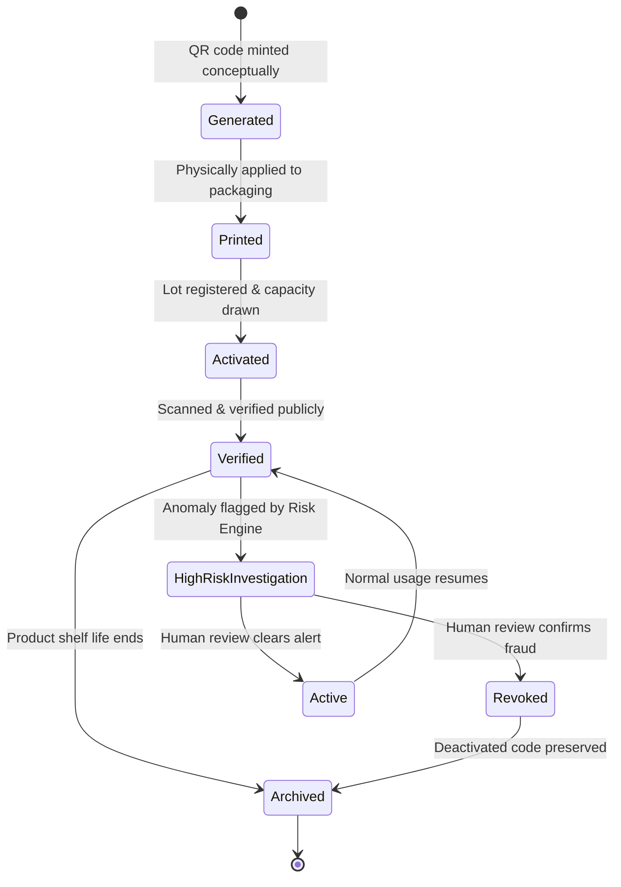
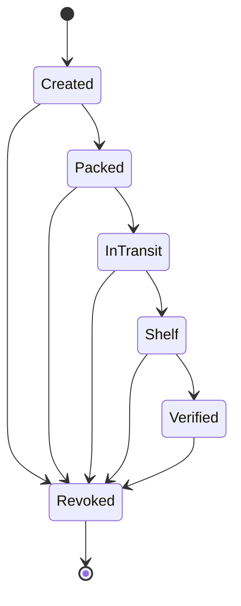
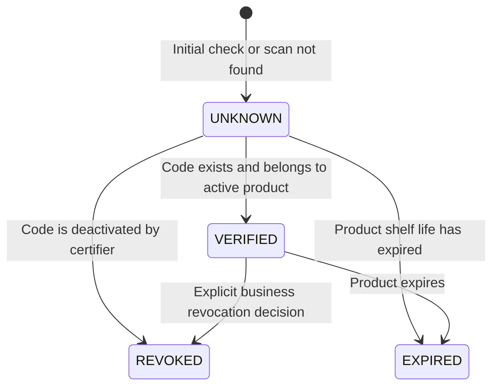

# SYSTEM_OVERVIEW

## Scope

This document owns:
- High-level architecture maps and diagrams
- Capability planning matrix (P0-P2 task priority)
- Major system domains (Identity, Budget, Minting, Verification, Evidence, Transparency)
- Core architectural design and engineering principles
- Executive workflows and user journeys

This document intentionally does NOT define:
- Detailed business invariants or real-world problem definitions (defined in [SYSTEM_CONTEXT.md](./SYSTEM_CONTEXT.md))
- Container port allocations, database instances, or network components (defined in [CONTAINER_ARCHITECTURE.md](../C4/L2_CONTAINER.md))
- Logical Bounded Contexts, domain service boundaries, or single-writer databases (defined in [SERVICE_BOUNDARIES.md](./SERVICE_BOUNDARIES.md))
- Step-by-step transaction details, state machine transitions, or API routes (defined in [DATA_FLOW.md](../sequence/DATA_FLOW.md))
- RBAC permissions grids, security policies, KMS keys, or transport encryption (defined in [SECURITY_ARCHITECTURE.md](../security/SECURITY_ARCHITECTURE.md))
- Host environment specifications (Dev/Staging/Prod) or disaster recovery strategies (defined in [DEPLOYMENT_ARCHITECTURE.md](../deployment/DEPLOYMENT_ARCHITECTURE.md))
- Programming languages or technical framework choices (defined in [TECHNOLOGY_STACK.md](./TECHNOLOGY_STACK.md))

## 1. Purpose

CapMint is an origin-claim registry for premium and organic food products. Its purpose is to prevent over-issuance of claim-bearing product identities by enforcing a signed production budget before any unit-level QR code can be minted.

The system exists because premium food claims are easy to print, easy to copy, and difficult for buyers to verify. CapMint addresses that gap by tying each legitimate physical unit to a unique, verifiable identity, bounded by approved production capacity and backed by traceable evidence.

Primary users are certifying bodies, producers, FPOs, hive operators, exporters, brands, pack houses, testing labs, consumers, buyers, regulators, and auditors. The business value is a credible trust layer that supplements existing certification and traceability systems without replacing them.

The architecture exists to enforce a small set of non-negotiable guarantees: supply must be capped, issuance must require trusted authority, history must be append-only, revocation must be public, and verification must be simple enough for routine consumer use.

## 2. System Overview

CapMint operates as a thin integrity layer between existing agricultural, certification, lab, and packaging workflows and a public verification experience.

Its major capabilities are:

- Registry of producers, production sources, certifiers, budgets, lots, unit codes, lab evidence, scans, and integrity log events
- Budget computation and approval
- Co-signed mint authorization
- Unit-level QR issuance in GS1 Digital Link format
- Stateful code lifecycle management
- Lot and code revocation
- Public verification with a fixed verdict vocabulary
- Clone-suspect detection based on scan patterns
- Append-only transparency logging with periodic external anchoring
- Offline-first field capture in the Stage 2 operating model

The core operating model is straightforward: trusted source data establishes a conservative production budget, a certifier co-signs that budget, the system mints unique codes only within remaining capacity, operational events update code state, evidence can invalidate lots, and the public verifier resolves any code to a narrow verdict with supporting provenance.

## 3. System Boundaries

### Internal Responsibilities

CapMint is responsible for:

- Maintaining the registry of domain records
- Computing and enforcing production budgets
- Requiring certifier authorization before minting
- Issuing one serialized code per physical unit
- Tracking code lifecycle state transitions
- Binding lot-level evidence to issued units
- Detecting basic clone-suspect scan patterns
- Preserving append-only event history
- Publishing a public verification result

### External Systems

CapMint depends on, but does not own:

- AgriStack for farmer identity, land parcel context, and crop records
- NPOP, PGS certifiers, and APEDA TraceNet workflows for certification authority and process context
- NABL-accredited labs for lab evidence generation
- GS1 Digital Link standards for QR structure
- External public channels used to publish periodic chain heads or log roots

### Trusted Systems

Trusted systems are those whose authority CapMint relies on to make integrity decisions:

- Certifier signing authority
- Source agricultural and certification records provided by linked systems
- Accredited lab outputs
- CapMint key-management controls

### Untrusted Systems

The following are treated as untrusted inputs until validated:

- Consumer devices and scan requests
- Public internet traffic
- Manually entered operational data before validation
- Presented QR codes and product context

### User-Facing Interfaces

- Public web verifier
- Operator-facing field and pack-house workflows
- Administrative and authenticated API endpoints

### Administrative Interfaces

- Authenticated administrative endpoints for budgets, lots, minting, transitions, revocation, lab records, log inspection, and clone alerts
- Auditor and regulator access patterns for reconciliation and chain-head review

### Public Interfaces

- Unauthenticated verification endpoint
- Publicly inspectable transparency-log verification information

### What the System Does Not Own

CapMint does not own:

- Organic certification decisions themselves
- Laboratory testing processes
- Farm management or ERP workflows
- Marketplace, payments, or pricing logic
- Native mobile applications
- Satellite analytics in v1
- APEDA or TraceNet replacement responsibilities

## 3.1 Bounded Contexts

CapMint is organized around domain boundaries defining single-writer responsibility and service encapsulation. For the detailed bounded contexts, service definitions, and ownership mappings, refer to [SERVICE_BOUNDARIES.md](./SERVICE_BOUNDARIES.md#3-bounded-contexts).

### 3.2 External APIs

CapMint integrates with external systems to validate crop bounds, organic certifications, and chemical safety checks. The canonical list of integrations and fallbacks is owned by [SYSTEM_CONTEXT.md](./SYSTEM_CONTEXT.md#15-external-ecosystem).

## 4. High-Level Architecture

At a high level, CapMint is composed of a browser-based public verifier, authenticated operational interfaces, an application backend, a signing and budget-authorization boundary, a relational system of record, and an append-only integrity log with periodic public anchoring.



For the physical container execution mappings and network interfaces, see [CONTAINER_ARCHITECTURE.md](../C4/L2_CONTAINER.md). For hosting topologies, routing setups, and physical network nodes, see [DEPLOYMENT_ARCHITECTURE.md](../deployment/DEPLOYMENT_ARCHITECTURE.md#3-deployment-model).

## 5. Trust Boundaries & Permissions

CapMint enforces cryptographic trust boundaries at its network and API limits to protect the integrity of minted identities and budgets. The canonical trust zone analysis and the Role-Based Access Control (RBAC) permission matrix are owned and documented in [SECURITY_ARCHITECTURE.md](../security/SECURITY_ARCHITECTURE.md#6-trust-boundaries).

    Approved --> Revoked
    PendingApproval --> Revoked
    Revoked --> [*]
```

#### QR Lifecycle (Append-Only Assets)


> [!IMPORTANT]
> QR records are immutable, append-only assets. When a QR is revoked or archived, the record is never deleted from the database.

#### Lot Lifecycle



#### Verification Validity Lifecycle



## 7. Core System Components & Domain Events

CapMint segregates features into isolated services. For detailed component lists, inputs/outputs, and downstream consumer dependencies, see [SERVICE_BOUNDARIES.md](./SERVICE_BOUNDARIES.md#5-service-responsibilities). For the canonical list of domain events and structural schemas, see [DATA_FLOW.md](../sequence/DATA_FLOW.md#8-domain-event-catalog).

## 8. User Request Lifecycle

API requests traverse strict validation and database commit paths. For step-by-step transaction sequence diagrams, see [DATA_FLOW.md](../sequence/DATA_FLOW.md#3-high-level-information-lifecycle).

## 9. User Journey

An end-to-end journey begins when a producer or operator is registered along with the relevant plot or hive cluster. Source production context is used to compute a conservative budget. A certifier approves and co-signs that budget, after which the producer or pack-house workflow can mint unit-level QR identities within remaining capacity.

As goods are packed and moved, units progress through lifecycle states and remain attached to their lot. Lab evidence can be attached later and can also trigger lot-level revocation. Once a code is printed on a physical unit, any buyer can scan it in a browser without installing an app. The public verifier returns the product validity status (VERIFIED, REVOKED, EXPIRED, UNKNOWN) and a distinct authenticity risk level (LOW, MEDIUM, HIGH, CRITICAL) calculated by the Risk Engine. If suspicious reuse appears, the risk level escalates to trigger human investigation and potential certifier revocation.

## 10. Major Modules & Ownership Table

The following matrix maps the ownership, dependencies, and consumption relationships for all primary modules within CapMint.

| Module | Owner | Depends On | Used By | Purpose |
|---|---|---|---|---|
| **Registry** | Core Platform Team | Primary Data Store | Budget Computation, Mint Service, Code Lifecycle, Verification, Revocation, Lab Evidence | Maintain canonical database records for all core entities. |
| **Budget Computation** | Budget Domain Lead | Registry, AgriStack | Mint Service, Pack-House Intake | Compute conservative production limits and track drawdown. |
| **Budget Authorization** | Security & Cryptography | Certifier authority, Key management | Budget Computation, Mint Service | Require certifier signature and private keys for budget activation. |
| **Mint Service** | Core Platform Team | Budget Computation, Registry, Transparency Log, KMS | Pack-House Intake, Operator workflows | Issue unique serials, enforce capacity check, format GS1 DL. |
| **Code Lifecycle** | Product Workflows Team | Registry, Transparency Log | Verification Service, Revocation | Manage status states (Minted, Packed, Distributed, Sold). |
| **Revocation** | Operations Team | Certifier authority, Lab Evidence, Code Lifecycle | Code Lifecycle, Verification Service | Invalidate lots and cascade state changes to attached units. |
| **Public Verifier** | Verification & Edge Team | Registry, Transparency Log, Scan Telemetry | Consumer Browser UI | Resolve public code to validity status and authenticity risk. |
| **Risk Assessment** | Security & Analytics Team | Scan events, Telemetry profiles | Public Verifier, Admin Alerting | Calculate product authenticity risk based on multiple behavioral signals. |
| **Lab Evidence Handling** | Integrations Team | Registry, NABL Labs API | Revocation, Lot Management | Bind lab report metadata and hashes to lot structures. |
| **Transparency Log** | Security & Cryptography | Core Services, Public Anchor Channel | Mint Service, Code Lifecycle, Revocation, Verification | Maintain a cryptographically chained, append-only history. |
| **Offline Field Capture** | Mobile & Field Apps Team | Operator PWA, Sync queue, Registry | Field Operators | Queue registration/evidence locally for deferred sync. |
| **Pack-House Intake** | Mobile & Field Apps Team | Offline Capture, Sync Queue, Budget Computation | Pack-House Operators | Record intake weights and draw down capacity budgets. |

## 10.1 System Capabilities & Master Planning Table

This master planning table defines CapMint's core capabilities, their domain owner, priority tier (P0-P2), and current execution status.

| Capability | Owner Module | Priority | Status | Description |
|---|---|---|---|---|
| **Producer & Plot Management** | Registry | P0 | Planned | Onboard producers and associate physical plots/hive clusters. |
| **Budget Computation & Enforcement** | Budget Computation | P0 | Planned | Compute capacity and block minting if remaining budget is <= 0. |
| **Certifier Signature Verification** | Budget Authorization | P0 | Planned | Validate certifier Ed25519 signature before budget activation. |
| **Unit Serial Minting (GS1 DL)** | Mint Service | P0 | Planned | Mint serials in standard-aligned GS1 Digital Link format. |
| **Code Lifecycle State Transitions** | Code Lifecycle | P1 | Planned | Progress units through Minted, Packed, Distributed, Sold, and Scanned. |
| **Lot-Level Invalidation (Revocation)** | Revocation | P0 | Planned | Revoke a batch and automatically cascade status to all child units. |
| **Public QR Code Verification** | Public Verifier | P0 | Planned | Resolve scan requests to a product validity status and independent risk score. |
| **Suspicious Scan Risk Assessment** | Risk Assessment | P1 | Planned | Analyze multi-signal telemetry (location, fingerprint, frequency) to compute authenticity risk. |
| **NABL Lab Evidence Ingestion** | Lab Evidence Handling | P1 | Planned | Store lab certificate metadata and secure document hash. |
| **Tamper-Evident Hashed Log** | Transparency Log | P0 | Planned | Cryptographically chain all state changes in an append-only log. |
| **Offline Field Capture & Sync** | Offline Field Capture | P2 | Planned | Allow offline queueing and eventual sync for field registration. |
| **Pack-House Intake & Drawdown** | Pack-House Intake | P1 | Planned | Draw down budget limits dynamically during physical lot packing. |

## 11. AI Architecture

No AI architecture is defined in the PRD.

## 12. Data Flow & Event Processing

Data moves dynamically from upstream registrations to public resolution and asynchronous logging. The detailed path maps and validation limits are owned by [DATA_FLOW.md](../sequence/DATA_FLOW.md).

## 13. Security & Telemetry Controls

Application-layer encryption, transport standards, key rotation, and privacy regulations protect the platform boundaries. The comprehensive security design is owned by [SECURITY_ARCHITECTURE.md](../security/SECURITY_ARCHITECTURE.md).

## 14. Observability & Telemetry Suite

Operational monitoring maps system health via correlation tracing, alerts, and runtime metrics. For details on the observability layout and alert policies, see [SECURITY_ARCHITECTURE.md](../security/SECURITY_ARCHITECTURE.md#18-cross-cutting-security-concerns).

## 15. Architectural Constraints & Invariants

System constraints and business invariants define CapMint's non-negotiable operational boundaries. The canonical list of invariants is owned by [SYSTEM_CONTEXT.md](./SYSTEM_CONTEXT.md#9-system-invariants).

## 17. Scalability & Availability Model

Runtime availability, stateless scaling, backups, and physical recovery boundaries protect verification reads. The logical scaling and reliability designs are owned by [DEPLOYMENT_ARCHITECTURE.md](../deployment/DEPLOYMENT_ARCHITECTURE.md#10-scalability-model). Performance Non-Functional Requirements (NFRs) are also documented in [DEPLOYMENT_ARCHITECTURE.md](../deployment/DEPLOYMENT_ARCHITECTURE.md#13-non-functional-performance-targets).

## 19. Technology Stack & Decision Matrix

Technical choices, frameworks, databases, and library alternative assessments are managed under one stack model. For the canonical catalog, evaluation matrix, and decision rationale, see [TECHNOLOGY_STACK.md](./TECHNOLOGY_STACK.md).

## 21. Architecture & Design Principles

CapMint's engineering decisions are guided by a set of non-negotiable architectural principles that prioritize security, correctness, and tamper-resistance:

- **Single Source of Truth**: All registry and state lookups must resolve to the canonical Postgres store. Caching layers are only used for performance optimization, never as the source of state.
- **Fail Closed**: Any signature validation failure, key mismatch, database connectivity loss, or capacity boundary breach must result in an immediate denial of action (e.g., minting is blocked).
- **Append-Only Ledger**: Operational records and the integrity log cannot be edited or deleted. Changes are expressed as new events, preserving the full audit trail.
- **Idempotency**: All operations (especially budget creation, minting, and offline synchronization) must support safe retries using unique client-provided request IDs to prevent duplicate drawdowns.
- **Event-Driven Invariants**: State changes publish domain events that drive downstream processes, verification caches, telemetry records, and clone alerts.
- **Least Privilege**: Users, integrations, and services have access only to the endpoints, tables, and signing keys necessary to fulfill their roles.
- **Immutable Audit**: History log blocks are hash-chained. The chain head is published periodically to external anchors to guarantee tamper detection.
- **Defense in Depth**: Security controls are applied at multiple layers (Cloudflare WAF, Fastify router validation, DB triggers/constraints, and separate KMS signing controls).
- **Modularity**: Separation of registry, budget enforcement, minting, verification, and integrity concerns to keep service boundaries clean.
- **Separation of Concerns**: CapMint aggregates and anchors third-party evidence but does not replace the certification authority, labs, or farm ERP software.
- **Maintainability & Simplicity**: The codebase prioritizes boring, readable, and highly testable TypeScript code over complex frameworks or pre-mature microservices.

## 22. Assumptions

- Assumption: The authenticated operator and administrative experience may be delivered through the same web-based application surface, because the PRD distinguishes protected endpoints and operator workflows but does not prescribe separate products.
- Assumption: Periodic external chain-head publication occurs out of band from user-facing verification requests, because the PRD requires periodic publication but does not define the exact trigger model.
- Assumption: Public transparency verification information is exposed through the verification surface or related public endpoints, because the PRD requires public inspectability but does not define a dedicated interface shape.

## 23. Out of Scope

The PRD explicitly excludes:

- Blockchain
- Tokens or tokenization
- Payments
- Surveillance video or field cameras
- Satellite integration in v1
- Native iOS or Android apps
- Full ERP or POS integration in MVP
- Multi-tenant enterprise admin
- Pricing or commercial quoting logic
- CapMint acting as an agricultural certifier
- Marketplace responsibilities

## 24. Risks

| Risk | Potential Impact | Mitigation |
|---|---|---|
| TraceNet API uncertainty | Integration delays or manual operational overhead | Use manual or file-based interchange until integration stabilizes |
| Adoption resistance | Pilot participants may reject added workflow burden | Keep Season 0 narrow, low-burden, and aligned with existing processes |
| Security failure | Key compromise or weak key handling undermines trust | Use KMS or HSM-oriented design, rotation, and audit trails |
| QR cloning persists | Fraud may continue despite unit serialization | Use anomaly detection, revocation, and later anti-tamper improvements |
| Offline sync loss | Field records may be delayed or lost | Use local persistence, queue visibility, and conflict handling |
| Overclaim risk | Public messaging could exceed what evidence proves | Enforce narrow fixed verdict vocabulary |
| Budgeting errors | Incorrect assumptions can distort issuance limits | Keep assumptions explicit, conservative, signed, and auditable |
| Resource constraints | Underfunding can expand delivery risk | Ship only the minimum critical trust loop first |

## 25. Future Evolution

The architecture can evolve without major redesign because the core trust loop is narrow and modular.

Likely evolution paths supported by the PRD include:

- Expanding from synthetic data to real producer and certifier integrations
- Hardening key management from stand-in keys to formal key ceremony and production-grade storage
- Extending offline-first operations beyond the initial field and pack-house workflows
- Refining clone detection as real scan telemetry accumulates
- Improving transparency publication mechanisms after pilot scale
- Adding localization for operator-facing experiences after English launch

The system should evolve by deepening integrity and operational robustness, not by broadening into certifier, ERP, marketplace, payment, or surveillance roles.

## 26. Glossary

- AgriStack: External source system for farmer identity, land parcel, and crop-related records.
- Anchor: A periodically published external reference to the current transparency-log chain head or root.
- Append-only history: A record model where corrections are expressed as new events rather than destructive edits.
- Budget: The approved issuance capacity that constrains how many unit identities may be minted.
- Certifier: The trusted authority that approves budgets and can revoke on evidence or error.
 - Authenticity Risk: The likelihood that a QR code represents a counterfeit, evaluated by the Risk Engine across multiple behavioral signals (LOW, MEDIUM, HIGH, CRITICAL).
- Digital Link: The GS1 QR-compatible URI format used for public code resolution.
- Exhausted: A capacity state indicating no additional issuance is allowed against the relevant budget.
- Expired: The verification status indicating the product has exceeded its designated shelf-life.
- Lab evidence: Lot-linked test information and report hashes carried by the system.
- Lot: A batch-level grouping of goods to which many unit codes can belong.
- Producer: The operating entity responsible for production or management of goods.
- Revoked: The verification status indicating the QR code has been explicitly deactivated by a certifier decision.
- Scan event: A recorded verification interaction used for audit and anomaly detection.
- Transparency log: The append-only hash-chained event history for material system actions.
- Unit code: The unique serialized identity for one physical unit.
- Unknown: The verification status for invalid, malformed, tampered, or unresolved codes.
- Verified: The verification status indicating a valid, active QR code registered in the database.

## 27. Architecture Freeze

> [!IMPORTANT]
> This section formally freezes the CapMint System Architecture Version 1.0. Any downstream changes to modules, invariants, data flows, or deployment models must follow the formal RFC process.

| Attribute | Value |
|---|---|
| **Version** | 1.0 |
| **Checkpoint** | CP-001 |
| **Status** | Approved |
| **Next Checkpoint** | CP-002 Database Design |
