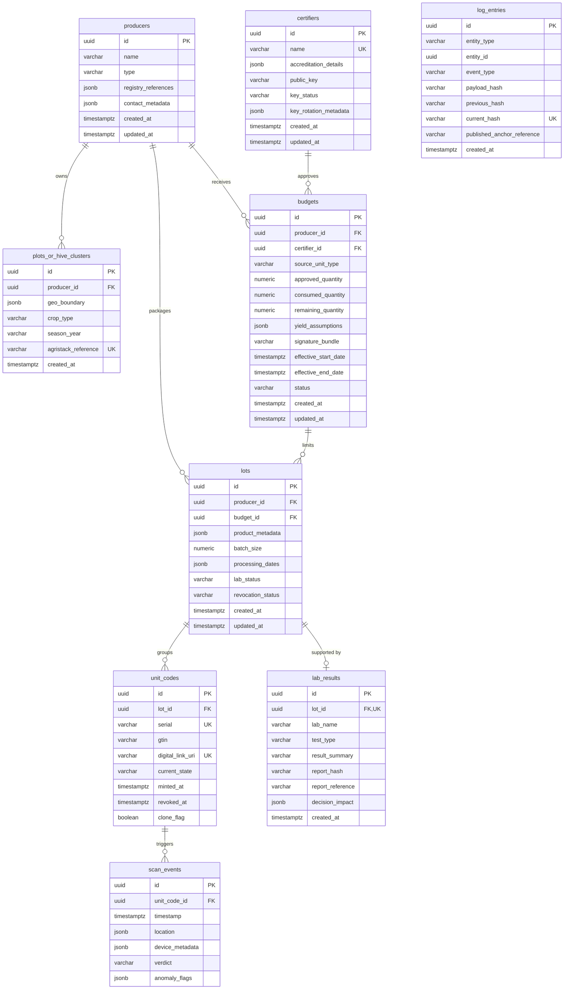

# Database Blueprint [DATABASE_BLUEPRINT]

This consolidated document defines the logical and referential database schema, entity specifications, relationship diagrams, state transitions, and business rules mapping for CapMint.

---

## 1. Executive Summary [DB-001]

The CapMint database is designed as a unit-level serialization registry and capacity enforcer. Its primary mission is to prevent supply chain over-issuance fraud (selling conventional products under organic certificate quotas) by enforcing certifier-signed yield limits before physical identifiers (QR codes) can be minted.

---

## 2. Business Domain Discovery [DB-002]

### 2.1 Domain Concept Vocabulary
The business domain is structured around nine core concepts:
1. **Certifier**: The regulatory authority that audits claims, registers cryptographic signing keys, and approves yield budgets.
2. **Producer**: The agricultural entity (Farmer, FPO, Hive Operator, Brand, Exporter) that cultivates or sources the commodity.
3. **Plot or Hive Cluster**: The physical land parcel or apiary registered under a producer.
4. **Budget**: The approved seasonal capacity ceiling (by weight/weight/count) signed cryptographically by a certifier.
5. **Lot**: A processed, packaged, or sorted batch of goods drawing from an active budget.
6. **Unit Code**: The individual retail package identity, exposed via a GS1 Digital Link compatible QR code.
7. **Lab Result**: The chemical or physical analysis report (e.g., NMR, pesticide panel) binding evidence to a specific lot.
8. **Scan Event**: The consumer verification query and telemetry record (IP, timestamp, approximate geohash).
9. **Log Entry**: The immutable building block of the hash-chained, append-only integrity ledger.

---

## 3. Entity Catalog [DB-003]

The database is divided into nine core tables, mapped to their single-writer microservices:
```
[Identity Service]     --> certifiers, producers, plots_or_hive_clusters
[Budget Service]       --> budgets
[Minting Service]      --> lots, unit_codes
[Evidence Service]     --> lab_results
[Verification Service] --> scan_events
[Transparency Service] --> log_entries
```

### 3.1 Table: `certifiers`
*   **Logical Owner Service**: `Identity Service`
*   **Purpose**: Profiles and active public keys of accredited certification bodies.
*   **Key Constraints**: Name must be unique. Public key must be Ed25519 standards-aligned.

| Column Name | Database Data Type | Nullability | Constraints / Keys | Description |
| :--- | :--- | :--- | :--- | :--- |
| `id` | `UUID` | `NOT NULL` | `PRIMARY KEY` | Unique identifier. |
| `name` | `VARCHAR(255)` | `NOT NULL` | `UNIQUE` | Registered name of the certifier. |
| `accreditation_details`| `JSONB` | `NOT NULL` | None | Accreditation agency IDs, licenses, validity dates. |
| `public_key` | `VARCHAR(128)` | `NOT NULL` | None | Ed25519 cryptographic public key in Hex. |
| `key_status` | `VARCHAR(32)` | `NOT NULL` | Check: `ACTIVE`, `ROTATED`, `REVOKED` | Cryptographic key lifecycle state. |
| `key_rotation_metadata`| `JSONB` | `NULL` | None | Timeline, history of rotated keys, and reasons. |
| `created_at` | `TIMESTAMPTZ` | `NOT NULL` | Default `NOW()` | Audit timestamp of registration. |
| `updated_at` | `TIMESTAMPTZ` | `NOT NULL` | Default `NOW()` | Timestamp of last profile edit. |

*   **Indexing Targets**:
    *   `idx_certifiers_key_status` ON (`key_status`) — Optimizes signature verification checks.

---

### 3.2 Table: `producers`
*   **Logical Owner Service**: `Identity Service`
*   **Purpose**: Main profile index of agricultural producers, FPOs, and processing brands.

| Column Name | Database Data Type | Nullability | Constraints / Keys | Description |
| :--- | :--- | :--- | :--- | :--- |
| `id` | `UUID` | `NOT NULL` | `PRIMARY KEY` | Unique identifier. |
| `name` | `VARCHAR(255)` | `NOT NULL` | None | Registered producer or FPO name. |
| `type` | `VARCHAR(32)` | `NOT NULL` | Check: `FARMER`, `FPO`, `BRAND`, `HIVE_OPERATOR` | Producer operating classification. |
| `registry_references` | `JSONB` | `NOT NULL` | None | AgriStack IDs, TraceNet organic certificates. |
| `contact_metadata` | `JSONB` | `NULL` | None | Address details, emails, phones, manager logs. |
| `created_at` | `TIMESTAMPTZ` | `NOT NULL` | Default `NOW()` | Profile creation date. |
| `updated_at` | `TIMESTAMPTZ` | `NOT NULL` | Default `NOW()` | Last update timestamp. |

---

### 3.3 Table: `plots_or_hive_clusters`
*   **Logical Owner Service**: `Identity Service`
*   **Purpose**: Geographical boundaries and crop properties of production sites.

| Column Name | Database Data Type | Nullability | Constraints / Keys | Description |
| :--- | :--- | :--- | :--- | :--- |
| `id` | `UUID` | `NOT NULL` | `PRIMARY KEY` | Unique identifier. |
| `producer_id` | `UUID` | `NOT NULL` | `FOREIGN KEY` $\rightarrow$ `producers(id)` | Owning agricultural entity. |
| `geo_boundary` | `JSONB` | `NOT NULL` | None | Geographic boundary points (polygons / coordinates). |
| `crop_type` | `VARCHAR(64)` | `NOT NULL` | None | Commodity category (e.g. `HONEY`, `MUSTARD`). |
| `season_year` | `VARCHAR(32)` | `NOT NULL` | None | Harvest season (e.g. `Rabi 2026`). |
| `agristack_reference` | `VARCHAR(100)` | `NULL` | `UNIQUE` | External land parcel ID from AgriStack. |
| `created_at` | `TIMESTAMPTZ` | `NOT NULL` | Default `NOW()` | Timestamp of registration. |

---

### 3.4 Table: `budgets`
*   **Logical Owner Service**: `Budget Service`
*   **Purpose**: Manages capacity quotas to prevent organic over-issuance.

| Column Name | Database Data Type | Nullability | Constraints / Keys | Description |
| :--- | :--- | :--- | :--- | :--- |
| `id` | `UUID` | `NOT NULL` | `PRIMARY KEY` | Unique identifier. |
| `producer_id` | `UUID` | `NOT NULL` | `FOREIGN KEY` $\rightarrow$ `producers(id)` | Recipient producer. |
| `certifier_id` | `UUID` | `NOT NULL` | `FOREIGN KEY` $\rightarrow$ `certifiers(id)` | Cryptographic signer certifier. |
| `source_unit_type` | `VARCHAR(32)` | `NOT NULL` | Check: `WEIGHT_KG`, `VOLUME_L`, `UNIT_COUNT` | Unit basis of budget capacity. |
| `approved_quantity` | `NUMERIC(12, 2)` | `NOT NULL` | Check: `> 0.00` | Authorized capacity limit. |
| `consumed_quantity` | `NUMERIC(12, 2)` | `NOT NULL` | Default `0.00`, Check: `>= 0.00` | Capacity consumed by minting. |
| `remaining_quantity`| `NUMERIC(12, 2)` | `NOT NULL` | `GENERATED ALWAYS` AS (`approved_quantity` - `consumed_quantity`) | Remaining capacity quota. |
| `yield_assumptions` | `JSONB` | `NOT NULL` | None | Math assumptions (area x yield rate). |
| `signature_bundle` | `VARCHAR(256)` | `NOT NULL` | None | Ed25519 cryptographic signature. |
| `effective_start_date`| `TIMESTAMPTZ` | `NOT NULL` | None | Quota active start timestamp. |
| `effective_end_date` | `TIMESTAMPTZ` | `NOT NULL` | None | Quota expiration timestamp. |
| `status` | `VARCHAR(32)` | `NOT NULL` | Check: `DRAFT`, `PENDING`, `ACTIVE`, `EXHAUSTED`, `REVOKED` | Quota status lifecycle. |
| `created_at` | `TIMESTAMPTZ` | `NOT NULL` | Default `NOW()` | Creation date. |
| `updated_at` | `TIMESTAMPTZ` | `NOT NULL` | Default `NOW()` | Last state transition date. |

---

### 3.5 Table: `lots`
*   **Logical Owner Service**: `Minting Service`
*   **Purpose**: Groups unit codes under a packaging batch and links them to testing evidence.

| Column Name | Database Data Type | Nullability | Constraints / Keys | Description |
| :--- | :--- | :--- | :--- | :--- |
| `id` | `UUID` | `NOT NULL` | `PRIMARY KEY` | Unique identifier. |
| `producer_id` | `UUID` | `NOT NULL` | `FOREIGN KEY` $\rightarrow$ `producers(id)` | Packaging producer. |
| `budget_id` | `UUID` | `NOT NULL` | `FOREIGN KEY` $\rightarrow$ `budgets(id)` | Budget quota drawn down. |
| `product_metadata` | `JSONB` | `NOT NULL` | None | Commodity description, GTIN code. |
| `batch_size` | `NUMERIC(12, 2)` | `NOT NULL` | Check: `> 0.00` | Quota volume consumed by lot. |
| `processing_dates` | `JSONB` | `NOT NULL` | None | Packaging and sorting dates. |
| `lab_status` | `VARCHAR(32)` | `NOT NULL` | Default `'PENDING'`, Check: `PENDING`, `PASSED`, `FAILED` | Laboratory check status. |
| `revocation_status` | `VARCHAR(32)` | `NOT NULL` | Default `'ACTIVE'`, Check: `ACTIVE`, `REVOKED` | Invalidation state. |
| `created_at` | `TIMESTAMPTZ` | `NOT NULL` | Default `NOW()` | Ingestion timestamp. |
| `updated_at` | `TIMESTAMPTZ` | `NOT NULL` | Default `NOW()` | Update timestamp. |

---

### 3.6 Table: `unit_codes`
*   **Logical Owner Service**: `Minting Service`
*   **Purpose**: Contains globally unique, non-sequential serialized unit identifiers and their states.

| Column Name | Database Data Type | Nullability | Constraints / Keys | Description |
| :--- | :--- | :--- | :--- | :--- |
| `id` | `UUID` | `NOT NULL` | `PRIMARY KEY` | Unique identifier. |
| `lot_id` | `UUID` | `NOT NULL` | `FOREIGN KEY` $\rightarrow$ `lots(id)` | Parent batch lot. |
| `serial` | `VARCHAR(64)` | `NOT NULL` | `UNIQUE` | Random non-sequential cryptographic serial. |
| `gtin` | `VARCHAR(14)` | `NOT NULL` | None | GS1 Global Trade Item Number. |
| `digital_link_uri` | `VARCHAR(2083)` | `NOT NULL` | `UNIQUE` | Standards-aligned URI scan string. |
| `current_state` | `VARCHAR(32)` | `NOT NULL` | Default `'MINTED'`, Check: `MINTED`, `PACKED`, `IN-TRANSIT`, `SHELF`, `VERIFIED`, `REVOKED` | Code state machine indicator. |
| `minted_at` | `TIMESTAMPTZ` | `NOT NULL` | Default `NOW()` | Time of minting. |
| `revoked_at` | `TIMESTAMPTZ` | `NULL` | None | Invalidation timestamp (bubbled down from lot). |
| `clone_flag` | `BOOLEAN` | `NOT NULL` | Default `FALSE` | High-risk clone suspect flag. |

---

### 3.7 Table: `lab_results`
*   **Logical Owner Service**: `Evidence Service`
*   **Purpose**: Links accredited laboratory tests and PDF hashes to batches/lots.

| Column Name | Database Data Type | Nullability | Constraints / Keys | Description |
| :--- | :--- | :--- | :--- | :--- |
| `id` | `UUID` | `NOT NULL` | `PRIMARY KEY` | Unique identifier. |
| `lot_id` | `UUID` | `NOT NULL` | `UNIQUE`, `FOREIGN KEY` $\rightarrow$ `lots(id)` | Tested lot batch. |
| `lab_name` | `VARCHAR(255)` | `NOT NULL` | None | Accredited NABL laboratory name. |
| `test_type` | `VARCHAR(64)` | `NOT NULL` | None | Testing method (e.g. NMR, panel). |
| `result_summary` | `VARCHAR(32)` | `NOT NULL` | Check: `PASS`, `FAIL` | Aggregated test outcome. |
| `report_hash` | `VARCHAR(64)` | `NOT NULL` | None | SHA-256 cryptographic hash of PDF. |
| `report_reference` | `VARCHAR(500)` | `NOT NULL` | None | Secure object store URL of the PDF. |
| `decision_impact` | `JSONB` | `NULL` | None | Extracted chemical residue limit trace details. |
| `created_at` | `TIMESTAMPTZ` | `NOT NULL` | Default `NOW()` | Ingestion date. |

---

### 3.8 Table: `scan_events`
*   **Logical Owner Service**: `Verification Service`
*   **Purpose**: Telemetry database of public scans to run geovelocity and spatial check heuristics.

| Column Name | Database Data Type | Nullability | Constraints / Keys | Description |
| :--- | :--- | :--- | :--- | :--- |
| `id` | `UUID` | `NOT NULL` | `PRIMARY KEY` | Unique identifier. |
| `unit_code_id` | `UUID` | `NOT NULL` | `FOREIGN KEY` $\rightarrow$ `unit_codes(id)` | Scanned unit code. |
| `timestamp` | `TIMESTAMPTZ` | `NOT NULL` | Default `NOW()` | Ingestion timestamp. |
| `location` | `JSONB` | `NULL` | None | Approximate geohash or location bounds. |
| `device_metadata` | `JSONB` | `NOT NULL` | None | IP hash, User-Agent parameters. |
| `verdict` | `VARCHAR(32)` | `NOT NULL` | Check: `VERIFIED`, `REVOKED`, `EXHAUSTED`, `CLONE-SUSPECT`, `MISMATCH` | Verdict presented to client. |
| `anomaly_flags` | `JSONB` | `NULL` | None | Metrics from clone heuristics. |

---

### 3.9 Table: `log_entries`
*   **Logical Owner Service**: `Transparency Service`
*   **Purpose**: The append-only, cryptographic event ledger database structure.

| Column Name | Database Data Type | Nullability | Constraints / Keys | Description |
| :--- | :--- | :--- | :--- | :--- |
| `id` | `UUID` | `NOT NULL` | `PRIMARY KEY` | Unique identifier. |
| `entity_type` | `VARCHAR(64)` | `NOT NULL` | None | Reference category (`BUDGET`, `LOT`, etc.). |
| `entity_id` | `UUID` | `NOT NULL` | None | Target record ID. |
| `event_type` | `VARCHAR(64)` | `NOT NULL` | None | Event name (e.g. `'MINT'`). |
| `payload_hash` | `VARCHAR(64)` | `NOT NULL` | None | SHA-256 hash of serialization details. |
| `previous_hash` | `VARCHAR(64)` | `NOT NULL` | None | Link to parent ledger block hash. |
| `current_hash` | `VARCHAR(64)` | `NOT NULL` | `UNIQUE` | Block hash: $\text{SHA-256}(\text{payload\_hash} + \text{previous\_hash})$. |
| `published_anchor_reference` | `VARCHAR(255)` | `NULL` | None | External git commit or anchor ID. |
| `created_at` | `TIMESTAMPTZ` | `NOT NULL` | Default `NOW()` | Event timestamp. |

---

## 4. Domain Relationships [DB-004]

Establishing strict referential boundaries prevents data orphans and ensures that cascading state changes (e.g., lot revocation bubbling down to units) are backed by clean database relationships.

| Parent Table | Child Table | Relationship Type | Cardinality | FK Column | Delete Rule | Update Rule | Purpose |
| :--- | :--- | :--- | :--- | :--- | :--- | :--- | :--- |
| `producers` | `plots_or_hive_clusters` | One-to-Many ($1:N$) | $1$ (Mandatory) $\rightarrow$ $0..*$ (Optional) | `producer_id` | `RESTRICT` | `CASCADE` | Maps locations to owning producer. |
| `certifiers` | `budgets` | One-to-Many ($1:N$) | $1$ (Mandatory) $\rightarrow$ $0..*$ (Optional) | `certifier_id` | `RESTRICT` | `CASCADE` | Tracks certifier signing budget quota. |
| `producers` | `budgets` | One-to-Many ($1:N$) | $1$ (Mandatory) $\rightarrow$ $0..*$ (Optional) | `producer_id` | `RESTRICT` | `CASCADE` | Tracks capacity allocation to producer. |
| `budgets` | `lots` | One-to-Many ($1:N$) | $1$ (Mandatory) $\rightarrow$ $0..*$ (Optional) | `budget_id` | `RESTRICT` | `CASCADE` | Tracks quota consumed by lots. |
| `producers` | `lots` | One-to-Many ($1:N$) | $1$ (Mandatory) $\rightarrow$ $0..*$ (Optional) | `producer_id` | `RESTRICT` | `CASCADE` | Tracks batch packaging producer. |
| `lots` | `unit_codes` | One-to-Many ($1:N$) | $1$ (Mandatory) $\rightarrow$ $1..*$ (Mandatory) | `lot_id` | `RESTRICT` | `CASCADE` | Groups retail codes under batch runs. |
| `lots` | `lab_results` | One-to-One ($1:1$) | $1$ (Mandatory) $\rightarrow$ $0..1$ (Optional) | `lot_id` | `RESTRICT` | `CASCADE` | Binds lab PDF reports to lots. |
| `unit_codes` | `scan_events` | One-to-Many ($1:N$) | $1$ (Mandatory) $\rightarrow$ $0..*$ (Optional) | `unit_code_id` | `RESTRICT` | `CASCADE` | Logs telemetry query events. |
| *Polymorphic* | `log_entries` | Polymorphic (Logical) | $1$ (Mandatory) $\rightarrow$ $0..*$ (Optional) | `entity_id` | N/A (Manual) | N/A (Manual)| decoupled ledger audit trail. |

---

## 5. Visual Entity Relationship Diagram [DB-005]



---

## 6. Entity State Machines [DB-006]

Valid state lifecycles and transitions are mapped below for the three mutable entities in the CapMint system.

### 6.1 Budget State transitions
*   `DRAFT` $\rightarrow$ `PENDING_APPROVAL`: Submitted by operator. Attributes locked.
*   `PENDING_APPROVAL` $\rightarrow$ `ACTIVE`: Valid certifier Ed25519 signature checks. Enables minting.
*   `ACTIVE` $\rightarrow$ `EXHAUSTED`: Triggered automatically when remaining capacity quantity is drawn down to exactly `0.00`.
*   `ACTIVE` or `EXHAUSTED` $\rightarrow$ `REVOKED`: Invalidation order (non-compliance order).

### 6.2 Lot State transitions
*   **Lab Status**: `PENDING` $\rightarrow$ `PASSED` (residue thresholds match safety limits) or `FAILED` (exceeds pesticide limits).
*   **Revocation Status**: `ACTIVE` $\rightarrow$ `REVOKED` (manual order or lab status `FAILED`).

### 6.3 Unit Code State transitions
*   `MINTED` $\rightarrow$ `PACKED` $\rightarrow$ `IN-TRANSIT` $\rightarrow$ `SHELF` $\rightarrow$ `VERIFIED` (scan requested).
*   Any state $\rightarrow$ `REVOKED`: Bubbled down automatically on parent lot invalidation.
*   `SHELF` $\rightarrow$ `CLONE-SUSPECT`: Set `clone_flag = TRUE` when geo-velocity heuristic thresholds are breached.

---

## 7. Business Rules & Constraints Mapping [DB-007]

| Rule ID | Business Rule / Invariant | Implementation Mechanism | Target Constraint / Lock |
| :--- | :--- | :--- | :--- |
| **BR-01** | **Yield Quota Ceiling (Supply Cap)** | CHECK Constraint + Row Lock | `budgets.consumed_quantity <= budgets.approved_quantity` DB check; `SELECT ... FOR UPDATE` row locks in Mint Service. |
| **BR-02** | **Certifier Digital Signature Gate** | Ed25519 Signature Verification | Service verifying `budgets.signature_bundle` against `certifiers.public_key`. |
| **BR-03** | **Cascade Revocation** | SQL Trigger + Cascade updates | DB Trigger on `lots` cascading updates to child `unit_codes.current_state` and setting `revoked_at`. |
| **BR-04** | **Non-Sequential Serials** | CSPRNG Serial Generator | Application code Node.js `crypto.randomBytes()`; `UNIQUE` index on `unit_codes.serial`. |
| **BR-05** | **Verdict Vocabulary Isolation** | Database CHECK Constraint | `chk_scan_events_verdict` DB check; Fastify API response validation schemas. |
| **BR-06** | **Immutable Ledger Integrity** | Event Hash-Chaining | Transparency Service recalculating SHA-256 event chains; `UNIQUE` index on `log_entries.current_hash`. |
| **BR-07** | **Spatial-Temporal Clone Check** | Geovelocity Calculations | Application code calculating speed; sorted B-Tree compound index on `scan_events(unit_code_id, timestamp DESC)`. |
| **BR-08** | **Land Parcel Origin Check** | GIS Plot Verification | PostGIS intersects checking boundaries against AgriStack spatial data. |

---

## 8. Checkpoint Review Logs [DB-008]

*   **Checkpoint ID**: CP-002 (Database Design)
*   **Target Date / Completion**: 2026-07-10 / 2026-07-10
*   **Status**: ✅ COMPLETE / SIGNED-OFF
*   **Database Compliance**: verified against yield limits, cascading update rules, Ed25519 signature checks, and `<300ms` low-latency scan indexes.
