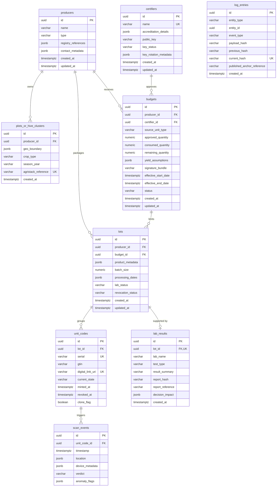

# CapMint — Entity Relationship Diagram (CP-002.4)

## 1. Executive Summary

This document represents the deliverables for **CP-002.4 (ERD)** under the Database Design phase. It defines the logical Entity Relationship Diagram (ERD) mapping the tables, attributes, primary/foreign keys, and relational cardinalities of the CapMint database.

---

## 2. Visual Entity Relationship Diagram (Mermaid)

The diagram below represents the logical relationships and primary/foreign key connections of all core entities in the database:

---

## 3. Relationship Explanations

1.  **`producers` $\rightarrow$ `plots_or_hive_clusters` ($1:N$)**: A producer owns zero or more geographical production sites (plots or hive clusters).
2.  **`certifiers` $\rightarrow$ `budgets` ($1:N$)**: A certifier authorizes and cryptographically signs zero or more capacity budgets.
3.  **`producers` $\rightarrow$ `budgets` ($1:N$)**: A producer receives zero or more capacity budgets allowing them to serialize goods.
4.  **`budgets` $\rightarrow$ `lots` ($1:N$)**: A budget quota constrains zero or more production batches (lots).
5.  **`producers` $\rightarrow$ `lots` ($1:N$)**: A producer acts as the packaging organization for zero or more lots.
6.  **`lots` $\rightarrow$ `unit_codes` ($1:N$)**: A lot run generates one or more retail-level package unit codes.
7.  **`lots` $\rightarrow$ `lab_results` ($1:1$)**: A lot run is backed by at most one analytical test report (NMR/residue panels).
8.  **`unit_codes` $\rightarrow$ `scan_events` ($1:N$)**: An individual unit code generates zero or more public verification telemetry logs.

*Note: The `log_entries` table is logically associated with all mutable entities (Budgets, Lots, Unit Codes) using polymorphic references (`entity_type` + `entity_id`) without physical foreign key constraints. This prevents cascading deletions or profile changes from breaking the historical cryptographic chain.*

---
*End of erd.md*
