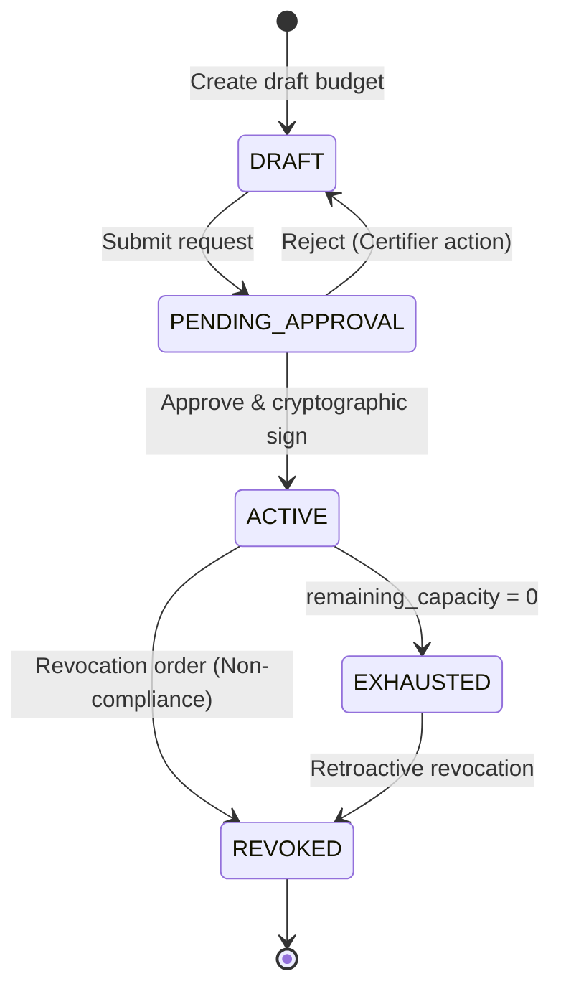
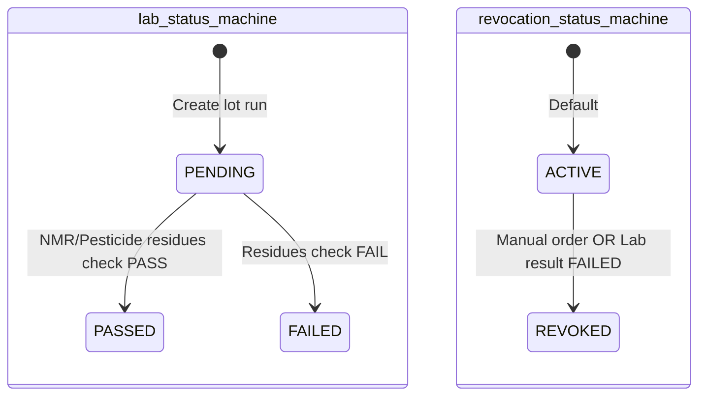
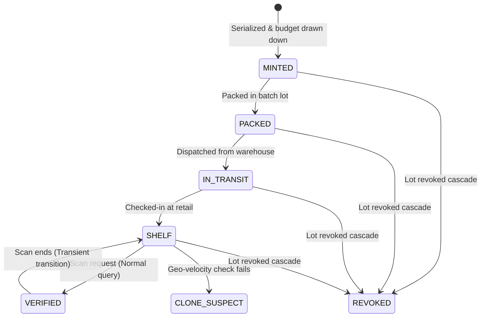

# CapMint — Entity State Machines (CP-002.6)

## 1. Executive Summary

This document represents the deliverables for **CP-002.6 (State Machines definition)** under the Database Design phase. It defines the formal lifecycle states, valid state transitions, triggers, and safety guard conditions for the three mutable entities in the CapMint system: **Budgets**, **Lots**, and **Unit Codes**.

Enforcing state changes through strict guard checks prevents illegal states (such as minting against a revoked budget or verifying a code from a failed lot).

---

## 2. State Machine Diagrams (Mermaid)

### 2.1 Budget State Machine

### 2.2 Lot State Machine

### 2.3 Unit Code State Machine

---

## 3. Detailed Transition Specifications

### 3.1 Budget Transitions

| Source State | Destination State | Triggering Event | Guard Conditions | Actions |
| :--- | :--- | :--- | :--- | :--- |
| `DRAFT` | `PENDING_APPROVAL` | `SubmitForApproval` | All site yield assumptions populated. | Lock draft attributes. |
| `PENDING_APPROVAL` | `ACTIVE` | `CertifierSignPayload`| Valid Ed25519 certifier signature matching public key. | Set status to `ACTIVE`. Publish `BudgetActivated`. |
| `ACTIVE` | `EXHAUSTED` | `CapacityFullyMinted` | remaining_quantity matches `0.00`. | Block future mint requests. Publish `BudgetExhausted`. |
| `ACTIVE` | `REVOKED` | `RevokeBudget` | Authorized certifier signature on revocation request. | Invalidate remaining balance. Publish `BudgetRevoked`. |

---

### 3.2 Lot Transitions

#### 3.2.1 Lab Status
| Source State | Destination State | Triggering Event | Guard Conditions | Actions |
| :--- | :--- | :--- | :--- | :--- |
| `PENDING` | `PASSED` | `UploadPassLabResult` | Test reports match pesticide safety thresholds. | Allow lot units to ship. |
| `PENDING` | `FAILED` | `UploadFailLabResult` | Test report pesticide parameters exceed thresholds. | Auto-trigger cascade revocation. |

#### 3.2.2 Revocation Status
| Source State | Destination State | Triggering Event | Guard Conditions | Actions |
| :--- | :--- | :--- | :--- | :--- |
| `ACTIVE` | `REVOKED` | `InvalidateBatch` | Lab status goes to `FAILED` OR certifier orders manual revocation. | Cascade `REVOKED` state to all related child unit codes. |

---

### 3.3 Unit Code Transitions

| Source State | Destination State | Triggering Event | Guard Conditions | Actions |
| :--- | :--- | :--- | :--- | :--- |
| `[*] (Init)` | `MINTED` | `MintRequest` | Target budget is `ACTIVE` and has capacity balance $\ge N$. | Generate serials, debit budget quota. |
| `MINTED` | `PACKED` | `BatchLotPackaging` | Unit code not already linked. | Assign parent `lot_id`. |
| `PACKED` | `IN-TRANSIT` | `DispatchShipment` | Lab status of parent lot is `PASSED`. | Update transport telemetry. |
| `IN-TRANSIT`| `SHELF` | `CheckInStore` | None | Update retail geo logs. |
| `SHELF` | `VERIFIED` | `PublicQRScan` | Telemetry is normal, parent lot revocation is `ACTIVE`. | Return `VERIFIED` verdict. |
| Any State | `REVOKED` | `LotRevocationCascaded`| Related lot record revocation status becomes `REVOKED`. | Set `revoked_at` timestamp. Return `REVOKED` scan verdict. |
| `SHELF` | `CLONE-SUSPECT` | `AnomalousTelemetry` | Geo-velocity heuristics trigger warning. | Set `clone_flag = TRUE`. Return `CLONE-SUSPECT` verdict. |

---
*End of state_machines.md*
