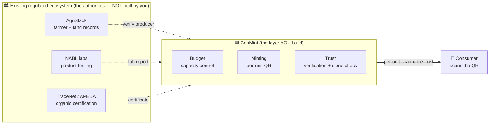

# The Organic Export Pipeline — and where CapMint fits

> This shows **two things at once**: (1) the real-world organic-farming → export → consumer
> pipeline as it already exists under India's NPOP/APEDA regime, and (2) exactly where
> **CapMint** plugs in. CapMint is a thin **serialization + trust layer on top of** that
> ecosystem — it never replaces the authorities. See [SCOPE_BOUNDARY.md](SCOPE_BOUNDARY.md).

---

## 1. The big picture — CapMint is a thin layer on top

The organic ecosystem already exists (farmers, labs, certifiers, government registries). CapMint
does **not** rebuild it — it *consumes* it and adds the one thing it's missing: **per-unit,
scannable proof for the consumer.**

**Read it as:** the authorities certify at the *batch/certificate* level → CapMint turns that
into *per-jar* proof → the consumer scans and trusts a single unit.

---

## 2. The full journey — from farm to the consumer's scan

Green = real-world/physical · 🟦 Blue = CapMint action · 🏛️ Orange = external authority.

```mermaid
flowchart TD
    classDef world fill:#e8f5e9,stroke:#2e7d32,color:#1b5e20
    classDef capmint fill:#e3f2fd,stroke:#1565c0,color:#0d47a1
    classDef gov fill:#fff3e0,stroke:#e65100,color:#e65100

    A["🌾 Farmer registers<br/>identity + land parcels"]:::world --> A2{{"AgriStack<br/>verify farmer + land"}}:::gov
    A2 --> B["🏅 Certification Body inspects farm<br/>→ Scope Certificate (NPOP)"]:::world
    B --> C1["🟦 CapMint: producer requests BUDGET<br/>certifier approves + cryptographically signs"]:::capmint
    C1 --> C["🌱 Organic cultivation + harvest"]:::world
    C --> D["📦 Processing + packaging into a batch"]:::world
    D --> D1["🟦 CapMint: create LOT (draws from budget)<br/>+ MINT digital QR identities*"]:::capmint
    D1 --> E["🧪 Sample sent to NABL-accredited lab"]:::world
    E --> E1{{"🟦 CapMint: ingest lab report<br/>PASS ✓  /  FAIL → auto-revoke batch"}}:::gov
    E1 --> F["🏅 Certification Body certifies the lot<br/>→ TraceNet Transaction Certificate"]:::world
    F --> F1["🟦 CapMint: lot = CERTIFIED →<br/>ATTACH the physical QR label**"]:::capmint
    F1 --> G["🚢 Export gate + customs clearance (APEDA)"]:::world
    G --> G1["🟦 CapMint: export/consignment gate<br/>only a CERTIFIED lot may ship"]:::capmint
    G1 --> H["🏬 Ship to importer → retailer → shelf"]:::world
    H --> I["🧑 Consumer scans the QR on the jar"]:::world
    I --> I1["🟦 CapMint: VERIFY<br/>genuine? certified? cloned?"]:::capmint
    I1 --> J["✅ 'Verified' + origin + provenance shown"]:::world
```

\* **Mint** = generate the digital serial/QR identity in the system. Happens **before** the lab,
matching how the real industry already serializes product — no process change required.
\*\* **Attach** = physically print/stick the QR onto the jar. Happens **only after** certification —
this is the real gate. Nothing is scannable until it's attached, so a consumer can never scan an
uncertified product. See [SCOPE_BOUNDARY.md](SCOPE_BOUNDARY.md) for why this split is the settled design.

---

## 3. Stage-by-stage — who does what

| # | Stage (real world) | External authority | CapMint's role |
| :--: | :-- | :-- | :-- |
| 0 | Farmer + land registered | **AgriStack** (govt) | Query to confirm producer is real |
| 1 | Farm inspected → Scope Certificate | **Certification Body** (via TraceNet) | The certifier is a real CB *user* of CapMint |
| 2 | Producer authorized to make N units | — | **Budget**: certifier approves + signs capacity |
| 3 | Cultivate → harvest → package (batch) | — | Producer creates a **Lot** (draws from budget) |
| 3.5 | Serialize units (digital) | — | **Mint**: unique per-unit QR identity, generated before the lab (matches real-world timing) |
| 4 | Sample tested | **NABL lab** | Ingest the lab report; **FAIL → auto-revoke** |
| 5 | Lot certified → Transaction Certificate | **Certification Body / TraceNet** | Record `CERTIFIED`; link the certificate |
| 5.5 | Label applied (physical) | — | **Attach**: the physical QR is only printed/applied to the jar now — the real gate |
| 6 | Export + customs | **APEDA / customs** | **Export gate**: only certified lots ship (backstop) |
| 8 | Distribute → retail → shelf | Importer / retailer | (codes are live in the field) |
| 9 | Consumer scans | — | **Trust**: verify genuine + certified + clone check |

---

## 4. The story, plainly (scratch → consumer)

1. A **farmer** registers land in **AgriStack**; CapMint checks they're real.
2. An accredited **Certification Body** inspects the farm and issues a **Scope Certificate**
   under NPOP (recorded in **TraceNet**). That CB becomes the "certifier" in CapMint.
3. The producer asks CapMint for a **budget** — "authority to make 10,000 units." The certifier
   **approves and cryptographically signs** it. Now 10,000 is a hard ceiling.
4. The crop is **grown, harvested, processed, and packaged** into a batch. The producer creates a
   matching **Lot** in CapMint, and CapMint **mints** the unique digital **QR identities** for it —
   this matches when the real industry already serializes product, so nothing changes upstream.
5. A sample goes to a **NABL lab**. CapMint ingests the report — **pass** continues the flow;
   **fail** automatically kills (revokes) the batch (and its already-minted, not-yet-attached codes).
6. The **Certification Body certifies the lot**, backed by a **TraceNet Transaction Certificate**.
   CapMint marks it `CERTIFIED`.
7. **Only now** is the physical QR label printed and **attached** to the jar. This is the real gate:
   nothing is scannable before this point, so an uncertified jar can never carry a working code.
8. The certified lot also passes the **export gate** and clears **customs** (APEDA) — a backstop,
   since attach-after-certification already prevents uncertified product from being labeled at all.
9. The product **ships to the retailer** (e.g., in Germany) and reaches the **shelf**.
10. A **consumer scans the QR**. CapMint answers truthfully: **genuine? certified? cloned?** — and
    shows the product's origin/provenance. That scan is the whole point: **per-unit trust the
    certificate alone could never give.**

---

## 5. Where CapMint exists (one line)

> Between **"a batch is certified organic"** (which the ecosystem already does) and
> **"a shopper trusts *this one jar*"** (which nothing else does) — CapMint is the
> **budget + minting + trust** layer that connects them.

## 6. Mint timing — settled (see [SCOPE_BOUNDARY.md](SCOPE_BOUNDARY.md))

**Mint before certification (digital, matches real-world serialization timing); attach the
physical QR label only after certification (the real gate).** This replaces the earlier "mint
before vs. mint after" framing — the mint/attach split gets the benefit of both (no forced process
change, no uncertified product ever carrying a working code) without the drawback of either.
