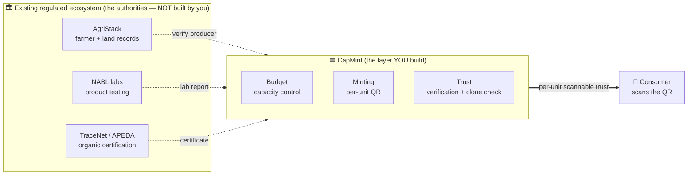

# The Organic Export Pipeline — and where CapMint fits

> This shows **two things at once**: (1) the real-world organic-farming → export → consumer
> pipeline as it already exists under India's NPOP/APEDA regime, and (2) exactly where
> **CapMint** plugs in. CapMint is a thin **serialization + trust layer on top of** that
> ecosystem — it never replaces the authorities. See [SCOPE_BOUNDARY.md](SCOPE_BOUNDARY.md).

---

## 1. The big picture — CapMint is a thin layer on top

The organic ecosystem already exists (farmers, labs, certifiers, government registries). CapMint
does **not** rebuild it — it *consumes* it and adds the one thing it's missing: **per-unit,
scannable proof for the consumer.**

**Read it as:** the authorities certify at the *batch/certificate* level → CapMint turns that
into *per-jar* proof → the consumer scans and trusts a single unit.

---

## 2. The full journey — from farm to the consumer's scan

Green = real-world/physical · 🟦 Blue = CapMint action · 🏛️ Orange = external authority.

```mermaid
flowchart TD
    classDef world fill:#e8f5e9,stroke:#2e7d32,color:#1b5e20
    classDef capmint fill:#e3f2fd,stroke:#1565c0,color:#0d47a1
    classDef gov fill:#fff3e0,stroke:#e65100,color:#e65100

    A["🌾 Farmer registers<br/>identity + land parcels"]:::world --> A2{{"AgriStack<br/>verify farmer + land"}}:::gov
    A2 --> B["🏅 Certification Body inspects farm<br/>→ Scope Certificate (NPOP)"]:::world
    B --> C1["🟦 CapMint: producer requests BUDGET<br/>certifier approves + cryptographically signs"]:::capmint
    C1 --> C["🌱 Organic cultivation + harvest"]:::world
    C --> D["📦 Processing + packaging into a batch"]:::world
    D --> D1["🟦 CapMint: create LOT (draws from budget)"]:::capmint
    D1 --> E["🧪 Sample sent to NABL-accredited lab"]:::world
    E --> E1{{"🟦 CapMint: ingest lab report<br/>PASS ✓  /  FAIL → auto-revoke batch"}}:::gov
    E1 --> F["🏅 Certification Body certifies the lot<br/>→ TraceNet Transaction Certificate"]:::world
    F --> F1["🟦 CapMint: lot = CERTIFIED → MINT the QR codes*"]:::capmint
    F1 --> G["🚢 Export gate + customs clearance (APEDA)"]:::world
    G --> G1["🟦 CapMint: export/consignment gate<br/>only a CERTIFIED lot may ship"]:::capmint
    G1 --> H["🏬 Ship to importer → retailer → shelf"]:::world
    H --> I["🧑 Consumer scans the QR on the jar"]:::world
    I --> I1["🟦 CapMint: VERIFY<br/>genuine? certified? cloned?"]:::capmint
    I1 --> J["✅ 'Verified' + origin + provenance shown"]:::world
```

\* **Mint timing is an open decision** (see below): mint *after* certification (shown here — zero
waste, no 'pending' window) **or** mint earlier with the export gate as the backstop.

---

## 3. Stage-by-stage — who does what

| # | Stage (real world) | External authority | CapMint's role |
| :--: | :-- | :-- | :-- |
| 0 | Farmer + land registered | **AgriStack** (govt) | Query to confirm producer is real |
| 1 | Farm inspected → Scope Certificate | **Certification Body** (via TraceNet) | The certifier is a real CB *user* of CapMint |
| 2 | Producer authorized to make N units | — | **Budget**: certifier approves + signs capacity |
| 3 | Cultivate → harvest → package (batch) | — | Producer creates a **Lot** (draws from budget) |
| 4 | Sample tested | **NABL lab** | Ingest the lab report; **FAIL → auto-revoke** |
| 5 | Lot certified → Transaction Certificate | **Certification Body / TraceNet** | Record `CERTIFIED`; link the certificate |
| 6 | Serialize units | — | **Minting**: unique per-unit QR identity |
| 7 | Export + customs | **APEDA / customs** | **Export gate**: only certified lots ship |
| 8 | Distribute → retail → shelf | Importer / retailer | (codes are live in the field) |
| 9 | Consumer scans | — | **Trust**: verify genuine + certified + clone check |

---

## 4. The story, plainly (scratch → consumer)

1. A **farmer** registers land in **AgriStack**; CapMint checks they're real.
2. An accredited **Certification Body** inspects the farm and issues a **Scope Certificate**
   under NPOP (recorded in **TraceNet**). That CB becomes the "certifier" in CapMint.
3. The producer asks CapMint for a **budget** — "authority to make 10,000 units." The certifier
   **approves and cryptographically signs** it. Now 10,000 is a hard ceiling.
4. The crop is **grown, harvested, processed, and packaged** into a batch. The producer creates a
   matching **Lot** in CapMint.
5. A sample goes to a **NABL lab**. CapMint ingests the report — **pass** continues the flow;
   **fail** automatically kills (revokes) the batch.
6. The **Certification Body certifies the lot**, backed by a **TraceNet Transaction Certificate**.
   CapMint marks it `CERTIFIED`.
7. CapMint **mints** the unique **QR codes** for the certified lot.
8. Only a **certified** lot passes the **export gate** and clears **customs** (APEDA). Uncertified
   product cannot leave.
9. The product **ships to the retailer** (e.g., in Germany) and reaches the **shelf**.
10. A **consumer scans the QR**. CapMint answers truthfully: **genuine? certified? cloned?** — and
    shows the product's origin/provenance. That scan is the whole point: **per-unit trust the
    certificate alone could never give.**

---

## 5. Where CapMint exists (one line)

> Between **"a batch is certified organic"** (which the ecosystem already does) and
> **"a shopper trusts *this one jar*"** (which nothing else does) — CapMint is the
> **budget + minting + trust** layer that connects them.

## 6. Open decision (tracked in [SCOPE_BOUNDARY.md](SCOPE_BOUNDARY.md))

**Mint timing.** Mint *after* certification (single mint-time gate → zero wasted labels, no
"pending" window) is preferred **if** producers can apply the QR label *after* the certificate
returns (a separate labeling step). Otherwise, mint earlier and rely on the export gate. One
operational question decides it.
