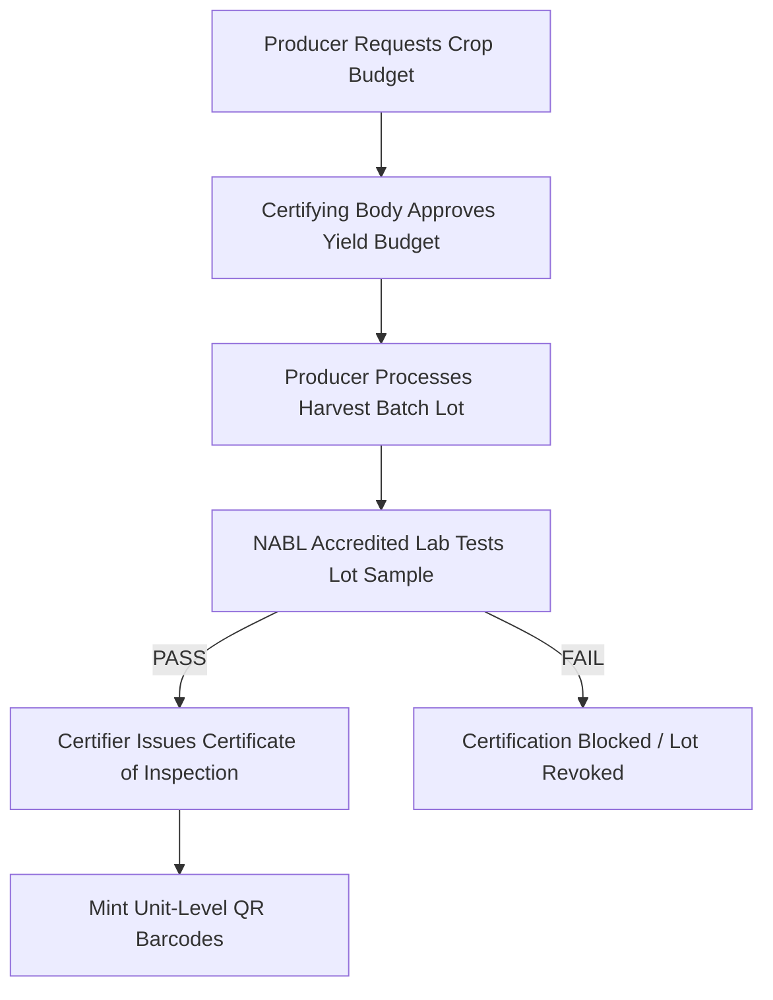

# APEDA TraceNet & NABL Compliance Specification

## 1. Executive Summary
CapMint enforces regulatory compliance for Indian organic agricultural exports managed by **APEDA** (Agricultural & Processed Food Products Export Development Authority) and accredited **NABL** (National Accreditation Board for Testing and Calibration Laboratories) facilities.

---

## 2. Regulatory Workflow & Business Rules

---

## 3. NABL Laboratory Testing Requirements

### 3.1 PDF Report Upload Validation (`LAB-01`, `LAB-02`)
*   **MIME Validation:** Only valid PDF files (`application/pdf` with `%PDF` header bytes) are accepted. Non-PDF files or corrupted binaries return `400 Bad Request`.
*   **Report Hash Generation:** A SHA-256 hash digest of the report binary is calculated and stored (`report_hash`).

### 3.2 Duplicate & Replacement Constraints (`LAB-03`, `LAB-04`)
*   **Duplicate Hash Check (`LAB-03`):** Re-uploading an identical PDF file hash for the same lot returns `409 Conflict`.
*   **Lab Report Replacement (`LAB-04`):** If a re-test report is uploaded with updated values for an existing lot, the old result is superseded, the lot status is updated, and a `LOT_LAB_TEST_REPLACED` audit entry is appended to the Transparency Ledger.

### 3.3 Database Summary Mapping
*   `lab_results.result_summary`: Constrained to `'PASS'` or `'FAIL'`.
*   `lots.lab_status`: Constrained to `'PENDING'`, `'PASSED'`, or `'FAILED'`.

---

## 4. Certification Enforcement (`CERT-01` to `CERT-04`)

1.  **Missing Report (`CERT-01`):** Certification requests on lots without an uploaded NABL report return `400 Bad Request`.
2.  **Failed Lab Test (`CERT-02`):** Certification requests on lots with `lab_status = FAILED` or `revocation_status = REVOKED` return `400 Bad Request`.
3.  **Already Certified (`CERT-03`):** Submitting a certification request for an already certified lot returns `409 Conflict`.
4.  **Already Revoked (`CERT-04`):** Submitting a revocation request for an already revoked lot returns `400 Bad Request`.
