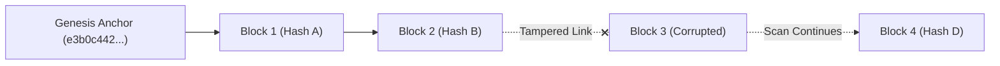

# Transparency Ledger & Audit Log Specification

## 1. Executive Overview
CapMint implements a high-throughput, **tamper-evident audit log ledger** using cryptographic hash-chaining stored in PostgreSQL (`log_entries`). It delivers blockchain-equivalent immutability without public chain network overhead.

---

## 2. Block Data Model (`log_entries`)

| Column Name | Data Type | Constraint | Description |
| :--- | :--- | :--- | :--- |
| `id` | `UUID` | `PRIMARY KEY` | Block entry identifier |
| `entity_type` | `VARCHAR(64)` | `NOT NULL` | Entity category (`LOT`, `BUDGET`, `ORGANIZATION`, `USER`) |
| `entity_id` | `UUID` | `NOT NULL` | ID of the target domain entity |
| `event_type` | `VARCHAR(64)` | `NOT NULL` | Event type (`LOT_MINTED`, `LOT_LAB_TEST_REPLACED`, `LOT_REVOKED`) |
| `payload_hash` | `VARCHAR(64)` | `NOT NULL` | SHA-256 hash of event metadata JSON |
| `previous_hash` | `VARCHAR(64)` | `NOT NULL` | SHA-256 hash of preceding block entry |
| `current_hash` | `VARCHAR(64)` | `UNIQUE NOT NULL` | SHA-256 hash digest of current block entry |
| `created_at` | `TIMESTAMPTZ` | `NOT NULL` | Block publication timestamp |

---

## 3. Non-Blocking Chain Verification Scan (`LEDGER-06`)

When an auditor or system triggers a chain integrity scan (`GET /api/v1/log/verify`):

1.  **Chronological Fetch:** Blocks are fetched ordered by `created_at ASC`.
2.  **Genesis Check:** The first block is verified against `GENESIS_BLOCK_ANCHOR`.
3.  **Hash Verification:** For each subsequent block $i$, the algorithm verifies:
    *   $\text{block}_i.\text{previous\_hash} == \text{block}_{i-1}.\text{current\_hash}$
    *   $\text{block}_i.\text{current\_hash} == \text{SHA256}(\text{recomputed\_block\_hash})$
4.  **Non-Blocking Full Scan:** If a tampered block is detected (broken link), the verification scanner logs the corrupted block index, sets `unbroken: false`, but **continues scanning remaining blocks** to provide complete transparency on subsequent block integrity.

